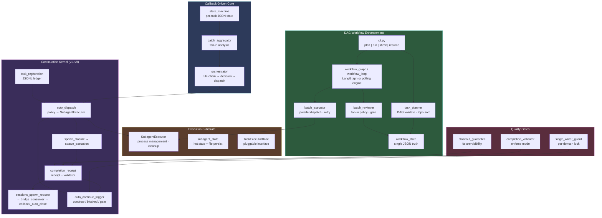
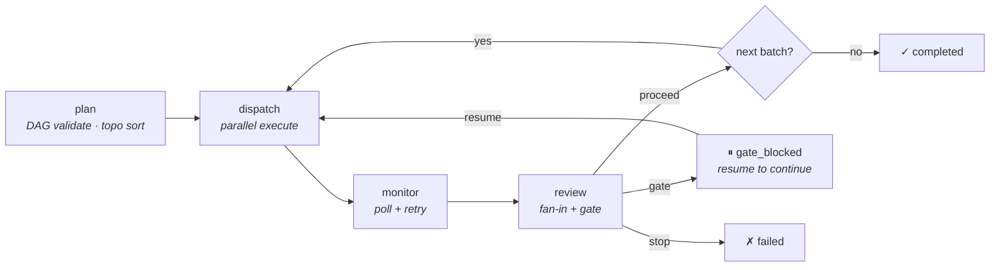

# OpenClaw Company Orchestration

> **OpenClaw 原生的多任务编排控制面** — 回调驱动 · 批量 DAG · Continuation Kernel · Fan-in 审查 · 门控续行

[中文版](README_CN.md) · [Operations Guide](docs/OPERATIONS.md) · [Current Truth](docs/CURRENT_TRUTH.md)

---

## What This Solves

When you use OpenClaw with `sessions_spawn` / subagents for multi-task work, you hit a coordination gap:

- An agent finishes a task, reports results — **then what?** Who decides the next step?
- 5 parallel tasks complete with mixed results — **proceed or stop?** By what rule?
- Process crashes mid-workflow — **where were we?** How to resume?
- Complex work needs phases (planning → execution → closeout) — **who orchestrates the handoffs?**

This repo is the **orchestration control plane** that answers these questions, built natively on OpenClaw's primitives (`sessions_spawn`, subagent, callback, shared-context).

---

## How It Works

The system has three tightly integrated layers, evolved incrementally from real production needs:



### Layer 1: Callback-Driven Core

The foundation. Each task is a JSON file (`~/.openclaw/shared-context/job-status/tsk_*.json`). When a task completes (callback received), the system:

1. **`state_machine`** — Updates task status (`pending → running → callback_received → final_closed`)
2. **`batch_aggregator`** — Checks if the batch is complete, analyzes success/failure/timeout statistics
3. **`orchestrator`** — Runs a rule chain (`all_success` / `partial_failure` / `major_failure` / `has_common_blocker`) → produces `Decision` (proceed / retry / abort / fix_blocker) → optionally dispatches next tasks

This is the **proven, production-validated base**. Trading roundtable, channel roundtable, and generic scenarios all plug in here.

### Layer 2: Continuation Kernel (v1–v9)

Built incrementally on top of the core to close the **"agent finishes then stops"** gap:

| Version | Module | What It Does |
|---------|--------|-------------|
| v1–v2 | `partial_continuation`, `task_registration` | Closeout contract + JSONL task ledger |
| v3–v4 | `auto_dispatch`, `spawn_closure` | Policy-based auto-dispatch + dedup + spawn artifacts |
| v5 | `spawn_execution`, `completion_receipt` | Full loop: spawn → execute → receipt |
| v6 | `sessions_spawn_request`, `callback_auto_close` | Generic sessions_spawn interface + auto-close bridge |
| v7–v8 | `bridge_consumer` | Consume request → execute (real or simulated) + auto-trigger |
| v9 | `sessions_spawn_bridge` | Real OpenClaw `sessions_spawn` API integration |

Every version adds a piece; the **linkage chain** connects them: `registration_id → dispatch_id → spawn_id → execution_id → receipt_id → request_id → consumed_id → api_execution_id`.

### Layer 3: DAG Workflow Enhancement

Adds what the callback-driven core doesn't have: a **global view** of multi-batch workflows with explicit dependencies, a **single JSON truth file**, and **LangGraph-grade checkpointing**.

| Module | Adds |
|--------|------|
| `workflow_state.py` | Single `workflow_state_*.json` — all batches, tasks, decisions in one file |
| `task_planner.py` | DAG validation (Kahn's algorithm), topological sort, `depends_on` |
| `batch_executor.py` | Parallel dispatch via SubagentExecutor, monitoring, configurable retry |
| `batch_reviewer.py` | Fan-in policy (`all_success` / `any_success` / `majority`) + gate conditions |
| `workflow_graph.py` | LangGraph StateGraph engine with SQLite checkpoint |
| `workflow_loop.py` | Zero-dependency polling fallback |
| `watchdog.py` | Stall detection, auto-resume marking |
| `cli.py` | Unified CLI: `plan`, `run`, `show`, `resume` (+ v1 commands: `status`, `batch-summary`, `decide`, `list`) |

### Execution Substrate

All layers share a common execution engine:

- **`SubagentExecutor`** — Wraps `sessions_spawn(runtime="subagent")` with process management, timeout, cleanup (process group kill), semaphore-based concurrency control
- **`subagent_state`** — Hot state in memory + cold state on disk, survives restart
- **`TaskExecutorBase`** — Abstract interface for plugging non-subagent backends (HTTP workers, LangChain agents, etc.)

### Quality Gates

Cross-cutting safety mechanisms:

- **`completion_validator`** — Enforce mode (not audit-only): blocked/gate/through rules, whitelist with prefix matching
- **`single_writer_guard`** — Per-domain file lock, prevents concurrent writes
- **`auto_continue_trigger`** — Based on validator + receipt + writer guard, outputs `continue_allowed` / `continue_blocked` / `gate_required`
- **`closeout_guarantee`** — Ensures failures are visible to users even when the main chain doesn't naturally surface them

---

## Workflow Lifecycle



### State Machine

```
Workflow: pending → running → completed / failed / gate_blocked (→ running via resume)
Task:     pending → running → callback_received → final_closed (or failed / timeout)
```

---

## Quick Start

```bash
# Install optional dependencies (recommended)
pip install langgraph langgraph-checkpoint-sqlite

# DAG workflow mode
python3 runtime/orchestrator/cli.py plan "Analyze codebase" config.json
python3 runtime/orchestrator/cli.py run workflow_state_wf_xxx.json --workspace /path/to/project
python3 runtime/orchestrator/cli.py show workflow_state_wf_xxx.json
python3 runtime/orchestrator/cli.py resume workflow_state_wf_xxx.json

# Callback-driven mode (original orchestrator)
python3 runtime/orchestrator/cli.py status <task_id>
python3 runtime/orchestrator/cli.py batch-summary <batch_id>
python3 runtime/orchestrator/cli.py decide <batch_id>
python3 runtime/orchestrator/cli.py list --state running
python3 runtime/orchestrator/cli.py stuck --timeout 60

# Entry point for OpenClaw scenarios
python3 runtime/scripts/orch_command.py --context <scenario> --channel-id "<id>" --topic "<topic>"
```

---

## Onboarding a New Scenario

### For Callback-Driven Scenarios (Trading, Channel, Custom)

1. **Choose an adapter**: `trading_roundtable` for trading, `channel_roundtable` for generic channels, or write your own extending `orchestrator.py`
2. **Configure auto-dispatch**: Start with `allow_auto_dispatch=false`, validate artifacts, then enable
3. **Set fan-in rules**: Configure in the `Orchestrator` rule chain
4. **First run**: Verify callback → ack → dispatch artifacts are stable before enabling auto-continuation

### For DAG Workflow Scenarios

1. **Define `config.json`**:
```json
[
  {
    "batch_id": "collect",
    "label": "Data Collection",
    "tasks": [
      {"task_id": "t1", "label": "Source A", "max_retries": 2},
      {"task_id": "t2", "label": "Source B"}
    ],
    "depends_on": [],
    "fan_in_policy": "any_success"
  },
  {
    "batch_id": "synthesize",
    "label": "Merge Results",
    "tasks": [{"task_id": "t3", "label": "Synthesize"}],
    "depends_on": ["collect"]
  }
]
```

2. **Provide runner script**: `<workspace>/scripts/run_subagent_claude_v1.sh <task_prompt> <label>`
3. **Run**: `plan` → `run` → `show` → `resume`

---

## Positioning

| Framework | Focus | This Repo |
|-----------|-------|-----------|
| **LangGraph** | General stateful agent graphs | **Embedded** as optional engine; we add batch DAG + fan-in + gate + JSON truth on top |
| **Deer-Flow** | Research workflow | Shared concept: SubagentExecutor design. We extend with continuation kernel + quality gates |
| **CrewAI / AutoGen** | Agent definition frameworks | We are a **control plane** — we orchestrate when and how agents run, not what they are |
| **Temporal** | Durable workflows at scale | We are single-process + JSON checkpoint — no server cluster needed |

**This repo is the OpenClaw-native orchestration control plane.** It keeps OpenClaw's `sessions_spawn`, callback, and shared-context as the canonical interface. External frameworks only enter at the leaf execution layer.

---

## Repository Structure

```
├── runtime/orchestrator/     # ALL orchestration modules (core + kernel + DAG + execution)
│   ├── state_machine.py      # Task state machine (per-task JSON files)
│   ├── batch_aggregator.py   # Fan-in analysis, batch summarization
│   ├── orchestrator.py       # Rule chain decision engine
│   ├── subagent_executor.py  # SubagentExecutor (Deer-Flow inspired)
│   ├── task_registration.py  # Task registry (JSONL ledger)
│   ├── auto_dispatch.py      # Auto-dispatch with policy evaluation
│   ├── spawn_closure.py      # Spawn closure artifacts
│   ├── completion_receipt.py # Completion receipts + validator integration
│   ├── sessions_spawn_*.py   # sessions_spawn request/bridge
│   ├── bridge_consumer.py    # Bridge consumption layer
│   ├── auto_continue_trigger.py  # Auto-continue decision
│   ├── completion_validator.py   # Enforce-mode validator
│   ├── workflow_state.py     # Single JSON truth (DAG enhancement)
│   ├── task_planner.py       # DAG validation + topo sort
│   ├── batch_executor.py     # Parallel dispatch + retry
│   ├── batch_reviewer.py     # Fan-in policy + gate
│   ├── workflow_graph.py     # LangGraph engine (SQLite checkpoint)
│   ├── workflow_loop.py      # Polling fallback engine
│   ├── watchdog.py           # Stall detection + auto-resume
│   ├── cli.py                # Unified CLI entry point
│   └── ...                   # Trading/channel adapters, quality gates, etc.
├── tests/orchestrator/       # Test suite (781 tests, all passing)
├── runtime/tests/            # Integration tests (subset)
├── docs/                     # CURRENT_TRUTH, Operations, architecture docs
├── examples/                 # Sample configs and payloads
├── schemas/                  # JSON schemas
├── scripts/                  # Helper scripts, runner entry
├── plugins/                  # OpenClaw plugins (human-gate)
├── archive/                  # Historical POCs and old kernel docs
└── orchestration_runtime/    # Early prototype (deprecated, see runtime/)
```

---

## Design Principles

1. **OpenClaw native** — Built on `sessions_spawn`, callback, shared-context. Not a framework transplant.
2. **Incremental** — Each kernel version adds one capability. No big-bang rewrites.
3. **Callback-driven first, DAG when needed** — Simple scenarios use callbacks; complex multi-batch DAGs use `workflow_state`.
4. **Prove, then automate** — Start with `allow_auto_dispatch=false`. Validate artifacts. Then enable auto-continuation.
5. **Thin bridge, not thick platform** — We orchestrate; agents do the work.

---

## Tests

```bash
cd <repo-root>
PYTHONPATH=runtime/orchestrator:runtime/scripts python3 -m pytest tests/orchestrator/ -q
# 781 passed
```

---

## License

MIT
