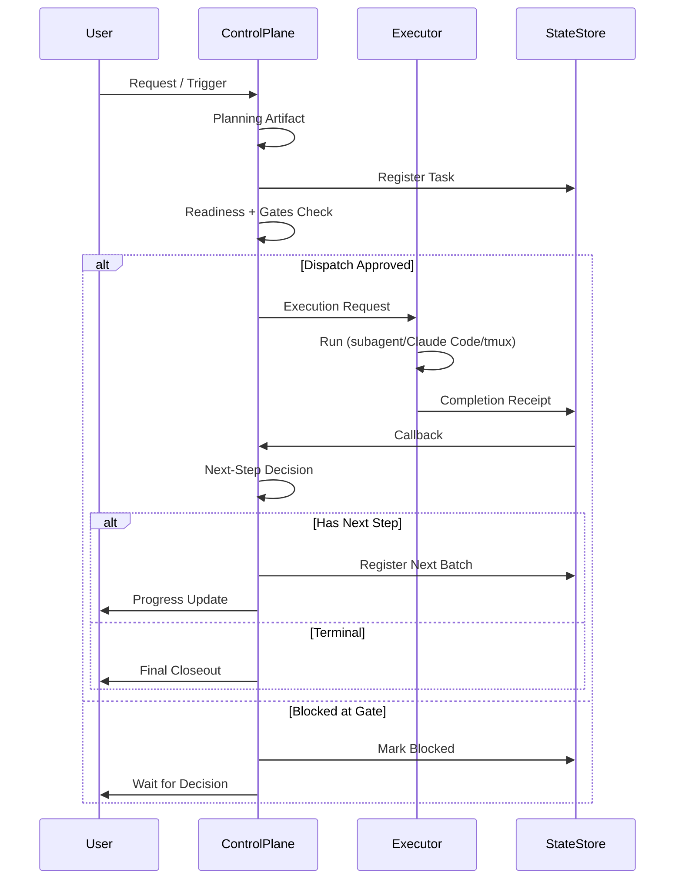

# OpenClaw Orchestration Control Plane

> A thin control-plane for multi-agent workflows on top of OpenClaw.
> **Default backend:** subagent | **Compat backend:** tmux | **First validation:** trading continuation
> **Current maturity:** safe semi-auto / thin bridge / production-validated on one scenario

---

## Quick Start (30 seconds)

**Single entry point:** `python3 ~/.openclaw/scripts/orch_command.py`

```bash
# Default: use current channel context
python3 ~/.openclaw/scripts/orch_command.py

# Specify channel/topic
python3 ~/.openclaw/scripts/orch_command.py \
  --channel-id "discord:channel:YOUR_ID" \
  --channel-name "your-channel" \
  --topic "discussion topic"

# Trading scenario
python3 ~/.openclaw/scripts/orch_command.py --context trading_roundtable

# Save contract to file
python3 ~/.openclaw/scripts/orch_command.py \
  --channel-id "discord:channel:YOUR_ID" \
  --topic "Architecture Review" \
  --output tmp/orch-contract.json
```

**Default behavior:**
- ✅ coding lane → Claude Code (via subagent)
- ✅ non-coding lane → subagent
- ✅ auto_execute=true (auto-register/dispatch/callback/continue)
- ✅ gate_policy=stop_on_gate (stops normally at gates)
- ✅ First-time users: use `--auto-execute false` to verify stability first

**Documentation:**
- **Skill entry:** `runtime/skills/orchestration-entry/SKILL.md`
- **Other channels:** `docs/quickstart/quickstart-other-channels.md`
- **Current truth:** `docs/CURRENT_TRUTH.md`

---

## What This Is

**This repository builds a practical orchestration control-plane for OpenClaw.**

It answers a specific question:

> **After one task completes, how does the system know what to do next—and keep moving safely?**

Real multi-agent systems rarely fail because "the model cannot answer." They fail because:
- A task completes but nobody owns the next step
- Multiple child tasks return without a clean fan-in point
- The system can plan but cannot safely dispatch the next action
- A callback is emitted but never reaches the right parent or channel
- Business ownership and execution ownership are mixed together

This repository makes those transitions **explicit** through:
- Continuation contracts
- Handoff schemas
- Registration and readiness tracking
- Dispatch plans
- Bridge consumption
- Execution requests and receipts
- Callback/ack separation

---

## What This Is Not

- ❌ Not a generic DAG platform
- ❌ Not an OpenClaw replacement
- ❌ Not a LangGraph/Temporal/DeepAgents wrapper
- ❌ Not just a trading bot repo
- ❌ Not "fully automatic with no human oversight"

**Current scope:** thin bridge / allowlist / safe semi-auto / validated on trading continuation

---

## Architecture Overview

```text
┌─────────────────────────────────────────────────────┐
│ Business Scenarios                                  │
│ trading / channel / future domain adapters          │
└─────────────────────────────────────────────────────┘
                        │
                        ▼
┌─────────────────────────────────────────────────────┐
│ Control Plane                                       │
│ contracts / planning / registration / readiness     │
│ callbacks / receipts / dispatch / continuation      │
└─────────────────────────────────────────────────────┘
                        │
                        ▼
┌─────────────────────────────────────────────────────┐
│ Execution Layer                                     │
│ subagent (default) / Claude Code / tmux (compat)    │
└─────────────────────────────────────────────────────┘
                        │
                        ▼
┌─────────────────────────────────────────────────────┐
│ OpenClaw Runtime Foundation                         │
│ sessions / tools / hooks / channels / messaging     │
└─────────────────────────────────────────────────────┘
```

**Key boundary:** Control plane decides **what happens next**; execution layer **runs the step**; OpenClaw provides primitives.

### Main Flow: Request → Callback → Closeout → Next Batch



**Core principle:** A task is not finished when execution stops—it is finished when **the next-step state is made explicit**.

### Owner vs Executor Decoupling

```text
owner    = who owns the business judgment
executor = who actually performs the work

Examples:
- owner=trading, executor=claude_code
- owner=main, executor=subagent
- owner=content, executor=tmux
```

This decoupling allows coding lanes to default to Claude Code without requiring every business-role agent to become the executor.

**Detailed architecture:** [`docs/architecture/overview.md`](docs/architecture/overview.md)

---

## Current Status

### Backend Strategy
| Backend | Status | Use Case |
|---------|--------|----------|
| **subagent** | ✅ DEFAULT | Automated execution, CI/CD, new development |
| **tmux** | ✅ SUPPORTED | Interactive sessions, manual observation |

### Maturity
> **thin bridge / explicit contracts / safe semi-auto / production-validated on one real scenario**

This repo is further along than a proposal, but still intentionally earlier than a fully general-purpose workflow platform.

### What's Real
- ✅ Trading continuation has entered **real execution path**
- ✅ Control-plane main chain is in place
- ✅ Dual-track backend (subagent + tmux) both supported
- ✅ 434 tests passing
- ✅ Real artifact-backed continuation (registration → dispatch → execution → receipt → callback)

### What's Not Yet Fully Closed
- ⚠️ Git push auto-continue is **not yet fully automatic**
- ⚠️ Overall maturity remains **safe semi-auto**, not "fully automatic无人续跑"

---

## Repository Structure

```text
openclaw-company-orchestration-proposal/
├── README.md / README.zh.md
├── docs/
│   ├── architecture/        # Architecture diagrams & overviews
│   ├── diagrams/            # Mermaid/flow diagrams
│   ├── quickstart/          # Channel-specific quickstart guides
│   ├── configuration/       # Auto-trigger config & troubleshooting
│   ├── CURRENT_TRUTH.md     # Current truth entry point
│   └── ...                  # Other documentation
├── runtime/
│   ├── orchestrator/        # Core orchestration logic
│   ├── skills/              # OpenClaw skill integrations
│   └── scripts/             # Entry commands & utilities
├── tests/                   # Behavioral tests (source of truth)
├── archive/                 # Historical material (reference only)
└── scripts/                 # Utility scripts
```

| Directory | Purpose |
|-----------|---------|
| `docs/` | Human-facing documentation: current truth, architecture, migration, releases |
| `runtime/` | Actual orchestration runtime: contracts, continuation, dispatch, bridge consumer |
| `tests/` | Behavioral proof—tests are a source of truth, not just packaging hygiene |
| `archive/` | Historical material kept for reference, not for the active path |

---

## Where to Start

| Goal | Entry Point |
|------|-------------|
| **Quick overview** | [`docs/executive-summary.md`](docs/executive-summary.md) |
| **Current truth** | [`docs/CURRENT_TRUTH.md`](docs/CURRENT_TRUTH.md) |
| **Architecture** | [`docs/architecture/overview.md`](docs/architecture/overview.md) |
| **Other channels** | [`docs/quickstart/quickstart-other-channels.md`](docs/quickstart/quickstart-other-channels.md) |
| **Auto-trigger config** | [`docs/configuration/auto-trigger-config-guide.md`](docs/configuration/auto-trigger-config-guide.md) |
| **Validation status** | [`docs/validation-status.md`](docs/validation-status.md) |
| **Technical debt** | [`docs/technical-debt/technical-debt-2026-03-22.md`](docs/technical-debt/technical-debt-2026-03-22.md) |

---

## Why This Exists

Many teams jump too early into Temporal-style complexity, or stay stuck in script spaghetti. This repo explores the **middle path**:
- Enough structure to be reliable
- Not so much machinery that iteration stops

It borrows from Temporal (durable workflow thinking), LangGraph (graph transitions), and DeepAgents (execution profiles)—but treats them as **leaf-layer techniques**, not as the company-wide control plane.

**The practical decision:**
- Use **OpenClaw** as the runtime foundation
- Keep a thin but explicit **control plane** in this repo
- Let **subagent / Claude Code / tmux** stay execution choices
- Only adopt heavier frameworks in narrow places where they actually help

---

## One-Sentence Summary

> **This repository is building a practical orchestration control-plane for OpenClaw, with subagent as the default execution path, tmux as a compatibility path, and trading as the first real proving ground.**
