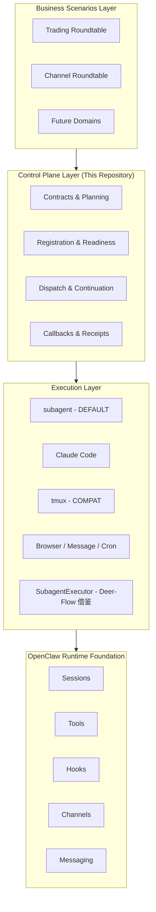
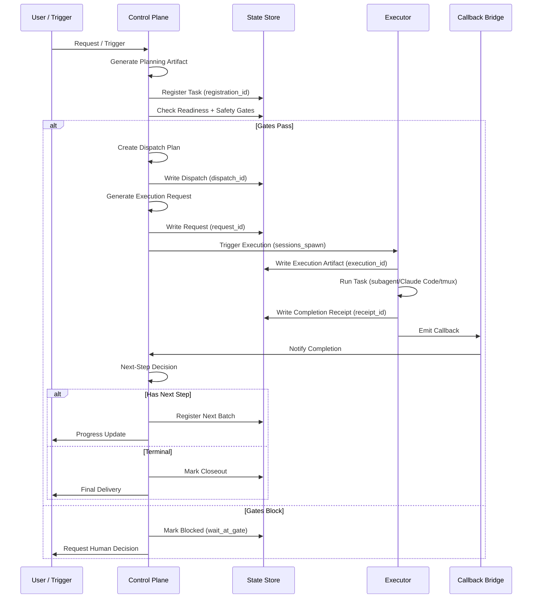

# OpenClaw Orchestration Control Plane

> **A practical control plane for multi-agent workflow orchestration — thin enough to iterate, structured enough to rely on.**
>
> **One-line pitch:** After one task completes, how does the system know what to do next—and keep moving safely? This repository makes those transitions explicit.
>
> **Default backend:** `subagent` | **Compat backend:** `tmux` | **First validated scenario:** `trading_roundtable` continuation
>
> **Maturity:** architecture-validated / unified main chain + LangGraph | **Latest:** v2 全量测试 781/781 通过 (2026-03-25)

### Quick Start

```bash
# 唯一入口
python3 runtime/orchestrator/cli.py plan "My workflow" config.json
python3 runtime/orchestrator/cli.py run workflow_state_wf_xxx.json
python3 runtime/orchestrator/cli.py show workflow_state_wf_xxx.json
python3 runtime/orchestrator/cli.py resume workflow_state_wf_xxx.json
```

> **操作指南**: [`docs/OPERATIONS.md`](docs/OPERATIONS.md) — 入口在哪？状态记在哪？怎么看？怎么恢复？
> **真值文件**: `workflow_state_<id>.json` — 所有工作流状态的唯一真值

---

## Table of Contents

1. [What This Repository Is](#what-this-repository-is)
2. [The Core Problem (and Why It's Hard)](#the-core-problem-and-why-its-hard)
3. [Why Not Just Prompt / Subagent / Callback?](#why-not-just-prompt--subagent--callback)
4. [System Boundaries](#system-boundaries)
5. [Core Concepts](#core-concepts)
6. [Architecture](#architecture)
7. [Why Not Temporal / LangGraph / DAG Engine?](#why-not-temporal--langgraph--dag-engine)
8. [Current Maturity](#current-maturity)
9. [Typical Scenarios](#typical-scenarios)
10. [Quick Start](#quick-start)
11. [Repository Navigation](#repository-navigation)
12. [Branch Governance](#branch-governance)
13. [Testing & Validation](#testing--validation)
14. [Roadmap](#roadmap)
15. [Why This Matters](#why-this-matters)

---

## What This Repository Is

### One-Line Pitch

**This repository builds a practical orchestration control-plane for OpenClaw: subagent as default execution path, tmux as compatibility path, trading as first real proving ground, external frameworks at leaf layer only.**

### Longer Framing

This is **not** another workflow engine wrapper. It is a **control plane for agent handoffs** — the layer that decides what happens next after a task completes, and ensures that decision is explicit, traceable, and safe.

Real multi-agent systems rarely fail because "the model cannot answer." They fail because:
- A task completes but nobody owns the next step
- Multiple child tasks return without a clean fan-in point
- The system can plan but cannot safely dispatch the next action
- A callback is emitted but never reaches the right parent or channel
- Business ownership and execution ownership are mixed together

**This repository makes those transitions explicit** through:
- Continuation contracts
- Handoff schemas
- Registration and readiness tracking
- Dispatch plans
- Bridge consumption
- Execution requests and receipts
- Callback/ack separation

### What You Get

| Capability | Description |
|------------|-------------|
| **Continuation contracts** | Explicit `stopped_because / next_step / next_owner` at task closeout |
| **Owner/Executor decoupling** | Business owner (who decides) separate from executor (who runs) |
| **Dual-track backend** | `subagent` (default, automated) + `tmux` (interactive, observable) |
| **Traceable linkage** | Full artifact chain: registration → dispatch → execution → receipt → callback |
| **Safe semi-auto** | Allowlist-based, condition-triggered, reversible auto-continuation |
| **Production-validated** | Real trading continuation path verified in production |
| **Deer-Flow借鉴落地** | SubagentExecutor 封装 + 热状态存储已实现 (2026-03-24) |

---

## The Core Problem (and Why It's Hard)

### The Question

> **After one task completes, how does the system know what to do next—and keep moving safely?**

This seems simple until you face real-world complexity:

### Why This Is Hard

| Challenge | Why It's Non-Trivial |
|-----------|---------------------|
| **Ownership ambiguity** | Who owns the next step: the agent that ran, the user who requested, or the business domain? |
| **Fan-in without chaos** | When 5 child tasks complete, how do you aggregate without race conditions or lost state? |
| **Callback delivery** | A callback is emitted—does it reach the right parent session, channel, or user? |
| **State alignment** | How do you align task state, execution state, and message delivery state without coupling? |
| **Safe automation** | When is it safe to auto-continue vs. requiring human approval? |
| **Traceability** | When something goes wrong, can you trace through the full chain of decisions? |

### The Naive Approach (and Why It Fails)

```
❌ "Just let the agent decide what's next"
   → No explicit contract, no traceability, no safety gates

❌ "Just add more callback handlers"
   → Callbacks ≠ state transitions; mixing them creates ambiguity

❌ "Just use a workflow engine"
   → Heavy infrastructure before understanding the actual handoff patterns
```

### Our Approach

**Make transitions explicit, not implicit:**

```
Task Completion → Explicit Closeout Contract → Next-Step Decision → Safe Dispatch
                      ↓
         (stopped_because / next_step / next_owner / readiness)
```

---

## Why Not Just Prompt / Subagent / Callback?

### The Temptation

Many teams start with:
```
User request → Prompt → Agent runs → Callback → Done
```

This works for single-turn tasks. It breaks for multi-step workflows.

### What's Missing

| Gap | Symptom | Our Solution |
|-----|---------|--------------|
| **No explicit closeout** | Agent finishes but system doesn't know "why it stopped" | Continuation contract with `stopped_because` |
| **No ownership separation** | Business logic mixed with execution logic | Owner/Executor decoupling |
| **No readiness tracking** | Next step dispatched before prerequisites ready | Registration + readiness check |
| **No safety gates** | Auto-continuation runs without allowlist | Allowlist-based gate policy |
| **No traceability** | Can't trace from outcome back to decision | Full artifact linkage chain |
| **No fan-in contract** | Multiple children complete, no aggregation point | Batch aggregator with readiness rollup |

### Why a Control Plane Is Necessary

```
┌─────────────────────────────────────────────────────────────┐
│ Without Control Plane                                       │
│                                                             │
│   Agent A → completes → "done?"                            │
│              ↓                                              │
│   Agent B → ??? (who triggers? who owns?)                  │
│                                                             │
│   Result: Silent failures, orphaned tasks, manual glue     │
└─────────────────────────────────────────────────────────────┘

┌─────────────────────────────────────────────────────────────┐
│ With Control Plane                                          │
│                                                             │
│   Agent A → completes → Receipt → Callback → Decision      │
│                                      ↓                      │
│   Registration → Readiness → Gate Check → Dispatch → B     │
│                                                             │
│   Result: Explicit transitions, traceable, safe automation │
└─────────────────────────────────────────────────────────────┘
```

---

## System Boundaries

### What This Repository Does

| In Scope | Description |
|----------|-------------|
| ✅ **Continuation contracts** | Define explicit handoff schemas between tasks |
| ✅ **Registration & readiness** | Track task state, prerequisites, and safety gates |
| ✅ **Dispatch planning** | Decide when and how to trigger next execution |
| ✅ **Execution bridging** | Connect control plane to execution backends (subagent/tmux) |
| ✅ **Completion receipts** | Generate structured closeout artifacts |
| ✅ **Callback/ack separation** | Separate task completion from message delivery |
| ✅ **Scenario adapters** | Trading, channel roundtable, future domain adapters |

### What This Repository Does NOT Do

| Out of Scope | Why |
|--------------|-----|
| ❌ **Generic DAG platform** | Not trying to be a general-purpose workflow engine |
| ❌ **OpenClaw replacement** | Built on top of OpenClaw primitives, not replacing them |
| ❌ **Temporal/LangGraph wrapper** | External frameworks enter at leaf layer only |
| ❌ **Trading bot** | Trading is first validated scenario, not the product |
| ❌ **Fully automatic** | Safe semi-auto with gates, allowlists, and human oversight |
| ❌ **Message transport** | Uses OpenClaw messaging; doesn't implement its own |

### Design Principle

> **External frameworks enter only at leaf execution layer, not as control plane replacement.**

---

## Core Concepts

### Owner vs Executor

```
owner    = who owns the business judgment (acceptance / decision)
executor = who actually performs the work
```

| Example | Owner | Executor |
|---------|-------|----------|
| Trading analysis | `trading` | `claude_code` |
| Channel discussion | `main` | `subagent` |
| Content generation | `content` | `tmux` |

**Why this matters:** Decoupling allows coding lanes to default to Claude Code without requiring every business-role agent to become the executor.

### Continuation

A **continuation** is the explicit contract for "what happens next" after a task completes:

```typescript
interface ContinuationContract {
  stopped_because: string;      // Why did execution stop?
  next_step?: string;           // What should happen next?
  next_owner?: string;          // Who owns the next step?
  readiness: ReadinessStatus;   // Are prerequisites met?
}
```

### Closeout

**Closeout** is the structured completion of a task. A task is not finished when execution stops—it is finished when **the next-step state is made explicit**.

| Closeout Type | Description |
|---------------|-------------|
| **Terminal closeout** | No next step; final delivery to user |
| **Continuation closeout** | Next step registered; auto-dispatch or gate wait |
| **User-visible closeout** | Closeout artifact delivered to user channel |

### Truth Anchor

A **truth anchor** is the canonical state record that all other states reference:

```
Truth Anchor = Task Registry Entry (registration_id)
                  ↓
          All other artifacts link back to this
```

### Gate

A **gate** is a safety checkpoint that can block auto-dispatch:

| Gate Type | Trigger |
|-----------|---------|
| **Allowlist gate** | Scenario not in allowlist |
| **Readiness gate** | Prerequisites not met |
| **Manual approval gate** | Human decision required |
| **Policy gate** | Policy evaluation failed |

### Callback vs Receipt

| Concept | Purpose | Lifecycle |
|---------|---------|-----------|
| **Receipt** | Task completion proof | Generated when execution stops |
| **Callback** | Notification to parent/channel | Emitted after receipt generated |
| **Ack** | Callback delivery confirmation | Received when callback acknowledged |

**Key insight:** `terminal ≠ callback_sent ≠ acked` — these are separate states.

### Execution Request

An **execution request** is the canonical interface between control plane and execution layer:

```typescript
interface ExecutionRequest {
  request_id: string;
  runtime: "subagent" | "acp";
  cwd: string;
  task: string;
  label: string;
  metadata: {
    dispatch_id: string;
    spawn_id: string;
    source: string;
  };
}
```

---

## Architecture

### Layering Model



### Layer Responsibilities

| Layer | Responsibility | Key Objects |
|-------|---------------|-------------|
| **Business Scenarios** | Domain-specific workflows | `trading_roundtable`, `channel_roundtable`, future adapters |
| **Control Plane** | Workflow orchestration logic | contracts, registration, dispatch plans, callbacks, receipts |
| **Execution** | Task execution backends | subagent (default), Claude Code, tmux (compat), SubagentExecutor (Deer-Flow 借鉴) |
| **Runtime** | OpenClaw primitives | sessions, tools, hooks, channels, messaging |

### Control Plane vs. Execution Substrate: What Changed

**Control Plane (保留的)**:
- ✅ OpenClaw 持有控制面：入口、sessions_spawn、launch/completion hook、callback bridge、scenario adapter
- ✅ Continuation contracts: `stopped_because / next_step / next_owner` 显式收口
- ✅ Registration + readiness + safety gates
- ✅ Dispatch planning + auto-trigger guards
- ✅ Completion receipts + callback/ack separation
- ✅ Truth anchor + artifact linkage chain

**Execution Substrate (替换/增强的)**:
- ✅ **SubagentExecutor 封装** (2026-03-24): 统一 task_id / timeout / status / result handle / tool allowlist
- ✅ **热状态存储** (2026-03-24): 内存缓存 + 文件持久化混合，重启后可恢复终态
- ✅ **工具权限隔离**: allowed_tools / disallowed_tools 过滤到 subagent 级
- ✅ **双轨后端**: subagent (DEFAULT) + tmux (SUPPORTED) 共存

**Deer-Flow 明确没借的**:
- ❌ **双线程池架构**: Python GIL 限制，收益有限；现有 subagent 天然隔离
- ❌ **全局内存字典**: 重启就丢；shared-context 文件系统更可靠
- ❌ **task_tool 轮询**: 已有 callback bridge / watcher / ack-final 协议更成熟
- ❌ **不替换 control plane**: Deer-Flow 只进 execution layer，不碰编排主链

### Main Flow



### Artifact Linkage Chain

Every execution maintains a complete linkage chain for traceability:

```
registration_id
       ↓
dispatch_id
       ↓
spawn_id
       ↓
execution_id
       ↓
receipt_id
       ↓
request_id
       ↓
consumed_id
       ↓
api_execution_id (childSessionKey / runId)
```

**Any ID can be used to query the full chain state.**

---

## Unified Main Chain (v2)

> Added 2026-03-25: Consolidates four parallel execution paths into one clear chain.

### The Problem with v1

v1 had four independent paths for "what happens after a task completes":
- `orchestrator.py` (batch callback) — `next_tasks` left empty
- `auto_dispatch.py` — whitelist limited to one scenario
- `auto_continue_trigger.py` — wrote decisions but never executed
- `sessions_spawn_request.py` — disabled by default

### The v2 Solution

One chain, four stages:

```
TaskPlanner → BatchExecutor → BatchReviewer → WorkflowLoop
(decompose)    (parallel exec)  (fan-in review)  (auto-advance)
```

**Key files:**
- `runtime/orchestrator/workflow_state.py` — Unified state model
- `runtime/orchestrator/workflow_loop.py` — Main orchestration loop
- `runtime/orchestrator/task_planner.py` — DAG-aware task decomposition
- `runtime/orchestrator/batch_executor.py` — Parallel SubagentExecutor dispatch
- `runtime/orchestrator/batch_reviewer.py` — Fan-in evaluation + gate decisions

**Unified state file:** `workflow_state.json` — one file to see global status, including `context_summary` for context recovery after LLM window compression.

### Quick Example

```python
from task_planner import TaskPlanner
from workflow_loop import WorkflowLoop

planner = TaskPlanner()
state = planner.plan("Trading analysis", [
    {"batch_id": "b0", "label": "Data collection", "tasks": [
        {"task_id": "t1", "label": "Collect A-share data"},
        {"task_id": "t2", "label": "Collect HK data"},
    ], "depends_on": []},
    {"batch_id": "b1", "label": "Analysis", "tasks": [
        {"task_id": "t3", "label": "Trend analysis"},
    ], "depends_on": ["b0"]},
])

save_workflow_state(state, "workflow_state.json")
loop = WorkflowLoop(workspace_dir="/path/to/workspace")
result = loop.run("workflow_state.json")
```

---

## Why Not Temporal / LangGraph / DAG Engine?

### The Question

Many teams ask: "Why not just use Temporal / LangGraph / a DAG engine as the backbone?"

### Trade-Off Analysis

| Framework | Strength | Why Not Our Backbone |
|-----------|----------|---------------------|
| **Temporal** | Durable execution, worker management, versioning | Heavy infrastructure; we need thin control plane for agent handoffs, not enterprise workflow engine |
| **LangGraph** | Agent-internal reasoning graphs | Excels at single-agent reasoning; our need is company-wide orchestration across multiple agents |
| **DAG Engine** | General workflow composition | Our patterns are not pure DAGs; we need explicit handoff contracts, not graph traversal |

### Our Decision

```
┌─────────────────────────────────────────────────────────────┐
│ Control Plane Strategy                                      │
│                                                             │
│ OpenClaw Native:                                            │
│   - Entry point (orch_command.py)                          │
│   - sessions_spawn integration                             │
│   - Launch/completion hooks                                │
│   - Callback bridge                                        │
│   - Scenario adapters                                      │
│   - Watcher/reconcile boundaries                           │
│                                                             │
│ External Frameworks (Leaf Layer Only):                     │
│   - DeepAgents: coding subagent profile                    │
│   - SWE-agent: issue-to-patch lane                         │
│   - LangGraph: local analysis graphs (if needed)           │
│   - Temporal: durable pilots (future, high-value only)     │
└─────────────────────────────────────────────────────────────┘
```

### Design Principle

> **OpenClaw holds the control plane; external frameworks enter only at leaf execution layer, benchmark layer, or local method layer.**

### When We Might Revisit

| Scenario | Consideration |
|----------|---------------|
| Cross-day durable execution | Temporal pilot for high-value workflows |
| Complex single-agent reasoning | LangGraph for analysis graphs |
| Enterprise compliance requirements | Re-evaluate durable execution guarantees |

---

## Current Maturity

### Maturity Matrix

| Aspect | Status | Notes |
|--------|--------|-------|
| **Backend strategy** | ✅ Dual-track | subagent (default) + tmux (compat) |
| **Trading continuation** | ✅ Production-validated | Real execution path verified |
| **Channel roundtable** | ✅ Minimum adapter | Generic channel onboarding |
| **Control plane main chain** | ✅ In place | Registration → dispatch → execution → receipt → callback |
| **Tests** | ✅ 700+ passing | 100% pass rate |
| **Validator (enforce mode)** | ✅ P0 enforced | Subtask completion validator in enforce mode (not audit-only) |
| **Single-writer guard** | ✅ P0-4 implemented | Per truth-domain / batch-domain (not global repo lock) |
| **Auto-continue trigger** | ✅ P0-4 implemented | Based on validator result + receipt status + writer conflict check |
| **Auto-dispatch execution** | ✅ P0-5 cutover | Dispatch execution switched to SubagentExecutor |
| **Parent-child / fan-in / closeout** | ✅ Batch-B integrated | Lineage + fan-in readiness + closeout glue integration |
| **Planning→execution→closeout** | ✅ Batch-D integrated | Medium-granularity truth-domain integration |
| **Execution substrate** | ✅ Extended | Issue lane + sessions_spawn_bridge + auto-dispatch |
| **Git push auto-continue** | ⚠️ Not fully automatic | Internal simulation only |
| **CLI integration** | ⚠️ Mock API call | OpenClaw CLI integration needs confirmation |
| **Auto-trigger config** | ⚠️ Local JSON | Version control pending (see technical debt) |

### What's Real vs. What's Not Closed

| Claim | Evidence | Status |
|-------|----------|--------|
| Trading continuation works | Real execution artifacts in `~/.openclaw/shared-context/` | ✅ Validated |
| Control plane main chain | 700+ tests passing, artifacts generated | ✅ Validated |
| Auto-trigger consumption | Configurable guards, dedupe mechanism | ✅ Implemented |
| Validator enforce mode | `completion_validator_rules.py` (mode=enforce) + integration tests | ✅ Implemented (2026-03-25) |
| Single-writer per domain | `single_writer_guard.py` (file lock per truth-domain) | ✅ Implemented (2026-03-25) |
| Auto-continue trigger | `auto_continue_trigger.py` + 10 tests | ✅ Implemented (2026-03-25) |
| Auto-dispatch to SubagentExecutor | `auto_dispatch.py` + 12 integration tests | ✅ Implemented (2026-03-25) |
| Parent-child / fan-in / closeout | `lineage.py` + `closeout_glue.py` + 6 integration tests | ✅ Implemented (2026-03-25) |
| Planning→execution→closeout integration | `planning_execution_closeout_integration.py` + 11 tests | ✅ Implemented (2026-03-25) |
| Full Git push auto-continue | Internal simulation only | ⚠️ Not fully closed |
| Generic 全自动无人续跑 | Not the design goal | ❌ Out of scope |

| **Deer-Flow: SubagentExecutor** | ✅ Implemented | 16/16 tests passing (2026-03-24) |
| **Deer-Flow: 热状态存储** | ✅ Implemented | 16/16 tests passing (2026-03-24) |
### Honest Summary

> **Further along than a proposal, but intentionally earlier than a fully general-purpose workflow platform.**
>
> **New architecture is live, not just planned:** SubagentExecutor + 热状态存储已实现并测试通过 (2026-03-24), but control plane remains OpenClaw-native. Deer-Flow patterns enter only at execution layer.

## Typical Scenarios

### Scenario 1: Trading Continuation

**Context:** Trading analysis completes; system must decide whether to auto-continue to next analysis batch.
| SubagentExecutor 封装 | `runtime/orchestrator/subagent_executor.py` + 16 tests | ✅ Implemented (2026-03-24) |
| 热状态存储 | `runtime/orchestrator/subagent_state.py` + 16 tests | ✅ Implemented (2026-03-24) |

```
User Request → trading_roundtable → Planning → Registration
                                           ↓
                              Readiness Check + Safety Gates
                                           ↓
                              Clean PASS? → Auto-trigger next batch
                              Otherwise → Wait at gate for human decision
```

**Key Points:**
- Only clean PASS results default to `triggered`
- Other results default to `skipped` (require human decision)
- Full artifact chain: registration → dispatch → execution → receipt → callback

### Scenario 2: Channel Roundtable

**Context:** Multi-agent discussion in a Discord channel; need to coordinate responses and track decisions.

```
Channel Message → channel_roundtable → Planning → Registration
                                              ↓
                                 Dispatch to coding lane (Claude Code)
                                              ↓
                                 Completion → Callback → Channel
```

**Key Points:**
- Generic adapter for non-trading scenarios
- Default auto-dispatch for allowlisted channels
- Owner/Executor decoupling: channel owns business, executor runs work

### Scenario Comparison

| Aspect | Trading | Channel |
|--------|---------|---------|
| **Adapter** | `trading_roundtable` | `channel_roundtable` |
| **Auto-trigger** | Clean PASS only | Allowlisted channels |
| **Owner** | `trading` | `main` or channel owner |
| **Executor** | `claude_code` or `subagent` | `subagent` (default) |
| **Gate policy** | `stop_on_gate` | `stop_on_gate` |

---

## Quick Start

### Unified Entry Command

```bash
python3 ~/.openclaw/scripts/orch_command.py
```

### Common Scenarios

```bash
# Default: use current channel context
python3 ~/.openclaw/scripts/orch_command.py

# Specify channel/topic
python3 ~/.openclaw/scripts/orch_command.py \
  --channel-id "discord:channel:YOUR_ID" \
  --channel-name "your-channel" \
  --topic "discussion topic"

# Trading scenario
python3 ~/.openclaw/scripts/orch_command.py --context trading_roundtable

# First-time users: verify stability before auto-execution
python3 ~/.openclaw/scripts/orch_command.py --auto-execute false
```

### Default Behavior

| Setting | Value |
|---------|-------|
| **Coding lane** | Claude Code (via subagent) |
| **Non-coding lane** | subagent |
| **Auto-execute** | `true` (auto-register/dispatch/callback/continue) |
| **Gate policy** | `stop_on_gate` (stops normally at gates) |

### Documentation Entry Points

| Document | Purpose |
|----------|---------|
| [`runtime/skills/orchestration-entry/SKILL.md`](runtime/skills/orchestration-entry/SKILL.md) | Skill entry point |
| [`docs/quickstart/quickstart-other-channels.md`](docs/quickstart/quickstart-other-channels.md) | Non-trading channel setup |
| [`docs/CURRENT_TRUTH.md`](docs/CURRENT_TRUTH.md) | Current truth (what works today) |

---

## Repository Navigation

### Directory Structure

```text
openclaw-company-orchestration-proposal/
├── README.md / README.zh.md          # Single entry point (this file)
├── docs/
│   ├── CURRENT_TRUTH.md              # Current truth entry point
│   ├── executive-summary.md          # 5-minute overview
│   ├── architecture/                 # Architecture diagrams & overviews
│   ├── diagrams/                     # Flow diagrams (Mermaid)
│   ├── quickstart/                   # Channel-specific quickstart guides
│   ├── configuration/                # Auto-trigger config & troubleshooting
│   ├── plans/                        # Current plans & roadmaps
│   ├── reports/                      # Validation & health reports
│   ├── review/                       # Architecture reviews
│   ├── technical-debt/               # Technical debt backlog
│   └── validation/                   # Validation evidence
├── runtime/
│   ├── orchestrator/
│   │   ├── workflow_state.py      # Unified state model (v2)
│   │   ├── workflow_loop.py       # Main orchestration loop (v2)
│   │   ├── task_planner.py        # DAG-aware task planner (v2)
│   │   ├── batch_executor.py      # Parallel batch executor (v2)
│   │   ├── batch_reviewer.py      # Fan-in reviewer (v2)
│   │   ├── ...                    # (v1 modules preserved)
│   ├── skills/                       # OpenClaw skill integrations
│   └── scripts/                      # Entry commands & utilities
├── tests/
│   └── orchestrator/                 # Behavioral tests (source of truth)
├── archive/                          # Historical material (reference only)
└── scripts/                          # Utility scripts
```

### Reading Order (Recommended)

| Order | Document | Purpose |
|-------|----------|---------|
| 1 | [`README.md`](README.md) | Quick start + architecture overview (you are here) |
| 2 | [`docs/CURRENT_TRUTH.md`](docs/CURRENT_TRUTH.md) | **Single source of truth** — what actually works today |
| 3 | [`docs/executive-summary.md`](docs/executive-summary.md) | 5-min design rationale — why this direction |
| 4 | [`docs/architecture/overview.md`](docs/architecture/overview.md) | Architecture deep dive |
| 5 | [`docs/quickstart/quickstart-other-channels.md`](docs/quickstart/quickstart-other-channels.md) | Setup guide for non-trading scenarios |

### Reference Documents (On-Demand)

| Topic | Document |
|-------|----------|
| Architecture deep dive | [`docs/architecture/overview.md`](docs/architecture/overview.md) |
| Main flow diagram | [`docs/diagrams/mainline-flow.md`](docs/diagrams/mainline-flow.md) |
| Plans & roadmap | [`docs/plans/overall-plan.md`](docs/plans/overall-plan.md) |
| Validation evidence | [`docs/validation-status.md`](docs/validation-status.md) |
| Technical debt | [`docs/technical-debt/technical-debt-2026-03-22.md`](docs/technical-debt/technical-debt-2026-03-22.md) |
| Architecture health | [`docs/reports/ARCHITECTURE_HEALTH_REPORT_2026-03-24.md`](docs/reports/ARCHITECTURE_HEALTH_REPORT_2026-03-24.md) |

---

## Branch Governance

### Branch Policy

| Policy | Description |
|--------|-------------|
| **`main` is canonical** | All development, releases, and documentation target `main` |
| **No long-lived branches** | Use short-lived topic branches merged via PR |
| **Historical branches** | Integration branches merged and deleted; backup tags preserved |

### Release Readiness

| Indicator | Meaning |
|-----------|---------|
| **Tests passing** | 700+ tests, 100% pass rate |
| **Artifacts generated** | Execution/receipt/request artifacts in `~/.openclaw/shared-context/` |
| **Documentation updated** | README, CURRENT_TRUTH, architecture docs aligned |
| **Technical debt tracked** | Known issues in `docs/technical-debt/` |

### Backup Tags

- `backup/integration-monorepo-runtime-import-20260324` — Monorepo consolidation backup

---

## Testing & Validation

### Run All Tests

```bash
cd openclaw-company-orchestration-proposal
python3 -m pytest tests/orchestrator/ -v
```

### Current Status

```
700+ tests passing (100% pass rate)
```

### Key Test Files

| Test File | Purpose |
|-----------|---------|
| `test_execute_mode_and_auto_trigger.py` | Execute mode + auto-trigger validation |
| `test_sessions_spawn_api_execution.py` | Real sessions_spawn API integration |
| `test_mainline_auto_continue.py` | Trading mainline auto-continue validation |
| `test_sessions_spawn_bridge.py` | Sessions spawn bridge validation |
| `test_continuation_backends_lifecycle.py` | Generic lifecycle kernel tests |
| `test_bridge_consumer.py` | Bridge consumption layer validation |
| `test_callback_auto_close.py` | Callback auto-close bridge validation |

### Validation Evidence

| Aspect | Evidence Location |
|--------|-------------------|
| Trading continuation | `docs/validation-status.md` |
| Control plane main chain | `tests/orchestrator/` |
| Auto-trigger consumption | `runtime/orchestrator/sessions_spawn_request.py` |
| Bridge consumer | `runtime/orchestrator/bridge_consumer.py` |

---

## Roadmap

### Current Phase: P0 — Contract Baseline

**Goal:** Establish default planning, continuation contract, issue lane baseline, heartbeat boundary.

| Deliverable | Status |
|-------------|--------|
| gstack-style planning default | ✅ Implemented |
| Continuation contract v1 | ✅ Implemented |
| Issue lane baseline | 🔄 In progress |
| Heartbeat boundary freeze | ✅ Documented |

### Next Phase: P1 — Leaf Pilots

**Goal:** Validate leaf execution enhancements without breaking control plane.

| Deliverable | Target |
|-------------|--------|
| DeepAgents / SWE-agent leaf pilots | Coding subagent profile, issue-to-patch lane |
| Planning → execution handoff standardization | Stable artifact fields |
| `stopped_because / next_step / owner` standardization | Standard closeout fields |

### Future: P2 — Selective Heavy Pilots

**Goal:** Only pilot heavy infrastructure for high-value scenarios.

| Scenario | Consideration |
|----------|---------------|
| Cross-day durable execution | Temporal pilot for high-value workflows |
| Complex analysis graphs | LangGraph for single-agent reasoning |
| Enterprise compliance | Re-evaluate durable execution guarantees |

---

## Why This Matters

### For External Technical Readers

**This repository demonstrates a practical middle path** between:
- Script spaghetti (no structure)
- Enterprise workflow engines (too heavy too soon)

**Key insights:**
1. **Explicit contracts beat implicit assumptions** — Make transitions visible
2. **Thin control planes enable iteration** — Don't over-engineer before patterns stabilize
3. **Traceability is non-negotiable** — Full artifact linkage for debugging
4. **Safe automation requires gates** — Allowlist-based, reversible, human-overrideable

### For Internal Decision Makers

**This repository solves real business problems:**
- Trading analysis continuation (validated in production)
- Channel coordination (generic adapter ready)
- Multi-agent handoffs (explicit contracts, no silent failures)

**Investment rationale:**
- Current maturity: safe semi-auto, production-validated on trading
- Next phase: leaf pilots to improve execution quality
- Long-term: selective heavy infrastructure only where justified

### One-Sentence Summary

> **This repository builds a practical orchestration control-plane for OpenClaw: subagent as default execution path, tmux as compatibility path, trading as first real proving ground, external frameworks at leaf layer only.**

---

## Owner & Maintenance

**Owner:** Zoe (CTO & Chief Orchestrator)

**Last updated:** 2026-03-24 (Repository consolidation + README standardization)

**Related repositories:**
- OpenClaw core: `~/.openclaw/`
- Workspace: `~/.openclaw/workspace/`

**Contact:** Discord #general channel
