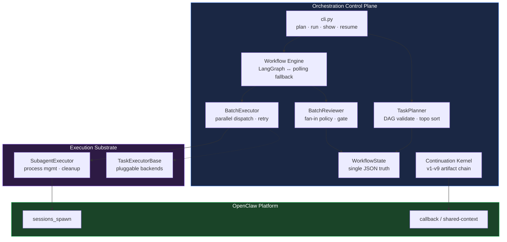
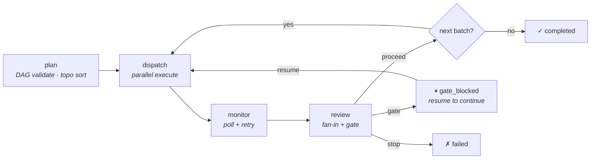

# OpenClaw Orchestration Control Plane

> **When an agent finishes a task, what happens next?**
> This repo makes the answer explicit, traceable, and safe — natively on OpenClaw.

[中文版](README_CN.md) · [Operations Guide](docs/OPERATIONS.md) · [Current Truth](docs/CURRENT_TRUTH.md)

---

## The Problem

Multi-agent systems rarely fail because the model can't answer a question. They fail because of **coordination gaps**:

| Gap | What Goes Wrong |
|-----|-----------------|
| **No explicit handoff** | Agent A finishes. Nobody tells Agent B. Work stalls silently. |
| **No fan-in** | 5 parallel tasks return mixed results. Proceed or stop? By what rule? |
| **No state continuity** | Process crashes. Where were we? What was done? How to resume? |
| **No safety gate** | Auto-dispatch without guardrails → runaway agents, wasted compute. |
| **No traceability** | Something went wrong. Can you trace the decision chain? |

These are not "nice to have" — they are the **reason most multi-agent automation stays in demo mode**.

---

## What This Repo Provides

An **orchestration control plane** for OpenClaw that makes task transitions explicit:

```
Task completes → Explicit contract → Fan-in review → Safety gate → Next dispatch
                     ↓
   (stopped_because / next_step / next_owner / readiness)
```

### Core Capabilities

| Capability | How It Works | Status |
|-----------|-------------|--------|
| **Batch DAG Planning** | Define task batches with `depends_on`. Kahn's algorithm validates DAG, topological sort determines execution order. | ✅ Production-tested |
| **Parallel Dispatch + Retry** | `BatchExecutor` dispatches tasks via `SubagentExecutor`, monitors completion, retries failed tasks (configurable `max_retries`). | ✅ Production-tested |
| **Fan-in Review** | `BatchReviewer` applies `all_success` / `any_success` / `majority` policy to determine batch outcome. | ✅ Production-tested |
| **Safety Gates** | Configurable gate conditions pause workflow for human review. Resume when ready. | ✅ Production-tested |
| **Single JSON Truth** | One `workflow_state_*.json` file per workflow — all batches, tasks, decisions, context. The only source of truth. | ✅ Production-tested |
| **LangGraph Integration** | Optional LangGraph StateGraph engine with SQLite checkpoint. Falls back to zero-dependency polling loop. | ✅ Production-tested |
| **Continuation Kernel** | 9-version incremental evolution: `registration → dispatch → spawn → execute → receipt → callback → auto-continue`. Full artifact linkage chain. | ✅ Production-tested |
| **Context Recovery** | `context_summary` auto-generated at each save. Resume from crash or context compression. | ✅ Production-tested |
| **Pluggable Executors** | `TaskExecutorBase` abstract interface — swap in HTTP workers, LangChain agents, or any custom backend. | ✅ Interface defined |

---

## Architecture



**Design principle:** OpenClaw holds the platform primitives (`sessions_spawn`, callbacks, shared-context). This repo holds the **orchestration logic** — batch DAG, fan-in, gates, state. External frameworks (LangGraph, etc.) only enter at the execution layer.

---

## How It Works

### Workflow Lifecycle



### State Machine

```
Workflow: pending → running → completed / failed / gate_blocked
                                              ↓ resume
                                           running
```

### Artifact Linkage (Continuation Kernel)

Every task execution maintains a traceable chain:

```
registration_id → dispatch_id → spawn_id → execution_id
    → receipt_id → request_id → consumed_id → api_execution_id
```

Any ID can be used to query the full chain — forward or backward.

---

## Quick Start

```bash
pip install langgraph langgraph-checkpoint-sqlite  # optional, recommended

# 1. Plan — validate DAG, create state file
python3 runtime/orchestrator/cli.py plan "Analyze codebase" config.json

# 2. Run — execute batches
python3 runtime/orchestrator/cli.py run workflow_state_wf_xxx.json --workspace /path/to/project

# 3. Monitor — check progress
python3 runtime/orchestrator/cli.py show workflow_state_wf_xxx.json

# 4. Resume — continue from gate or crash
python3 runtime/orchestrator/cli.py resume workflow_state_wf_xxx.json
```

### Example `config.json`

```json
[
  {
    "batch_id": "collect",
    "label": "Data Collection",
    "tasks": [
      {"task_id": "t1", "label": "Source A", "max_retries": 2},
      {"task_id": "t2", "label": "Source B"}
    ],
    "depends_on": [],
    "fan_in_policy": "any_success"
  },
  {
    "batch_id": "synthesize",
    "label": "Merge Results",
    "tasks": [{"task_id": "t3", "label": "Synthesize"}],
    "depends_on": ["collect"]
  }
]
```

---

## Onboarding a New Scenario

### Step 1: Define Your Workflow

Create a `config.json` with batch definitions. Each batch has:
- `batch_id` — unique identifier
- `tasks[]` — array of `{task_id, label}`, optional `executor` (default: `subagent`), optional `max_retries`
- `depends_on` — list of batch IDs this batch waits for (cycles are rejected)
- `fan_in_policy` — `all_success` (default) / `any_success` / `majority`

### Step 2: Provide a Runner Script

`SubagentExecutor` looks for `<workspace>/scripts/run_subagent_claude_v1.sh`. Arguments: `<task_prompt> <label>`.

### Step 3: Run and Iterate

```bash
python3 runtime/orchestrator/cli.py plan "Your goal" config.json
python3 runtime/orchestrator/cli.py run workflow_state_wf_xxx.json --workspace .
```

Start with simple 2-batch workflows. Validate artifacts. Add complexity gradually.

### For Callback-Driven Scenarios

If your scenario is callback-driven (like trading or channel roundtable):

1. Choose an adapter: `trading_roundtable`, `channel_roundtable`, or custom
2. Start with `allow_auto_dispatch=false`
3. Validate callback → ack → dispatch artifacts are stable
4. Then enable auto-continuation

---

## Positioning vs Other Frameworks

| Framework | What It Optimizes For | How We Relate |
|-----------|----------------------|---------------|
| **LangGraph** | General-purpose stateful agent graphs, checkpoints, interrupts | **Embedded** as our optional engine. We add batch DAG, fan-in, gates, and JSON truth on top. |
| **Deer-Flow** (ByteDance) | Research workflow: plan → research → report | Shared concept: `SubagentExecutor` design (task_id / timeout / status). We extend with full continuation kernel and quality gates. |
| **CrewAI / AutoGen** | Agent definition and conversation | We are the **control plane** — we decide *when and how* agents run, not *what* agents are. |
| **Temporal** | Durable workflows at enterprise scale | We are single-process + JSON checkpoint. No server cluster needed. Right-sized for OpenClaw. |
| **Google ADK** | Code-first agent toolkit | We focus on **orchestration** not **agent capability**. ADK agents can be task executors under our planner. |

**One line:** We are a **thin, opinionated control plane** for OpenClaw. LangGraph is an optional execution backend. Agents do the work; we orchestrate the transitions.

---

## Repository Structure

```
runtime/orchestrator/       # Core orchestration modules
├── cli.py                  # Unified CLI entry point
├── workflow_state.py       # Single JSON truth model
├── task_planner.py         # DAG validation + topological sort
├── batch_executor.py       # Parallel dispatch + retry
├── batch_reviewer.py       # Fan-in policy + gate conditions
├── workflow_graph.py       # LangGraph engine (SQLite checkpoint)
├── workflow_loop.py        # Zero-dependency polling fallback
├── subagent_executor.py    # Process management + cleanup
├── executor_interface.py   # Pluggable executor abstract interface
├── watchdog.py             # Stall detection + auto-resume
├── state_machine.py        # Per-task state (callback-driven core)
├── batch_aggregator.py     # Fan-in analysis
├── orchestrator.py         # Rule chain decision engine
├── auto_dispatch.py        # Policy-based auto-dispatch
├── completion_receipt.py   # Completion receipt + validator
├── sessions_spawn_*.py     # OpenClaw sessions_spawn integration
└── ...                     # Adapters, quality gates, artifacts

tests/orchestrator/         # Test suite (781 tests, all passing)
docs/                       # Operations guide, architecture docs
examples/                   # Sample configs and payloads
```

---

## Design Principles

1. **OpenClaw Native** — Built on `sessions_spawn`, callback, shared-context. Not a framework transplant.
2. **Incremental Evolution** — Each kernel version adds one capability. No big-bang rewrites.
3. **Callback-Driven First, DAG When Needed** — Simple scenarios use callbacks. Complex multi-batch workflows use `workflow_state`.
4. **Prove, Then Automate** — Start with `allow_auto_dispatch=false`. Validate. Then enable.
5. **Thin Bridge, Not Thick Platform** — We orchestrate the transitions. Agents do the work.

---

## Tests

```bash
PYTHONPATH=runtime/orchestrator:runtime/scripts python3 -m pytest tests/orchestrator/ -q
# 781 passed
```

---

## License

MIT
