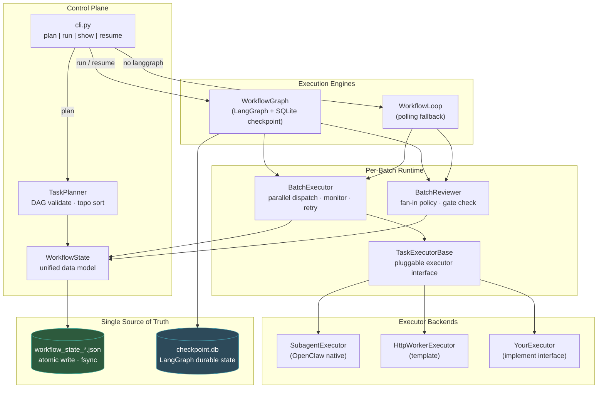
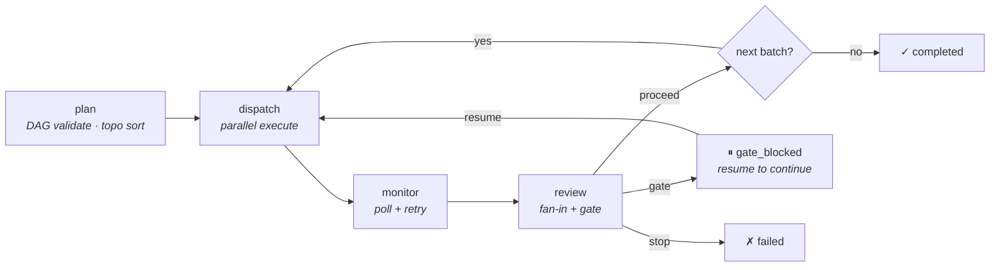
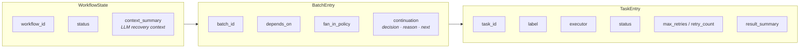
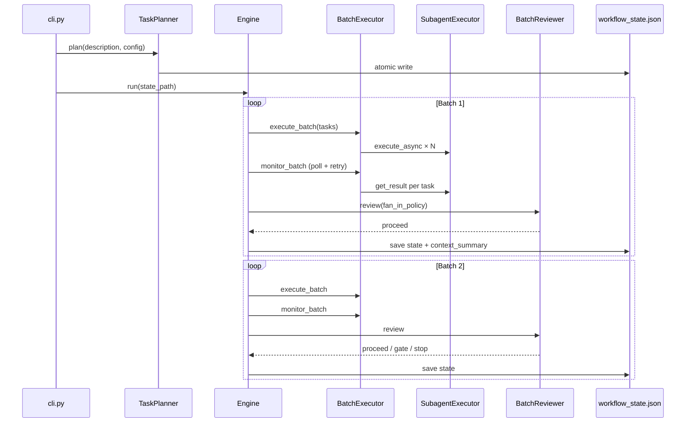

# OpenClaw Orchestration — Multi-Agent Batch DAG Control Plane

> **One CLI · One JSON truth · Batched DAG · Fan-in review · Gated continuation**

[中文版](README_CN.md) · [Operations Guide](docs/OPERATIONS.md)

---

## The Problem

When you use OpenClaw (Claude Code) with subagents, you face a coordination gap:

- **No batch control** — subagents run one-by-one or ad-hoc; no way to dispatch 5 tasks in parallel, wait for all/any/majority, then decide what's next.
- **No persistence** — if the process dies, you lose track of what ran, what succeeded, what to resume.
- **No policy** — no fan-in rules (all must pass? majority enough?), no gate checkpoints for human review, no retry strategy.
- **No DAG** — tasks have dependencies (B depends on A), but you manage order manually.

This project fills that gap with a **thin, opinionated control plane**.

---

## What This Is (and Isn't)

**IS:** A batch DAG orchestrator that sits **above** OpenClaw's subagent execution.

```
You define:   config.json (batches, tasks, dependencies, policies)
You run:      orchestrator-cli plan → run → show → resume
You get:      Parallel execution, fan-in review, gated continuation, crash recovery
```

**ISN'T:** An agent framework. We don't define agents, tools, or prompts. CrewAI, AutoGen, LangGraph define *what agents do*. We define *when they run, how results are collected, and what happens next*.

---

## Architecture



### Key Design Decisions

| Decision | Why |
|----------|-----|
| **JSON file as truth** | Human-readable, `git diff`-able, survives process crash. No database needed. |
| **Dual engine** | LangGraph (with SQLite checkpoint) when available; pure-Python polling loop as zero-dependency fallback. Same state file, same semantics. |
| **Pluggable executor** | `TaskExecutorBase` interface — swap SubagentExecutor for HTTP workers, LangChain agents, or anything that can start/poll. |
| **Fan-in as first-class** | `all_success`, `any_success`, `majority` — the reviewer decides per batch, not hardcoded. |
| **Gate = human checkpoint** | Heuristic triggers (e.g. `NEEDS_REVIEW` in output) pause the workflow. CLI `resume` continues. |

---

## Workflow Lifecycle



### State Machine

```
pending → running → completed
                  → failed
                  → gate_blocked → running (resume)
```

---

## Quick Start

```bash
pip install langgraph langgraph-checkpoint-sqlite  # optional but recommended

# 1. Plan — validate DAG, create state file
python3 runtime/orchestrator/cli.py plan "Analyze codebase" config.json

# 2. Run — execute all batches
python3 runtime/orchestrator/cli.py run workflow_state_wf_xxx.json --workspace /path/to/project

# 3. Check status
python3 runtime/orchestrator/cli.py show workflow_state_wf_xxx.json

# 4. Resume (if gate_blocked or recovering from crash)
python3 runtime/orchestrator/cli.py resume workflow_state_wf_xxx.json
```

---

## Data Model: `workflow_state.json`



One file. All state. Human-readable JSON with `fsync` for crash safety.

---

## Onboarding a New Scenario

### Step 1: Define `config.json`

```json
[
  {
    "batch_id": "collect",
    "label": "Data Collection",
    "tasks": [
      {"task_id": "t1", "label": "Source A", "max_retries": 2},
      {"task_id": "t2", "label": "Source B", "max_retries": 2}
    ],
    "depends_on": [],
    "fan_in_policy": "any_success"
  },
  {
    "batch_id": "synthesize",
    "label": "Merge Results",
    "tasks": [{"task_id": "t3", "label": "Synthesize findings"}],
    "depends_on": ["collect"],
    "fan_in_policy": "all_success"
  }
]
```

### Step 2: Provide a Runner Script

`SubagentExecutor` calls `<workspace>/scripts/run_subagent_claude_v1.sh <task_prompt> <label>`. This is your execution backend — it receives the task, runs the agent, returns JSON result.

### Step 3: Customize Policies (Optional)

- **Fan-in per batch**: `all_success` (default), `any_success`, `majority`
- **Gate conditions**: Override `BatchReviewer._check_gate_conditions` for custom approval triggers
- **Retry**: Set `max_retries` per task for automatic retry on failure
- **Custom executor**: Implement `TaskExecutorBase` for non-subagent backends

### Step 4: Run

```bash
python3 runtime/orchestrator/cli.py plan "My workflow" config.json
python3 runtime/orchestrator/cli.py run workflow_state_wf_xxx.json --workspace ./my-project
```

---

## Positioning vs Other Frameworks

| Framework | Focus | How We Differ |
|-----------|-------|---------------|
| **LangGraph** | General stateful agent graphs | We **embed** LangGraph as one engine; we add batch DAG semantics, fan-in policies, and file-based truth on top |
| **Deer-Flow** | Research workflow: plan → research → report | Shared concept: `SubagentExecutor` design. We extend with configurable fan-in, retry, and gate policies |
| **CrewAI** | Role-based agent teams | We are a **control plane**, not an agent definition framework |
| **AutoGen / AG2** | Conversational multi-agent protocols | We orchestrate **batched parallel workers**, not message-passing conversations |
| **Temporal** | Durable workflow engine at scale | We are **single-process + JSON checkpoint** — no server cluster needed |
| **Google ADK** | Code-first agent toolkit | We focus on **when and how to dispatch**, not agent capabilities. ADK agents could run under our executor |

**Summary:** We are a thin, opinionated batch DAG control plane. Other frameworks define what agents *are*. We define how agents *coordinate*.

---

## Two-Batch Execution Sequence



---

## Crash Recovery

```bash
# See where it stopped
python3 runtime/orchestrator/cli.py show workflow_state_wf_xxx.json

# Resume from exactly where it left off
python3 runtime/orchestrator/cli.py resume workflow_state_wf_xxx.json
```

- **JSON state** survives any crash (atomic write + fsync)
- **LangGraph checkpoint** (SQLite) survives process restart
- **Watchdog** (`watchdog.py`) can auto-detect stalled workflows and mark them for resume

---

## Repository Structure

| Directory | Purpose | Status |
|-----------|---------|--------|
| `runtime/orchestrator/` | **v2 core** — workflow state, planner, executors, engines, CLI | Active |
| `tests/orchestrator/` | Test suite (781 tests, all passing) | Active |
| `docs/` | Operations guide, architecture docs | Active |
| `examples/` | Sample configs and payloads | Active |
| `schemas/` | JSON schemas for contracts | Active |
| `scripts/` | Helper scripts, runner entry point | Active |
| `plugins/` | OpenClaw plugins (e.g. human-gate) | Active |
| `archive/` | Historical POCs and old docs | Archived |
| `orchestration_runtime/` | v1 runtime (deprecated) | Deprecated |

### v2 Core Files (the Main Chain)

```
runtime/orchestrator/
├── workflow_state.py      # Unified data model (WorkflowState, BatchEntry, TaskEntry)
├── task_planner.py        # DAG validation, topological sort, state file creation
├── batch_executor.py      # Parallel task dispatch, monitoring, retry logic
├── batch_reviewer.py      # Fan-in evaluation (all/any/majority) + gate conditions
├── workflow_graph.py      # LangGraph engine with SQLite checkpoint
├── workflow_loop.py       # Polling fallback engine (zero dependencies)
├── subagent_executor.py   # OpenClaw subagent process management
├── executor_interface.py  # Pluggable executor abstract base
├── watchdog.py            # Stall detection and auto-resume marking
└── cli.py                 # Unified CLI entry point
```

---

## License

MIT. This repository is the OpenClaw company orchestration monorepo.
