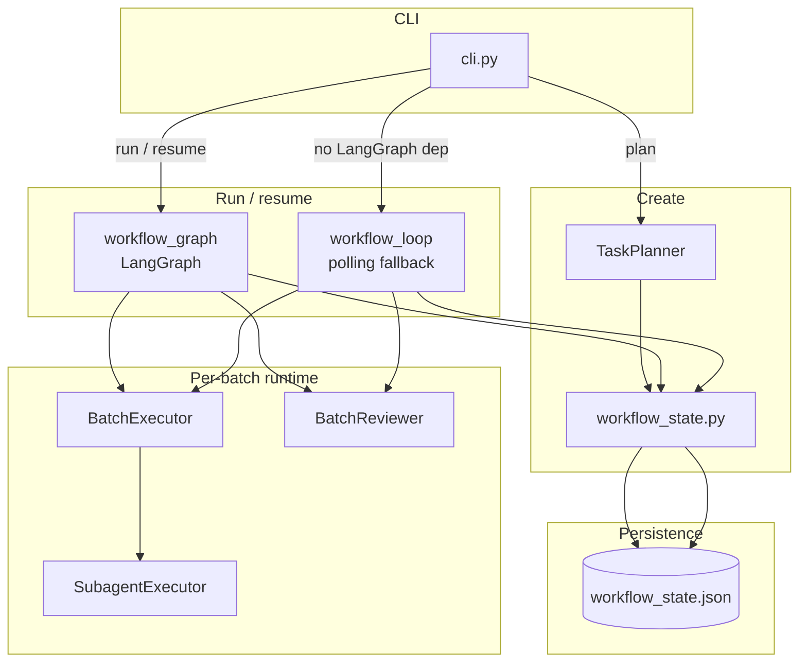
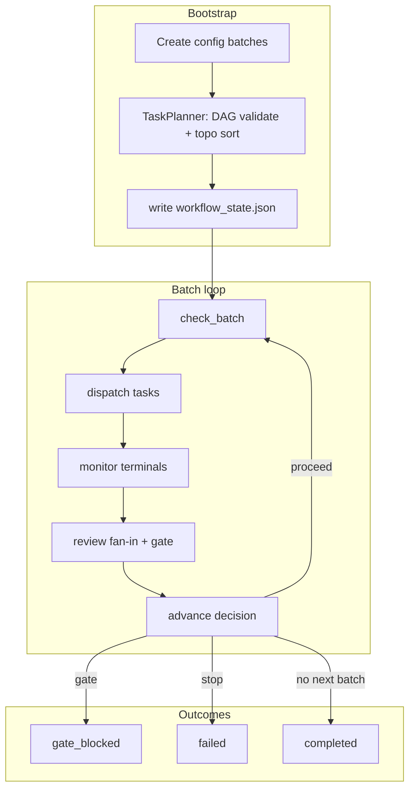
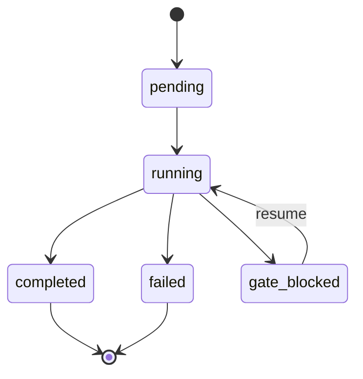
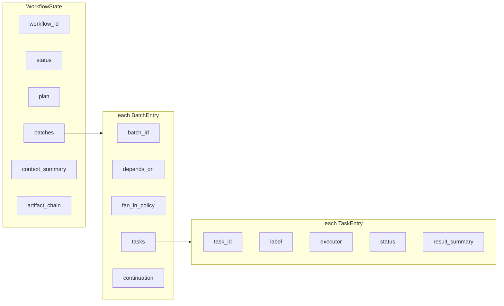
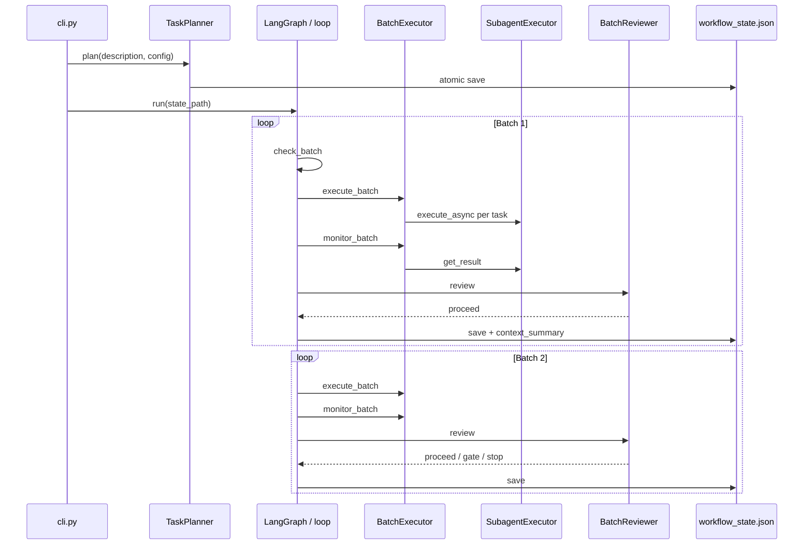

# OpenClaw Company Orchestration — Multi-Agent Workflow Control Plane

> **One CLI**, **one JSON state file**, **batched parallel tasks**, **fan-in review**, **automatic or gated continuation**. LangGraph when available; polling loop otherwise.

[中文版 README](README_CN.md) · [Operations](docs/OPERATIONS.md) · [Current truth](docs/CURRENT_TRUTH.md)

---

## What This Is

A **control-plane** orchestrator for OpenClaw-style multi-agent work:

1. **Plan** — Validate batch DAG (`depends_on`), topological sort, emit `workflow_state_*.json`.
2. **Execute** — Per batch, dispatch parallel tasks via `SubagentExecutor` (subprocess / runner script).
3. **Review** — Apply `fan_in_policy` (`all_success` | `any_success` | `majority`) and optional **gate** heuristics.
4. **Advance** — `proceed` (next batch), `gate` (pause for human), or `stop` (workflow failed).

OpenClaw keeps policy, channels, and spawn semantics; this runtime is the **batch DAG + persistence + continuation** layer.

---

## Quick Start

```bash
python3 runtime/orchestrator/cli.py plan "My goal" config.json
python3 runtime/orchestrator/cli.py run workflow_state_wf_xxx.json --workspace /path/to/workspace
python3 runtime/orchestrator/cli.py show workflow_state_wf_xxx.json
python3 runtime/orchestrator/cli.py resume workflow_state_wf_xxx.json
```

- **`run`** uses **`workflow_graph.py` (LangGraph)** if `langgraph` is importable; else **`workflow_loop.py`** (poll + sleep). Same state file and semantics.

---

## 1. Architecture Overview



---

## 2. Workflow Lifecycle



---

## 3. WorkflowState Machine

Workflow-level status in `workflow_state.py`:



---

## 4. `workflow_state.json` Data Shape



`plan` holds `total_batches`, `current_batch_index`, `description`. `continuation` stores `ContinuationDecision`: `decision` ∈ `proceed` | `gate` | `stop`, `stopped_because`, `next_batch`, `decided_at`.

---

## 5. Typical Two-Batch Execution (Sequence)



---

## 6. Positioning vs Other Frameworks

| Framework | What it optimizes for | This repo |
|-----------|----------------------|-----------|
| **LangGraph** | General stateful graphs, checkpoints, interrupts | **Embedded** as Engine A; we define **batch / fan-in / gate** semantics and **JSON** as source of truth |
| **CrewAI** | Role-based crews, high-level agent teams | **File-backed control plane** + subprocess execution; no crew/role DSL |
| **AutoGen / AG2** | Conversational multi-agent protocols | **Batch DAG + policies** over **spawned workers**, not message-centric agents |
| **Temporal** | Durable workflows, workers, retries at scale | **Single-process** orchestrator + **JSON checkpoint**; no Temporal server/cluster |
| **Dify** | Low-code apps, RAG, chat flows | **Code-first** OpenClaw integration; not a visual app builder |

**Summary:** We are a **thin, opinionated control plane** (batches, fan-in, gates, one state file) that can **ride LangGraph** for graph execution or **degrade** to a simple loop.

---

## 7. Onboarding a New Scenario

1. **`config.json`** — Array of batch objects:
   - `batch_id`, `label`, `tasks[]` with `task_id`, `label`, optional `executor` (default `subagent`)
   - `depends_on`: list of prior `batch_id` (DAG; cycles rejected)
2. **`fan_in_policy`** per batch: `all_success` (default), `any_success`, `majority`
3. **Gate (optional)** — Extend `BatchReviewer._check_gate_conditions` (default: substring `NEEDS_REVIEW` in `result_summary` triggers `gate`)
4. **Runner** — `SubagentExecutor` expects `<workspace>/scripts/run_subagent_claude_v1.sh` (arguments: task prompt, label). If missing, a **simulated** `python -c print(...)` runs (for tests)

Then: `plan` → `run` with `--workspace` pointing at the tree that contains `scripts/`.

---

## 8. Known Gaps (vs Mature Orchestrators)

| Area | Today | Typical gap vs LangGraph / CrewAI / Temporal |
|------|--------|-----------------------------------------------|
| **Checkpointing** | LangGraph `MemorySaver` in-process | No distributed / DB-backed graph store |
| **Retries & sagas** | Task failures → batch review → `stop` | No automatic retry policies, compensations |
| **Scale-out** | Single orchestrator process | No worker pool / queue integration |
| **Observability** | Logs + JSON file | No first-class traces/metrics UI |
| **Agent abstraction** | Task = label string + executor | No built-in role/crew/tool schemas |
| **Human-in-the-loop** | Gate + `resume` CLI | No rich approval UI or SLA timers |
| **Versioning** | Implicit in repo | No workflow definition registry / migration |

These are intentional **thin-plane** tradeoffs; closing them is product/engineering follow-up.

---

## Example `config.json`

```json
[
  {
    "batch_id": "b0",
    "label": "Collect",
    "tasks": [
      {"task_id": "t1", "label": "Source A"},
      {"task_id": "t2", "label": "Source B"}
    ],
    "depends_on": []
  },
  {
    "batch_id": "b1",
    "label": "Synthesize",
    "tasks": [{"task_id": "t3", "label": "Merge findings"}],
    "depends_on": ["b0"],
    "fan_in_policy": "all_success"
  }
]
```

---

## References

- **State model:** `runtime/orchestrator/workflow_state.py`
- **Engines:** `workflow_graph.py`, `workflow_loop.py`
- **Planning:** `task_planner.py`
- **Execution / review:** `batch_executor.py`, `batch_reviewer.py`, `subagent_executor.py`
- **CLI:** `runtime/orchestrator/cli.py`

---

## License / Monorepo Note

This repository is the **OpenClaw company orchestration** monorepo (`docs/`, `runtime/`, `tests/`). See `docs/CURRENT_TRUTH.md` for the live boundary of what is “default main chain” vs historical docs.
