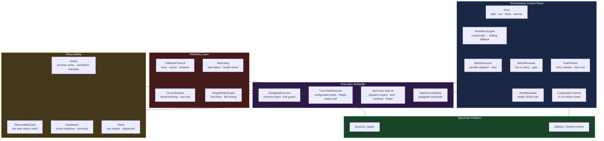
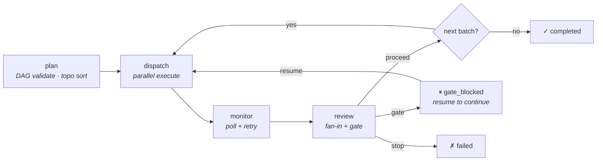

# OpenClaw Orchestration Control Plane

> **When an agent finishes a task, what happens next?**
> This repo makes the answer explicit, traceable, and safe — natively on OpenClaw.

[中文版](README_CN.md) · [Operations Guide](docs/OPERATIONS.md) · [Current Truth](docs/CURRENT_TRUTH.md)

---

## The Problem

Multi-agent systems rarely fail because the model can't answer a question. They fail because of **coordination gaps**:

| Gap | What Goes Wrong |
|-----|-----------------|
| **No explicit handoff** | Agent A finishes. Nobody tells Agent B. Work stalls silently. |
| **No fan-in** | 5 parallel tasks return mixed results. Proceed or stop? By what rule? |
| **No state continuity** | Process crashes. Where were we? What was done? How to resume? |
| **No safety gate** | Auto-dispatch without guardrails → runaway agents, wasted compute. |
| **No traceability** | Something went wrong. Can you trace the decision chain? |

These are not "nice to have" — they are the **reason most multi-agent automation stays in demo mode**.

---

## What This Repo Provides

An **orchestration control plane** for OpenClaw that makes task transitions explicit:

```
Task completes → Explicit contract → Fan-in review → Safety gate → Next dispatch
                     ↓
   (stopped_because / next_step / next_owner / readiness)
```

### Core Capabilities

| Capability | How It Works | Status |
|-----------|-------------|--------|
| **Batch DAG Planning** | Define task batches with `depends_on`. Kahn's algorithm validates DAG, topological sort determines execution order. | ✅ Production-tested |
| **Parallel Dispatch + Retry** | `BatchExecutor` dispatches tasks via `SubagentExecutor`, monitors completion, retries failed tasks (configurable `max_retries`). | ✅ Production-tested |
| **Fan-in Review** | `BatchReviewer` applies `all_success` / `any_success` / `majority` policy to determine batch outcome. | ✅ Production-tested |
| **Safety Gates** | Configurable gate conditions pause workflow for human review. Resume when ready. | ✅ Production-tested |
| **Single JSON Truth** | One `workflow_state_*.json` file per workflow — all batches, tasks, decisions, context. The only source of truth. | ✅ Production-tested |
| **LangGraph Integration** | Optional LangGraph StateGraph engine with SQLite checkpoint. Falls back to zero-dependency polling loop. | ✅ Production-tested |
| **Continuation Kernel** | 9-version incremental evolution: `registration → dispatch → spawn → execute → receipt → callback → auto-continue`. Full artifact linkage chain. | ✅ Production-tested |
| **Context Recovery** | `context_summary` auto-generated at each save. Resume from crash or context compression. | ✅ Production-tested |
| **Pluggable Executors** | `TaskExecutorBase` abstract interface — swap in HTTP workers, LangChain agents, or any custom backend. | ✅ Interface defined |
| **Hooks System** | Three-mode enforcement hooks (audit/warn/enforce): promise verification, completion translation. | ✅ Production-tested |
| **Alerts & Observability** | Rule-based alerting with audit trail, observability cards, dashboard rendering. | ✅ Production-tested |
| **Denial Circuit Breaker** | Track consecutive (3) and total (20) failures per dispatch target; auto-trip to prevent runaway retries. | ✅ Implemented |

---

## Architecture



**Design principle:** OpenClaw holds the platform primitives (`sessions_spawn`, callbacks, shared-context). This repo holds the **orchestration logic** — batch DAG, fan-in, gates, state. External frameworks (LangGraph, etc.) only enter at the execution layer.

---

## Dispatch Engine (`start-tmux-task.sh`)

The generic task dispatch engine. Creates tmux sessions with Claude Code, manages lifecycle from launch to completion. Project-specific wrappers set `OPENCLAW_SESSION_PREFIX` and default directories, then `exec` this script.

```bash
start-tmux-task.sh --label <name> --workdir <dir> --task <prompt> \
  [--type <type>] [--model <model>] [--auto-exit] [--no-ralph] [--no-worktree]
```

| Capability | Implementation |
|-----------|---------------|
| **Concurrency lock** | `mkdir`-based atomic lock serializes session creation; prevents exceeding `MAX_SESSIONS`. 60s stale lock recovery. |
| **Results dedup** | Checks `results/{session}.json/.txt` before dispatch; skips already-completed tasks. |
| **Ralph init** | Enables persistent execution by default (`--no-ralph` to disable). Graceful degradation if `ralph-init.sh` not found or fails. |
| **Worktree isolation** | Auto-creates git worktree for coding tasks (`bugfix/feat/crash/comp/fix`). Branch name saved to `.openclaw-branch` metadata for cleanup. |
| **Auto-exit** | `--auto-exit` writes a marker file; `on-stop.sh` sends `/exit` via tmux after Ralph allows stop. For unattended cron/orchestrator dispatches. |
| **Hooks integration** | Exports `NC_SESSION` + `NC_PROJECT_DIR`; passes `--name` to Claude CLI. All Stop/SessionEnd hooks fire correctly. |
| **Atomic state files** | State + progress files written via `tmp+mv` (Pattern 6). |
| **Configurable prefix** | `OPENCLAW_SESSION_PREFIX` env var (default: `oc`). Session names: `{prefix}-{label}`. |

### TmuxTaskExecutor (Python)

`TmuxTaskExecutor` is the orchestrator's interface to the dispatch engine:

```python
executor = TmuxTaskExecutor(workspace_dir="/path/to/project", timeout_seconds=3600)
handle = executor.execute(task_id="t1", label="Review", context={"type": "review", "prompt": "..."})
result = executor.poll(handle)  # checks progress file + Ralph state
```

- `poll()` detects completion via `phase: idle-waiting-input` in progress file, but guards against Ralph-active false positives
- Session prefix configurable via `OPENCLAW_SESSION_PREFIX` (default: `oc`)
- 60s subprocess timeout for dispatch (covers lock wait + CC init)

---

## How It Works

### Workflow Lifecycle



### State Machine

```
Workflow: pending → running → completed / failed / gate_blocked / timed_out / stalled_unrecoverable
                                              ↓ resume
                                           running
```

`stalled_unrecoverable` is set by the watchdog when a workflow stalls >3 times after automatic resume attempts.

### Artifact Linkage (Continuation Kernel)

Every task execution maintains a traceable chain:

```
registration_id → dispatch_id → spawn_id → execution_id
    → receipt_id → request_id → consumed_id → api_execution_id
```

Any ID can be used to query the full chain — forward or backward.

---

## Quick Start

```bash
pip install langgraph langgraph-checkpoint-sqlite  # optional, recommended

# 1. Plan — validate DAG, create state file
python3 runtime/orchestrator/cli.py plan "Analyze codebase" config.json

# 2. Run — execute batches
python3 runtime/orchestrator/cli.py run workflow_state_wf_xxx.json --workspace /path/to/project

# 3. Monitor — check progress
python3 runtime/orchestrator/cli.py show workflow_state_wf_xxx.json

# 4. Resume — continue from gate or crash
python3 runtime/orchestrator/cli.py resume workflow_state_wf_xxx.json
```

### Example `config.json`

```json
[
  {
    "batch_id": "collect",
    "label": "Data Collection",
    "tasks": [
      {"task_id": "t1", "label": "Source A", "max_retries": 2},
      {"task_id": "t2", "label": "Source B"}
    ],
    "depends_on": [],
    "fan_in_policy": "any_success"
  },
  {
    "batch_id": "synthesize",
    "label": "Merge Results",
    "tasks": [{"task_id": "t3", "label": "Synthesize"}],
    "depends_on": ["collect"]
  }
]
```

---

## Product Entry: Onboard + Run + Status

**For channel operators and agents: three simple commands, zero mental overhead.**

| Command | Purpose | One-liner |
|---------|---------|-----------|
| `onboard` | Generate channel onboarding recommendation | "How do I onboard this channel?" |
| `run` | Trigger execution | "Run a task for me" |
| `status` | View status overview | "What's the current progress?" |

```bash
python3 runtime/scripts/orch_product.py onboard
python3 runtime/scripts/orch_product.py run --task "Your task description" --workdir /path/to/workdir
python3 runtime/scripts/orch_product.py status
```

**Full documentation:** [docs/orch_product_guide.md](docs/orch_product_guide.md)

---

## Reliability & Hardening

The control plane incorporates patterns from Claude Code's execution harness architecture:

| Mechanism | What It Does |
|-----------|-------------|
| **Atomic Writes** | All state files use `tempfile + os.fsync + os.replace` — crash mid-write leaves the previous file intact. Shared via `utils/io.py`. |
| **File-Level Locking** | `subagent_executor` uses `fcntl.flock` to prevent concurrent read-modify-write races on state files. |
| **Denial Circuit Breaker** | Tracks consecutive (3) and total (20) failures per dispatch target. When tripped, the target is skipped and an alternative strategy is recommended. |
| **Watchdog Health Checks** | Unified `full_health_check()` combines workflow stall detection, dead process reconciliation, orphan completion recovery, and queued task stall detection. |
| **Orphan Completion Recovery** | `reconcile_orphan_completions()` detects tasks whose process exited but state still shows "running" — prevents silent task loss. |
| **Fork Bomb Prevention** | Three-layer guard in `SubagentExecutor`: (1) `OPENCLAW_SPAWN_DEPTH` env var, (2) system-wide `pgrep` process count, (3) `threading.Semaphore`. |
| **Subprocess Timeouts** | All synchronous `subprocess.run()` calls have explicit timeouts (60s for dispatch, 30s for kill-session, 5s for capture-pane). |
| **UTC Timestamps** | All modules use `datetime.now(timezone.utc)` for consistent cross-process timestamp ordering. |
| **Dispatch Concurrency Lock** | `mkdir`-based atomic lock in `start-tmux-task.sh` serializes session creation to prevent exceeding `MAX_SESSIONS`. 60s stale lock auto-recovery. |
| **Auto-Exit for Unattended Sessions** | `--auto-exit` marker file + `on-stop.sh` integration. Ralph-aware: only fires after Ralph allows stop. Prevents zombie sessions from cron/orchestrator dispatches. |
| **Batch Timeout Cleanup** | `batch_executor` now cancels running executors before marking tasks as `timed_out`, preventing orphaned tmux sessions. |
| **Retry Semantics** | `max_retries=0` correctly means "no retries" (not "use default"). `-1` or omitted means "use default" (3). |
| **Main Loop Crash Recovery** | `workflow_loop` wraps the main loop in `try-except`; unhandled exceptions set `status=failed` and persist state before exiting. |
| **Single Writer Guard** | `fcntl.flock`-based file locking with 5-minute timeout, reentrant for same writer. |

---

## Hooks System

Three-mode behavioral enforcement hooks that constrain agent behavior at the control plane level:

| Hook | Purpose | Modes |
|------|---------|-------|
| **PostPromiseVerifyHook** | Verifies that when an agent claims a task is "in progress", there is a real execution anchor (dispatch_id, session_id, tmux_session). | audit / warn / enforce |
| **PostCompletionTranslateHook** | Forces agents to produce human-readable completion reports after subtask completion. Required sections: conclusion, evidence, action. | audit / warn / enforce |

Configure modes via `OPENCLAW_HOOK_ENFORCE_MODE` (default: `audit`) and per-hook overrides via `OPENCLAW_HOOK_PER_HOOK_MODES` JSON env var.

---

## Unified Execution Runtime

> Single entry point for task execution — automatic backend selection (tmux/subagent).

```python
from unified_execution_runtime import run_task

result = run_task(
    task_description="Refactor auth module, estimated 1 hour",
    workdir="/path/to/workdir",
)
print(f"Backend: {result.backend}, Session: {result.session_id}")
```

### Backend Selection Logic

```
Task → Explicit backend_preference? → Yes → Use it
                  ↓ No
         backend_selector.recommend()
                  ↓
    ┌─────────────┴─────────────┐
    │                           │
Long task (>30min)          Short task (≤30min)
Requires monitoring         Documentation
Coding keywords             ↓
↓                           subagent
tmux
```

### Documentation

- [Design Document](docs/design/unified_execution_runtime_design.md)
- [Backend Selection Guide](docs/BACKEND_SELECTION_GUIDE.md)

---

## Onboarding a New Scenario

### Step 1: Define Your Workflow

Create a `config.json` with batch definitions. Each batch has:
- `batch_id` — unique identifier
- `tasks[]` — array of `{task_id, label}`, optional `executor` (default: `subagent`), optional `max_retries`
- `depends_on` — list of batch IDs this batch waits for (cycles are rejected)
- `fan_in_policy` — `all_success` (default) / `any_success` / `majority`

### Step 2: Install and Configure Runner

```bash
npm install -g @anthropic-ai/claude-code
claude --version
# Runner script: scripts/run_subagent_claude_v1.sh (auto-detects Claude CLI)
```

### Step 3: Run and Iterate

```bash
python3 runtime/orchestrator/cli.py plan "Your goal" config.json
python3 runtime/orchestrator/cli.py run workflow_state_wf_xxx.json --workspace .
```

### For Callback-Driven Scenarios

1. Choose an adapter: `trading_roundtable`, `channel_roundtable`, or custom
2. Start with `allow_auto_dispatch=false`
3. Validate callback → ack → dispatch artifacts are stable
4. Then enable auto-continuation

---

## Positioning vs Other Frameworks

| Framework | What It Optimizes For | How We Relate |
|-----------|----------------------|---------------|
| **LangGraph** | General-purpose stateful agent graphs, checkpoints, interrupts | **Embedded** as our optional engine. We add batch DAG, fan-in, gates, and JSON truth on top. |
| **Deer-Flow** (ByteDance) | Research workflow: plan → research → report | Shared concept: `SubagentExecutor` design. We extend with full continuation kernel and quality gates. |
| **CrewAI / AutoGen** | Agent definition and conversation | We are the **control plane** — we decide *when and how* agents run, not *what* agents are. |
| **Temporal** | Durable workflows at enterprise scale | We are single-process + JSON checkpoint. No server cluster needed. Right-sized for OpenClaw. |
| **Google ADK** | Code-first agent toolkit | We focus on **orchestration** not **agent capability**. ADK agents can be task executors under our planner. |

**One line:** We are a **thin, opinionated control plane** for OpenClaw. LangGraph is an optional execution backend. Agents do the work; we orchestrate the transitions.

---

## Repository Structure

```
runtime/orchestrator/           # Core orchestration modules (90+ files)
├── cli.py                      # Unified CLI entry point
├── workflow_state.py           # Single JSON truth model
├── workflow_state_store.py     # Thread-safe singleton state access
├── workflow_loop.py            # Zero-dependency polling fallback
├── workflow_graph.py           # LangGraph engine (SQLite checkpoint)
├── task_planner.py             # DAG validation + topological sort
├── batch_executor.py           # Parallel dispatch + retry
├── batch_reviewer.py           # Fan-in policy + gate conditions
├── batch_aggregator.py         # Fan-in analysis
├── orchestrator.py             # Rule chain decision engine
├── contracts.py                # Canonical callback envelope + task tiers
├── core/                       # Core abstractions
│   ├── types.py                # Shared types (GateResult, FanOutMode, FanInMode)
│   ├── phase_engine.py         # Phase state machine
│   ├── task_registry.py        # Multi-index in-memory task registry
│   ├── callback_router.py      # Priority-based callback routing
│   ├── dispatch_planner.py     # Backend selection + dispatch planning
│   ├── fanout_controller.py    # Fan-out/fan-in controller
│   ├── quality_gate.py         # Quality gate evaluator
│   └── handoff_schema.py       # Planning-to-execution handoff
├── hooks/                      # Behavioral enforcement hooks
│   ├── hook_config.py          # Three-mode config (audit/warn/enforce)
│   ├── hook_exceptions.py      # HookViolationError
│   ├── hook_integrations.py    # Integration points
│   ├── post_promise_verify_hook.py   # "Empty promise" detection
│   └── post_completion_translate_hook.py  # Human-readable report enforcement
├── utils/                      # Shared utilities
│   ├── io.py                   # Atomic file writes (fsync + replace)
│   └── time.py                 # Unified UTC timestamps
├── alerts/                     # Alert system
│   └── trading_alert_sender.py # Trading-specific alert delivery
├── alert_audit.py              # Alert audit logging
├── alert_dispatcher.py         # Alert routing and dispatch
├── alert_rules.py              # Alert rule definitions
├── adapters/                   # Domain-specific adapters
│   ├── base.py                 # Base adapter interface
│   └── trading.py              # Trading scenario adapter
├── trading/                    # Trading domain modules
│   ├── schemas.py              # Trading data schemas
│   ├── callback_validator.py   # Trading callback validation
│   └── simulation_adapter.py   # Trading simulation
├── subagent_executor.py        # Process management + fork bomb prevention
├── subagent_state.py           # Subagent state persistence
├── executor_interface.py       # Pluggable executor abstract interface
├── tmux_executor.py            # Tmux session executor
├── tmux_status_sync.py         # Tmux status synchronization
├── tmux_terminal_receipts.py   # Tmux terminal receipts
├── auto_dispatch.py            # Policy-based auto-dispatch
├── bridge_consumer.py          # Callback consumption engine
├── completion_receipt.py       # Completion receipt generation
├── completion_validator.py     # Completion quality gate kernel
├── completion_validator_rules.py  # Through/Block/Gate scoring rules
├── fallback_protocol.py        # Retry/cancel/closeout + circuit breaker
├── retry_cancel_contract.py    # Unified retry/cancel semantics
├── single_writer_guard.py      # File-level locking (fcntl.flock)
├── watchdog.py                 # Stall detection + unified health checks
├── state_machine.py            # Per-task state (callback-driven core)
├── lineage.py                  # Task lineage tracking
├── observability_card.py       # Observability card CRUD
├── dashboard.py                # Dashboard rendering
├── telemetry.py                # Telemetry/metrics
├── unified_execution_runtime.py  # Single entry point for task execution
├── run_task.py                 # Task runner entry point
├── sessions_spawn_bridge.py    # Session spawn bridge
├── sessions_spawn_request.py   # Session spawn request handling
├── spawn_closure.py            # v4 continuation: dispatch → spawn
├── spawn_execution.py          # v5 continuation: spawn → execution
├── closeout_*.py               # Closeout lifecycle (5 modules)
├── completion_*.py             # Completion handling (5 modules)
├── *_roundtable.py             # Roundtable coordination (trading/channel)
└── ...                         # Planning, continuation, entry defaults

runtime/scripts/                # CLI scripts and bridges
tests/orchestrator/             # Test suite (885 tests)
runtime/tests/orchestrator/     # Additional runtime tests
docs/                           # Operations guide, architecture docs
examples/                       # Sample configs and payloads
schemas/                        # JSON schemas
plugins/                        # Plugin modules (human-gate-message)
```

---

## Design Principles

1. **OpenClaw Native** — Built on `sessions_spawn`, callback, shared-context. Not a framework transplant.
2. **Incremental Evolution** — Each kernel version adds one capability. No big-bang rewrites.
3. **Callback-Driven First, DAG When Needed** — Simple scenarios use callbacks. Complex multi-batch workflows use `workflow_state`.
4. **Prove, Then Automate** — Start with `allow_auto_dispatch=false`. Validate. Then enable.
5. **Thin Bridge, Not Thick Platform** — We orchestrate the transitions. Agents do the work.
6. **Fail-Closed Defaults** — Atomic writes, file locking, UTC timestamps, subprocess timeouts. Safety by default, not by opt-in.

---

## Tests

```bash
PYTHONPATH=runtime/orchestrator python3 -m pytest tests/orchestrator/ -q
# 885 tests
```

---

## Observability

- **Status Cards**: Per-task observability cards with real-time progress tracking
- **Unified Index**: Query by owner/scenario
- **Task Board**: Dashboard grouped by stage
- **tmux Integration**: Auto-register tmux sessions to observability index
- **Behavioral Hooks**: "Promise-then-verify" hooks prevent empty promises

```bash
# List all tasks
python3 scripts/sync-tmux-observability.py list

# Generate task board snapshot
python3 -c "
from observability_card import generate_board_snapshot
import json
print(json.dumps(generate_board_snapshot()['summary'], indent=2))
"
```

### Documentation

- [Observability Setup Guide](docs/OBSERVABILITY_SETUP_GUIDE.md)
- [Observability Design](docs/observability-transparency-design-2026-03-28.md)
- [tmux Integration Guide](docs/tmux-integration-guide.md)

---

## License

MIT
