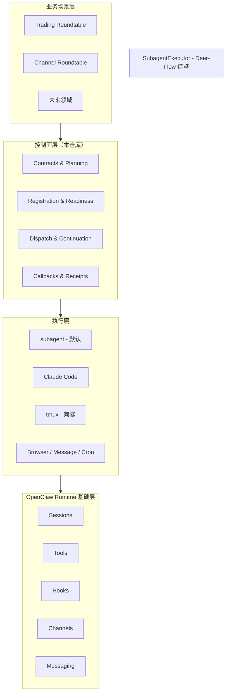
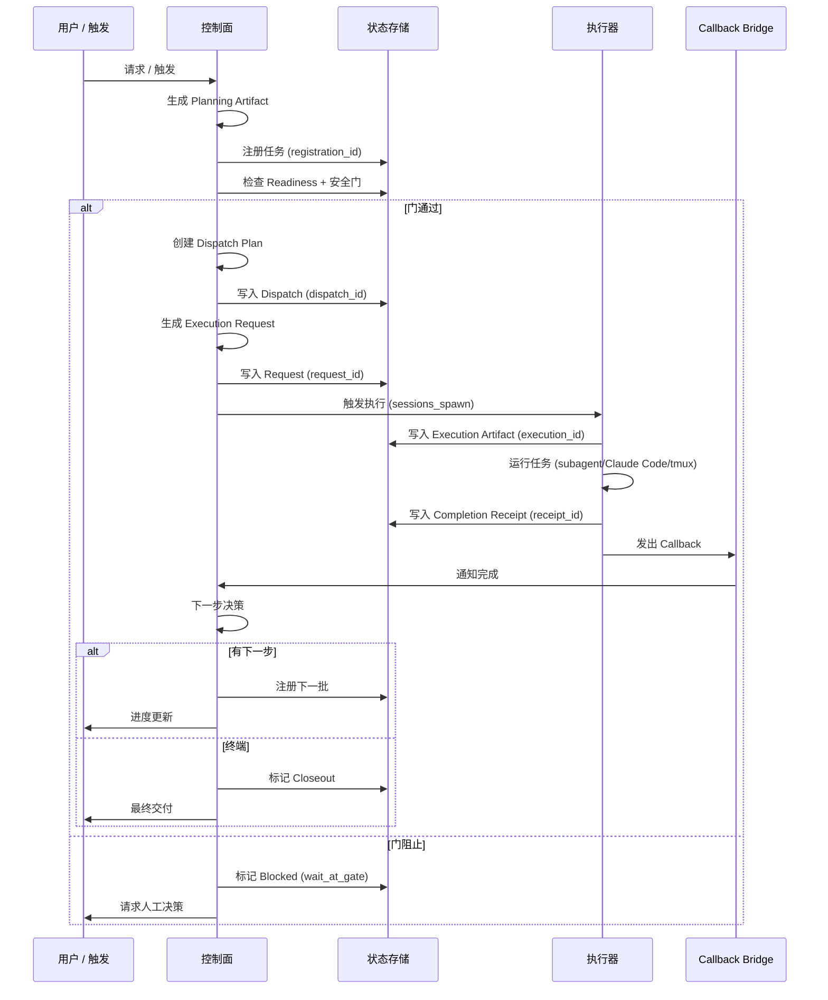

# OpenClaw Orchestration Control Plane

> **OpenClaw 多 Agent 工作流编排的统一控制面 —— 足够薄以便迭代，足够结构化以便依赖。**
>
> **一句话定位：** 当一个任务完成后，系统如何知道下一步该做什么——并且安全地继续推进？这个仓库让这些过渡变得显式。
>
> **默认后端：** `subagent` | **兼容后端：** `tmux` | **首个验证场景：** `trading_roundtable` continuation
>
> **当前成熟度：** safe semi-auto / thin bridge / trading continuation 生产验证

---

## 目录

1. [仓库是什么](#仓库是什么)
2. [核心问题（以及为什么难）](#核心问题以及为什么难)
3. [为什么不能只靠 Prompt / Subagent / Callback](#为什么不能只靠-prompt--subagent--callback)
4. [系统边界](#系统边界)
5. [核心概念](#核心概念)
6. [架构分层](#架构分层)
7. [为什么不直接用 Temporal / LangGraph / DAG Engine](#为什么不直接用-temporal--langgraph--dag-engine)
8. [当前成熟度](#当前成熟度)
9. [典型场景](#典型场景)
10. [快速开始](#快速开始)
11. [仓库导航](#仓库导航)
12. [分支治理](#分支治理)
13. [测试与验证](#测试与验证)
14. [路线图](#路线图)
15. [为什么值得关注](#为什么值得关注)

---

## 仓库是什么

### 一句话定位

**这是一个构建在 OpenClaw 之上的工作流控制层：默认执行走 subagent，兼容保留 tmux，trading 是第一个真实验证场景，外部框架只进叶子层。**

### 完整定位

这**不是**另一个 workflow engine 的 wrapper。这是一个 **Agent 交接的控制面** —— 决定任务完成后下一步怎么走，并确保这个决策是显式的、可追溯的、安全的。

真实的多 Agent 系统很少因为"模型无法回答"而失败。它们失败是因为：
- 一个任务结束了，但没人知道谁拥有下一步
- 多个子任务都回来了，但没有 clean fan-in 点
- 系统能生成计划，却不能安全地自动派发下一步
- callback 发出去了，但没有正确回到父会话或用户可见频道
- 业务归属和执行归属混在一起

**这个仓库通过以下机制让这些过渡变得显式：**
- Continuation contract
- Handoff schema
- Registration / readiness 追踪
- Dispatch plan
- Bridge consumption
- Execution request / receipt
- Callback/ack 分离

### 你能获得什么

| 能力 | 说明 |
|------|------|
| **Continuation contract** | 任务收口时显式的 `stopped_because / next_step / next_owner` |
| **Owner/Executor 解耦** | 业务归属（谁决策）与执行归属（谁运行）分离 |
| **双轨后端** | `subagent`（默认，自动化）+ `tmux`（交互，可观测） |
| **可追溯链路** | 完整 artifact 链：registration → dispatch → execution → receipt → callback |
| **安全半自动** | 白名单、条件触发、可回退的自动续推 |
| **生产验证** | trading continuation 真实执行路径已验证 |
| **Deer-Flow 借鉴落地** | SubagentExecutor 封装 + 热状态存储已实现 (2026-03-24) |

---

## 核心问题（以及为什么难）

### 核心问题

> **当一个任务完成后，系统如何知道下一步该做什么——并且安全地继续推进？**

这个问题看起来简单，直到你面对真实世界的复杂度：

### 为什么这个问题难

| 挑战 | 为什么不简单 |
|------|-------------|
| **归属模糊** | 下一步谁拥有：运行的 agent、请求的用户、还是业务域？ |
| **Fan-in 不乱** | 5 个子任务完成时，如何聚合而不产生竞态或状态丢失？ |
| **Callback 投递** | callback 发出去了——它是否到达正确的父会话、频道或用户？ |
| **状态对齐** | 如何对齐任务状态、执行状态、消息投递状态而不耦合？ |
| **安全自动化** | 何时可以自动续推 vs. 需要人工审批？ |
| **可追溯性** | 出问题时，能否追溯完整的决策链？ |

### 朴素方法（以及为什么失败）

```
❌ "让 agent 自己决定下一步"
   → 没有显式 contract，没有可追溯性，没有安全门

❌ "多加几个 callback handler"
   → Callback ≠ 状态转移；混在一起产生歧义

❌ "直接上 workflow engine"
   → 还没理解实际的 handoff 模式就引入重型基础设施
```

### 我们的方法

**让过渡显式，而不是隐式：**

```
任务完成 → 显式收口 Contract → 下一步决策 → 安全派发
              ↓
   (stopped_because / next_step / next_owner / readiness)
```

---

## 为什么不能只靠 Prompt / Subagent / Callback

### 诱惑

很多团队从这样的模式开始：
```
用户请求 → Prompt → Agent 运行 → Callback → 结束
```

这对单轮任务有效。对多步工作流会失效。

### 缺失什么

| 缺口 | 症状 | 我们的方案 |
|------|------|-----------|
| **没有显式收口** | Agent 完成但系统不知道"为什么停" | Continuation contract 带 `stopped_because` |
| **没有归属分离** | 业务逻辑与执行逻辑混在一起 | Owner/Executor 解耦 |
| **没有 readiness 追踪** | 前提条件未满足就派发下一步 | Registration + readiness check |
| **没有安全门** | 自动续推没有白名单控制 | 白名单 gate policy |
| **没有可追溯性** | 无法从结果追溯到决策 | 完整 artifact linkage 链 |
| **没有 fan-in contract** | 多个孩子完成，没有聚合点 | Batch aggregator with readiness rollup |

### 为什么需要控制面

```
┌─────────────────────────────────────────────────────────────┐
│ 没有控制面                                                  │
│                                                             │
│   Agent A → 完成 → "完了？"                                │
│              ↓                                              │
│   Agent B → ？？？（谁触发？谁拥有？）                      │
│                                                             │
│   结果：静默失败、孤儿任务、手工胶水                        │
└─────────────────────────────────────────────────────────────┘

┌─────────────────────────────────────────────────────────────┐
│ 有控制面                                                    │
│                                                             │
│   Agent A → 完成 → Receipt → Callback → 决策               │
│                                      ↓                      │
│   Registration → Readiness → Gate Check → Dispatch → B     │
│                                                             │
│   结果：显式过渡、可追溯、安全自动化                        │
└─────────────────────────────────────────────────────────────┘
```

---

## 系统边界

### 这个仓库做什么

| 范围内 | 说明 |
|--------|------|
| ✅ **Continuation contracts** | 定义任务间显式的 handoff schema |
| ✅ **Registration & readiness** | 追踪任务状态、前提条件、安全门 |
| ✅ **Dispatch planning** | 决定何时以及如何触发下一步执行 |
| ✅ **Execution bridging** | 连接控制面与执行后端（subagent/tmux） |
| ✅ **Completion receipts** | 生成结构化的收口 artifact |
| ✅ **Callback/ack 分离** | 分离任务完成与消息投递 |
| ✅ **场景适配器** | Trading、channel roundtable、未来领域适配器 |

### 这个仓库不做什么

| 范围外 | 为什么 |
|--------|--------|
| ❌ **通用 DAG 平台** | 不想成为通用 workflow engine |
| ❌ **OpenClaw 替代品** | 构建在 OpenClaw 原语之上，不替代它们 |
| ❌ **Temporal/LangGraph wrapper** | 外部框架只进入叶子执行层 |
| ❌ **Trading bot** | Trading 是首个验证场景，不是产品 |
| ❌ **全自动** | 安全半自动，带门、白名单、人工监督 |
| ❌ **消息传输** | 使用 OpenClaw messaging，不自己实现 |

### 设计原则

> **外部框架只进入叶子执行层，不替代控制面。**

---

## 核心概念

### Owner vs Executor

```
owner    = 业务归属 / 判断 / 验收
executor = 真正执行的人或执行器
```

| 例子 | Owner | Executor |
|------|-------|----------|
| Trading 分析 | `trading` | `claude_code` |
| 频道讨论 | `main` | `subagent` |
| 内容生成 | `content` | `tmux` |

**为什么重要：** 这个解耦让 coding lane 可以默认走 Claude Code，而不要求业务角色 agent 自己扛执行。

### Continuation

**Continuation** 是任务完成后"下一步怎么走"的显式 contract：

```typescript
interface ContinuationContract {
  stopped_because: string;      // 为什么执行停止？
  next_step?: string;           // 下一步应该做什么？
  next_owner?: string;          // 谁拥有下一步？
  readiness: ReadinessStatus;   // 前提条件满足了吗？
}
```

### Closeout

**Closeout** 是任务的结构化完成。一个任务不是在执行停下时结束，而是在**"下一步状态被明确表达"之后才真正收口**。

| Closeout 类型 | 说明 |
|--------------|------|
| **Terminal closeout** | 没有下一步；最终交付给用户 |
| **Continuation closeout** | 下一步已注册；自动派发或门等待 |
| **User-visible closeout** | Closeout artifact 交付到用户频道 |

### Truth Anchor

**Truth Anchor** 是所有其他状态引用的规范状态记录：

```
Truth Anchor = Task Registry Entry (registration_id)
                  ↓
          所有其他 artifact 都链接回这个
```

### Gate

**Gate** 是可以阻止自动派发的安全检查点：

| Gate 类型 | 触发条件 |
|----------|---------|
| **Allowlist gate** | 场景不在白名单中 |
| **Readiness gate** | 前提条件未满足 |
| **Manual approval gate** | 需要人工决策 |
| **Policy gate** | 策略评估失败 |

### Callback vs Receipt

| 概念 | 目的 | 生命周期 |
|------|------|---------|
| **Receipt** | 任务完成证明 | 执行停止时生成 |
| **Callback** | 通知父会话/频道 | Receipt 生成后发出 |
| **Ack** | Callback 投递确认 | Callback 被确认时收到 |

**关键洞察：** `terminal ≠ callback_sent ≠ acked` —— 这些是独立的状态。

### Execution Request

**Execution Request** 是控制面与执行层之间的规范接口：

```typescript
interface ExecutionRequest {
  request_id: string;
  runtime: "subagent" | "acp";
  cwd: string;
  task: string;
  label: string;
  metadata: {
    dispatch_id: string;
    spawn_id: string;
    source: string;
  };
}
```

---

## 架构分层

### 分层模型



### 分层职责

| 层 | 职责 | 关键对象 |
|----|------|---------|
| **业务场景** | 领域特定工作流 | `trading_roundtable`、`channel_roundtable`、未来适配器 |
| **控制面** | 工作流编排逻辑 | contracts、registration、dispatch plans、callbacks、receipts |
| **执行** | 任务执行后端 | subagent（默认）、Claude Code、tmux（兼容）、SubagentExecutor（Deer-Flow 借鉴） |
| **Runtime** | OpenClaw 原语 | sessions、tools、hooks、channels、messaging |

### Control Plane vs. Execution Substrate: 什么变了n
n
**Control Plane (保留的)**:n
- ✅ OpenClaw 持有控制面：入口、sessions_spawn、launch/completion hook、callback bridge、scenario adaptern
- ✅ Continuation contracts: `stopped_because / next_step / next_owner` 显式收口n
- ✅ Registration + readiness + safety gatesn
- ✅ Dispatch planning + auto-trigger guardsn
- ✅ Completion receipts + callback/ack separationn
- ✅ Truth anchor + artifact linkage chainn
n
**Execution Substrate (替换/增强的)**:n
- ✅ **SubagentExecutor 封装** (2026-03-24): 统一 task_id / timeout / status / result handle / tool allowlistn
- ✅ **热状态存储** (2026-03-24): 内存缓存 + 文件持久化混合，重启后可恢复终态n
- ✅ **工具权限隔离**: allowed_tools / disallowed_tools 过滤到 subagent 级n
- ✅ **双轨后端**: subagent (DEFAULT) + tmux (SUPPORTED) 共存n
n
**Deer-Flow 明确没借的**:n
- ❌ **双线程池架构**: Python GIL 限制，收益有限；现有 subagent 天然隔离n
- ❌ **全局内存字典**: 重启就丢；shared-context 文件系统更可靠n
- ❌ **task_tool 轮询**: 已有 callback bridge / watcher / ack-final 协议更成熟n
- ❌ **不替换 control plane**: Deer-Flow 只进 execution layer，不碰编排主链n
n
### 主流程



### Artifact 链路

每次执行维护完整的链路以便追溯：

```
registration_id
       ↓
dispatch_id
       ↓
spawn_id
       ↓
execution_id
       ↓
receipt_id
       ↓
request_id
       ↓
consumed_id
       ↓
api_execution_id (childSessionKey / runId)
```

**任何 ID 都可用于查询完整链路状态。**

---

## 为什么不直接用 Temporal / LangGraph / DAG Engine

### 问题

很多团队问："为什么不直接用 Temporal / LangGraph / DAG engine 当 backbone？"

### Trade-Off 分析

| 框架 | 优势 | 为什么不是我们的 backbone |
|------|------|------------------------|
| **Temporal** | Durable execution、worker 管理、版本控制 | 重型基础设施；我们需要的是 Agent 交接的薄控制面，不是企业 workflow engine |
| **LangGraph** | Agent 内部 reasoning graph | 擅长单 Agent reasoning；我们需要的是跨多 Agent 的公司级编排 |
| **DAG Engine** | 通用工作流组合 | 我们的模式不是纯 DAG；我们需要显式的 handoff contracts，不是图遍历 |

### 我们的决策

```
┌─────────────────────────────────────────────────────────────┐
│ 控制面策略                                                  │
│                                                             │
│ OpenClaw Native:                                            │
│   - 入口 (orch_command.py)                                 │
│   - sessions_spawn 集成                                    │
│   - Launch/completion hooks                                │
│   - Callback bridge                                        │
│   - 场景适配器                                             │
│   - Watcher/reconcile 边界                                 │
│                                                             │
│ 外部框架（仅叶子层）：                                      │
│   - DeepAgents: coding subagent profile                    │
│   - SWE-agent: issue-to-patch lane                         │
│   - LangGraph: 局部 analysis graphs（如需要）              │
│   - Temporal: durable pilots（未来，仅高价值）             │
└─────────────────────────────────────────────────────────────┘
```

### 设计原则

> **OpenClaw 持有控制面；外部框架只进入叶子执行层、benchmark 层、或局部方法层。**

### 何时重新评估

| 场景 | 考虑 |
|------|------|
| 跨天 durable execution | Temporal pilot 用于高价值工作流 |
| 复杂单 Agent reasoning | LangGraph 用于 analysis graphs |
| 企业合规要求 | 重新评估 durable execution guarantees |

---

## 当前成熟度

### 成熟度矩阵

| 方面 | 状态 | 说明 |
|------|------|------|
| **后端策略** | ✅ 双轨兼容 | subagent（默认）+ tmux（兼容） |
| **Trading continuation** | ✅ 生产验证 | 真实执行路径已验证 |
| **Channel roundtable** | ✅ 最小适配器 | 通用频道接入 |
| **控制面主链** | ✅ 已打通 | 注册 → 派发 → 执行 → receipt → callback |
| **测试** | ✅ 468 个通过 | 100% 通过率 |
| **自动续推** | ⚠️ safe semi-auto | 白名单、条件触发、可回退 |
| **Deer-Flow: SubagentExecutor** | ✅ 已实现 | 16/16 测试通过 (2026-03-24) |
| **Deer-Flow: 热状态存储** | ✅ 已实现 | 16/16 测试通过 (2026-03-24) |
| **Git push 自动续推** | ⚠️ 尚未完全自动 | 内部模拟闭环已通；真实 push 执行器待实现 |
| **CLI 集成** | ⚠️ Mock API call | OpenClaw CLI 集成需确认 |
| **Auto-trigger 配置** | ⚠️ 本地 JSON | 版本控制待完成（见 technical debt） |

### 哪些是真的 vs. 哪些还没闭环

| 声称 | 证据 | 状态 |
|------|------|------|
| Trading continuation 有效 | `~/.openclaw/shared-context/` 中的真实执行 artifact | ✅ 已验证 |
| 控制面主链打通 | 468 个测试通过，artifact 生成 | ✅ 已验证 |
| Auto-trigger consumption | 可配置的 guards、去重机制 | ✅ 已实现 |
| SubagentExecutor 封装 | `runtime/orchestrator/subagent_executor.py` + 16 测试 | ✅ 已实现 (2026-03-24) |
| 热状态存储 | `runtime/orchestrator/subagent_state.py` + 16 测试 | ✅ 已实现 (2026-03-24) |
| 完整 Git push 自动续推 | 仅内部模拟 | ⚠️ 未完全闭环 |
| 通用全自动无人续跑 | 不是设计目标 | ❌ 范围外 |

### 诚实总结

> **已不只是方案稿，但也还没重到可以叫"通用 workflow 平台"。**

---

## 典型场景

### 场景 1：Trading Continuation

**上下文：** Trading 分析完成；系统必须决定是否自动续推到下一批分析。

```
用户请求 → trading_roundtable → Planning → Registration
                                           ↓
                              Readiness Check + 安全门
                                           ↓
                              Clean PASS? → 自动触发下一批
                              否则 → 在门处等待人工决策
```

**关键点：**
- 仅 clean PASS 结果默认 `triggered`
- 其他结果默认 `skipped`（需要人工决策）
- 完整 artifact 链：registration → dispatch → execution → receipt → callback

### 场景 2：Channel Roundtable

**上下文：** Discord 频道中的多 Agent 讨论；需要协调响应并追踪决策。

```
频道消息 → channel_roundtable → Planning → Registration
                                              ↓
                                 派发到 coding lane (Claude Code)
                                              ↓
                                 完成 → Callback → 频道
```

**关键点：**
- 非 trading 场景的通用适配器
- 白名单频道默认自动派发
- Owner/Executor 解耦：频道拥有业务，executor 运行工作

### 场景对比

| 方面 | Trading | Channel |
|------|---------|---------|
| **适配器** | `trading_roundtable` | `channel_roundtable` |
| **Auto-trigger** | 仅 Clean PASS | 白名单频道 |
| **Owner** | `trading` | `main` 或频道 owner |
| **Executor** | `claude_code` 或 `subagent` | `subagent`（默认） |
| **Gate policy** | `stop_on_gate` | `stop_on_gate` |

---

## 快速开始

### 统一入口命令

```bash
python3 ~/.openclaw/scripts/orch_command.py
```

### 常见场景

```bash
# 默认：使用当前频道上下文
python3 ~/.openclaw/scripts/orch_command.py

# 指定频道/主题
python3 ~/.openclaw/scripts/orch_command.py \
  --channel-id "discord:channel:YOUR_ID" \
  --channel-name "your-channel" \
  --topic "讨论主题"

# Trading 场景
python3 ~/.openclaw/scripts/orch_command.py --context trading_roundtable

# 首次接入：先验证稳定再开启自动执行
python3 ~/.openclaw/scripts/orch_command.py --auto-execute false
```

### 默认行为

| 设置 | 值 |
|------|-----|
| **Coding lane** | Claude Code（via subagent） |
| **Non-coding lane** | subagent |
| **Auto-execute** | `true`（自动注册/派发/回调/续推） |
| **Gate policy** | `stop_on_gate`（命中 gate 正常停住） |

### 文档入口

| 文档 | 目的 |
|------|------|
| [`runtime/skills/orchestration-entry/SKILL.md`](runtime/skills/orchestration-entry/SKILL.md) | Skill 入口 |
| [`docs/quickstart/quickstart-other-channels.md`](docs/quickstart/quickstart-other-channels.md) | 非 trading 频道设置 |
| [`docs/CURRENT_TRUTH.md`](docs/CURRENT_TRUTH.md) | 当前真值（今天实际工作的内容） |

---

## 仓库导航

### 目录结构

```text
openclaw-company-orchestration-proposal/
├── README.md / README.zh.md          # 单入口文档（本文件）
├── docs/
│   ├── CURRENT_TRUTH.md              # 当前真值入口
│   ├── executive-summary.md          # 5 分钟快速概览
│   ├── architecture/                 # 架构图与总览
│   ├── diagrams/                     # 流程图 (Mermaid)
│   ├── quickstart/                   # 频道专属 Quickstart
│   ├── configuration/                # Auto-trigger 配置与排查
│   ├── plans/                        # 当前计划与路线图
│   ├── reports/                      # 验证与健康报告
│   ├── review/                       # 架构评审
│   ├── technical-debt/               # 技术债务清单
│   └── validation/                   # 验证证据
├── runtime/
│   ├── orchestrator/                 # 核心编排逻辑
│   ├── skills/                       # OpenClaw skill 集成
│   └── scripts/                      # 入口命令与工具
├── tests/
│   └── orchestrator/                 # 行为测试（真值来源）
├── archive/                          # 历史资料（仅供参考）
└── scripts/                          # 工具脚本
```

### 阅读顺序（推荐）

| 顺序 | 文档 | 目的 |
|------|------|------|
| 1 | [`README.md`](README.md) | 快速开始 + 架构总览（你在这里） |
| 2 | [`docs/CURRENT_TRUTH.md`](docs/CURRENT_TRUTH.md) | **单一真值来源** — 今天实际工作的内容 |
| 3 | [`docs/executive-summary.md`](docs/executive-summary.md) | 5 分钟设计原理 — 为什么选这个方向 |
| 4 | [`docs/architecture/overview.md`](docs/architecture/overview.md) | 架构详解 |
| 5 | [`docs/quickstart/quickstart-other-channels.md`](docs/quickstart/quickstart-other-channels.md) | 非 trading 场景设置指南 |

### 参考文档（按需）

| 主题 | 文档 |
|------|------|
| 架构详解 | [`docs/architecture/overview.md`](docs/architecture/overview.md) |
| 主流程图 | [`docs/diagrams/mainline-flow.md`](docs/diagrams/mainline-flow.md) |
| 计划与路线图 | [`docs/plans/overall-plan.md`](docs/plans/overall-plan.md) |
| 验证证据 | [`docs/validation-status.md`](docs/validation-status.md) |
| 技术债务 | [`docs/technical-debt/technical-debt-2026-03-22.md`](docs/technical-debt/technical-debt-2026-03-22.md) |
| 架构健康度 | [`docs/reports/ARCHITECTURE_HEALTH_REPORT_2026-03-24.md`](docs/reports/ARCHITECTURE_HEALTH_REPORT_2026-03-24.md) |

---

## 分支治理

### 分支策略

| 策略 | 说明 |
|------|------|
| **`main` 是唯一 canonical** | 所有开发、发布、文档更新均针对 `main` |
| **无长期分支** | 使用短期 topic 分支通过 PR 合并 |
| **历史分支** | Integration 分支已合并删除；备份 tag 保留 |

### 发布就绪口径

| 指标 | 含义 |
|------|------|
| **测试通过** | 468 个测试，100% 通过率 |
| **Artifact 生成** | `~/.openclaw/shared-context/` 中的 execution/receipt/request artifact |
| **文档更新** | README、CURRENT_TRUTH、架构文档对齐 |
| **技术债务追踪** | 已知问题在 `docs/technical-debt/` 中 |

### 备份 Tags

- `backup/integration-monorepo-runtime-import-20260324` — Monorepo 收敛备份

---

## 测试与验证

### 运行全部测试

```bash
cd openclaw-company-orchestration-proposal
python3 -m pytest tests/orchestrator/ -v
```

### 当前状态

```
468 个测试通过（100% 通过率）
```

### 关键测试文件

| 测试文件 | 目的 |
|---------|------|
| `test_execute_mode_and_auto_trigger.py` | Execute mode + auto-trigger 验证 |
| `test_sessions_spawn_api_execution.py` | 真实 sessions_spawn API 集成 |
| `test_mainline_auto_continue.py` | Trading 主线自动续推验证 |
| `test_sessions_spawn_bridge.py` | Sessions spawn bridge 验证 |
| `test_continuation_backends_lifecycle.py` | 通用 lifecycle kernel 测试 |
| `test_bridge_consumer.py` | Bridge consumption layer 验证 |
| `test_callback_auto_close.py` | Callback auto-close bridge 验证 |

### 验证证据

| 方面 | 证据位置 |
|------|---------|
| Trading continuation | `docs/validation-status.md` |
| 控制面主链 | `tests/orchestrator/` |
| Auto-trigger consumption | `runtime/orchestrator/sessions_spawn_request.py` |
| Bridge consumer | `runtime/orchestrator/bridge_consumer.py` |

---

## 路线图

### 当前阶段：P0 — Contract 基线

**目标：** 建立默认 planning、continuation contract、issue lane baseline、heartbeat boundary。

| 交付物 | 状态 |
|--------|------|
| gstack-style planning default | ✅ 已实现 |
| Continuation contract v1 | ✅ 已实现 |
| Issue lane baseline | 🔄 进行中 |
| Heartbeat boundary freeze | ✅ 已文档化 |

### 下一阶段：P1 — 叶子 Pilots

**目标：** 验证叶子执行增强，不破坏控制面。

| 交付物 | 目标 |
|--------|------|
| DeepAgents / SWE-agent leaf pilots | Coding subagent profile、issue-to-patch lane |
| Planning → execution handoff 标准化 | 稳定的 artifact 字段 |
| `stopped_because / next_step / owner` 标准化 | 标准 closeout 字段 |

### 未来：P2 — 选择性重型 Pilots

**目标：** 仅在高价值场景试点重型基础设施。

| 场景 | 考虑 |
|------|------|
| 跨天 durable execution | Temporal pilot 用于高价值工作流 |
| 复杂 analysis graphs | LangGraph 用于单 Agent reasoning |
| 企业合规 | 重新评估 durable execution guarantees |

---

## 为什么值得关注

### 对外部技术读者

**这个仓库展示了一条实用的中间路径**，介于：
- 脚本意大利面（没有结构）
- 企业 workflow engines（过早重型化）

**关键洞察：**
1. **显式 contracts 胜过隐式假设** — 让过渡可见
2. **薄控制面支持迭代** — 模式稳定前不要过度工程化
3. **可追溯性不可协商** — 完整 artifact 链路用于调试
4. **安全自动化需要门** — 白名单、可回退、人工可覆盖

### 对内部决策者

**这个仓库解决真实业务问题：**
- Trading 分析续推（生产验证）
- 频道协调（通用适配器就绪）
- 多 Agent 交接（显式 contracts，无静默失败）

**投资理由：**
- 当前成熟度：safe semi-auto，trading 生产验证
- 下一阶段：叶子 pilots 提升执行质量
- 长期：仅在有正当理由时引入选择性重型基础设施

### 一句话记住它

> **这是一个构建在 OpenClaw 之上的工作流控制层：默认执行走 subagent，兼容保留 tmux，trading 是第一个真实验证场景，外部框架只进叶子层。**

---

## Owner 与维护

**Owner:** Zoe (CTO & Chief Orchestrator)

**最后更新：** 2026-03-24（仓库收敛改造 + README 标准化）

**相关仓库：**
- OpenClaw core: `~/.openclaw/`
- Workspace: `~/.openclaw/workspace/`

**联系：** Discord #general 频道
