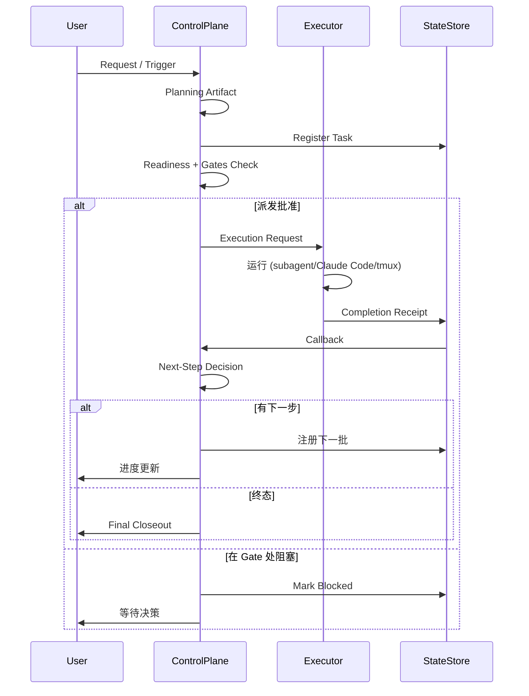

# OpenClaw Orchestration Control Plane

> 构建在 OpenClaw 之上的薄层多 Agent 工作流控制面。
> **默认后端：** subagent | **兼容后端：** tmux | **首个验证场景：** trading continuation
> **当前成熟度：** safe semi-auto / thin bridge / 单场景生产验证

---

## 快速开始（30 秒）

**统一入口：** `python3 ~/.openclaw/scripts/orch_command.py`

```bash
# 默认：使用当前频道上下文
python3 ~/.openclaw/scripts/orch_command.py

# 指定频道/主题
python3 ~/.openclaw/scripts/orch_command.py \
  --channel-id "discord:channel:YOUR_ID" \
  --channel-name "your-channel" \
  --topic "讨论主题"

# Trading 场景
python3 ~/.openclaw/scripts/orch_command.py --context trading_roundtable

# 保存 contract 到文件
python3 ~/.openclaw/scripts/orch_command.py \
  --channel-id "discord:channel:YOUR_ID" \
  --topic "架构评审" \
  --output tmp/orch-contract.json
```

**默认行为：**
- ✅ coding lane → Claude Code（via subagent）
- ✅ non-coding lane → subagent
- ✅ auto_execute=true（自动注册/派发/回调/续推）
- ✅ gate_policy=stop_on_gate（命中 gate 正常停住）
- ✅ 首次接入建议 `--auto-execute false` 先验证稳定

**文档入口：**
- **Skill 入口：** `runtime/skills/orchestration-entry/SKILL.md`
- **其他频道：** `docs/quickstart/quickstart-other-channels.md`
- **当前真值：** `docs/CURRENT_TRUTH.md`

---

## 这个仓库是什么

**这个仓库构建的是 OpenClaw 的实用编排控制面。**

它回答一个具体问题：

> **当一个任务完成后，系统如何知道下一步该做什么——并且安全地继续推进？**

真实的多 Agent 系统很少因为"模型无法回答"而失败。它们失败是因为：
- 一个任务结束了，但没人知道谁拥有下一步
- 多个子任务都回来了，但没有 clean fan-in 点
- 系统能生成计划，却不能安全地自动派发下一步
- callback 发出去了，但没有正确回到父会话或用户可见频道
- 业务归属和执行归属混在一起

这个仓库通过以下机制让这些过渡变得**显式**：
- Continuation contract
- Handoff schema
- Registration / readiness 追踪
- Dispatch plan
- Bridge consumption
- Execution request / receipt
- Callback/ack 分离

---

## 这个仓库不是什么

- ❌ 不是通用 DAG 平台
- ❌ 不是 OpenClaw 替代品
- ❌ 不是 LangGraph/Temporal/DeepAgents 的 wrapper
- ❌ 不是单纯的 trading bot repo
- ❌ 不是"全自动无人续跑"

**当前范围：** thin bridge / allowlist / safe semi-auto / trading continuation 已验证

---

## 架构总览

```text
┌─────────────────────────────────────────────────────┐
│ 业务场景层                                           │
│ trading / channel / 未来其他领域适配器                │
└─────────────────────────────────────────────────────┘
                        │
                        ▼
┌─────────────────────────────────────────────────────┐
│ 控制面                                               │
│ contract / planning / registration / readiness      │
│ callback / receipt / dispatch / continuation        │
└─────────────────────────────────────────────────────┘
                        │
                        ▼
┌─────────────────────────────────────────────────────┐
│ 执行层                                               │
│ subagent（默认）/ Claude Code / tmux（兼容）         │
└─────────────────────────────────────────────────────┘
                        │
                        ▼
┌─────────────────────────────────────────────────────┐
│ OpenClaw Runtime 基础层                              │
│ sessions / tools / hooks / channels / messaging     │
└─────────────────────────────────────────────────────┘
```

**关键边界：** 控制面决定**下一步怎么走**；执行层**真正去跑**；OpenClaw 提供原始能力。

### 主流程：Request → Callback → Closeout → Next Batch



**核心原则：** 一个任务不是在执行停下时结束，而是在**"下一步状态被明确表达"之后才真正收口**。

### Owner 与 Executor 解耦

```text
owner    = 业务归属 / 判断 / 验收
executor = 真正执行的人或执行器

例子：
- owner=trading, executor=claude_code
- owner=main, executor=subagent
- owner=content, executor=tmux
```

这个解耦让 coding lane 可以默认走 Claude Code，而不要求业务角色 agent 自己扛执行。

**详细架构：** [`docs/architecture/overview.md`](docs/architecture/overview.md)

---

## 当前状态

### 后端策略
| 后端 | 状态 | 使用场景 |
|------|------|----------|
| **subagent** | ✅ 默认 | 自动化执行、CI/CD、新开发 |
| **tmux** | ✅ 支持 | 交互式会话、人工观测 |

### 成熟度
> **thin bridge / explicit contracts / safe semi-auto / production-validated on one real scenario**

它已经不只是方案稿，但也还没有重到可以叫"通用 workflow 平台"。

### 什么是真的
- ✅ Trading continuation 已进入**真实执行路径**
- ✅ Control-plane 主链已打通
- ✅ 双轨后端（subagent + tmux）均支持
- ✅ 434 个测试通过
- ✅ 真实 artifact-backed continuation（registration → dispatch → execution → receipt → callback）

### 什么还没完全闭环
- ⚠️ Git push auto-continue **尚未完全自动**
- ⚠️ 整体成熟度仍是 **safe semi-auto**，不是"全域全自动无人续跑"

---

## 仓库结构

```text
openclaw-company-orchestration-proposal/
├── README.md / README.zh.md
├── docs/
│   ├── architecture/        # 架构图与总览
│   ├── diagrams/            # Mermaid/流程图
│   ├── quickstart/          # 频道专属 Quickstart
│   ├── configuration/       # Auto-trigger 配置与排查
│   ├── CURRENT_TRUTH.md     # 当前真值入口
│   └── ...                  # 其他文档
├── runtime/
│   ├── orchestrator/        # 核心编排逻辑
│   ├── skills/              # OpenClaw skill 集成
│   └── scripts/             # 入口命令与工具
├── tests/                   # 行为测试（真值来源）
├── archive/                 # 历史资料（仅供参考）
└── scripts/                 # 工具脚本
```

| 目录 | 用途 |
|------|------|
| `docs/` | 人类可读文档：当前真值、架构、迁移、发布材料 |
| `runtime/` | 实际编排运行时：contract、continuation、dispatch、bridge consumer |
| `tests/` | 行为真值——测试是真值来源，不只是打包卫生 |
| `archive/` | 历史资料保留参考，不是主路径 |

---

## 从哪里开始

| 目标 | 入口 |
|------|------|
| **快速了解** | [`docs/executive-summary.md`](docs/executive-summary.md) |
| **当前真值** | [`docs/CURRENT_TRUTH.md`](docs/CURRENT_TRUTH.md) |
| **架构** | [`docs/architecture/overview.md`](docs/architecture/overview.md) |
| **其他频道** | [`docs/quickstart/quickstart-other-channels.md`](docs/quickstart/quickstart-other-channels.md) |
| **Auto-trigger 配置** | [`docs/configuration/auto-trigger-config-guide.md`](docs/configuration/auto-trigger-config-guide.md) |
| **验证状态** | [`docs/validation-status.md`](docs/validation-status.md) |
| **技术债务** | [`docs/technical-debt/technical-debt-2026-03-22.md`](docs/technical-debt/technical-debt-2026-03-22.md) |

---

## 为什么存在

很多团队要么过早跳进 Temporal 式的复杂性，要么困在脚本意大利面。这个仓库探索**中间路径**：
- 足够结构化以可靠
- 不过度复杂以保持迭代速度

它借鉴了 Temporal（durable workflow 思维）、LangGraph（graph transition）、DeepAgents（execution profile）——但把它们视为**叶子层技术**，而不是公司级 control plane。

**实际设计选择：**
- 用 **OpenClaw** 做 runtime foundation
- 在这个仓库里保留一层清晰的 **control plane**
- 把 **subagent / Claude Code / tmux** 看成执行器选择
- 只在真正有价值的局部引入更重的框架

---

## 一句话记住它

> **这是一个构建在 OpenClaw 之上的工作流控制层：默认执行走 subagent，兼容保留 tmux，trading 是第一个真实验证场景。**
