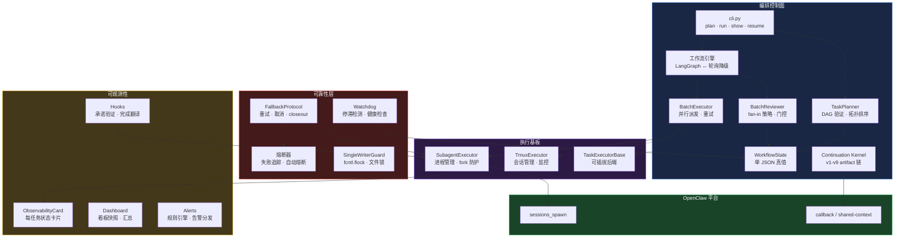
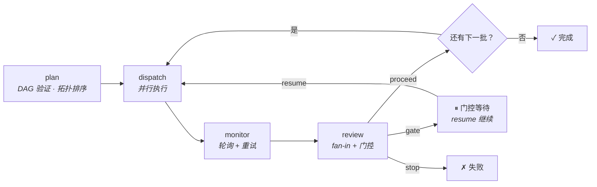

# OpenClaw 编排控制面

> **当一个 Agent 做完任务后，接下来该做什么？**
> 本仓库让这个答案变得显式、可追溯、安全 — 原生构建在 OpenClaw 之上。

[English](README.md) · [运维指南](docs/OPERATIONS.md) · [当前真值](docs/CURRENT_TRUTH.md)

---

## 解决什么问题

多 Agent 系统很少因为"模型答不上来"而失败。它们失败在**协调缺口**上：

| 缺口 | 出了什么问题 |
|------|------------|
| **没有显式交接** | Agent A 做完了。没人告诉 Agent B。工作静默停滞。 |
| **没有 Fan-in** | 5 个并行任务返回不同结果。继续还是停？按什么规则？ |
| **没有状态连续性** | 进程崩溃了。我们在哪？做了什么？怎么恢复？ |
| **没有安全门控** | 没有护栏的自动派发 → agent 失控、算力浪费。 |
| **没有可追溯性** | 出了问题。你能追溯完整的决策链吗？ |

这些不是"锦上添花"——它们是**大多数多 Agent 自动化只能停留在 demo 阶段**的原因。

---

## 本仓库提供什么

一个面向 OpenClaw 的**编排控制面**，让任务过渡变得显式：

```
任务完成 → 显式契约 → Fan-in 评审 → 安全门控 → 下一步派发
                ↓
   (stopped_because / next_step / next_owner / readiness)
```

### 核心能力

| 能力 | 怎么做到的 | 状态 |
|------|----------|------|
| **批次 DAG 规划** | 定义带 `depends_on` 的任务批次。Kahn 算法校验 DAG，拓扑排序决定执行顺序。 | ✅ 生产验证 |
| **并行派发 + 重试** | `BatchExecutor` 通过 `SubagentExecutor` 派发任务，监控完成状态，失败自动重试（可配置 `max_retries`）。 | ✅ 生产验证 |
| **Fan-in 评审** | `BatchReviewer` 按 `all_success` / `any_success` / `majority` 策略决定批次结果。 | ✅ 生产验证 |
| **安全门控** | 可配置的门控条件暂停工作流等待人工审查。准备好后 resume 继续。 | ✅ 生产验证 |
| **单 JSON 真值** | 每个工作流一个 `workflow_state_*.json` 文件 — 所有批次、任务、决策、上下文。唯一真值源。 | ✅ 生产验证 |
| **LangGraph 集成** | 可选的 LangGraph StateGraph 引擎 + SQLite 检查点。无依赖时降级为轮询引擎。 | ✅ 生产验证 |
| **Continuation Kernel** | 9 个版本渐进演化：`注册 → 派发 → spawn → 执行 → receipt → 回调 → 自动续行`。完整 artifact linkage 链。 | ✅ 生产验证 |
| **上下文恢复** | 每次保存自动生成 `context_summary`。从崩溃或上下文压缩中恢复。 | ✅ 生产验证 |
| **可插拔执行器** | `TaskExecutorBase` 抽象接口 — 可接入 HTTP worker、LangChain agent 或任何自定义后端。 | ✅ 接口已定义 |
| **Hook 系统** | 三模式行为约束钩子（audit/warn/enforce）：承诺验证、完成翻译。 | ✅ 生产验证 |
| **告警与可观测** | 规则驱动告警 + 审计日志、可观测卡片、看板渲染。 | ✅ 生产验证 |
| **熔断器** | 按目标追踪连续（3 次）和累计（20 次）失败；自动熔断防止失控重试。 | ✅ 已实现 |

---

## 架构



**设计原则：** OpenClaw 持有平台原语（`sessions_spawn`、回调、shared-context）。本仓库持有**编排逻辑** — 批次 DAG、fan-in、门控、状态。外部框架（LangGraph 等）只进入执行层。

---

## 工作流程

### 生命周期



### 状态机

```
工作流: pending → running → completed / failed / gate_blocked / timed_out / stalled_unrecoverable
                                              ↓ resume
                                           running
```

`stalled_unrecoverable` 由 Watchdog 在工作流连续停滞超过 3 次自动恢复尝试后设置。

### Artifact Linkage（续行内核）

每次任务执行维护完整的可追溯链：

```
registration_id → dispatch_id → spawn_id → execution_id
    → receipt_id → request_id → consumed_id → api_execution_id
```

任意 ID 都可以正向或反向查询完整链路。

---

## 快速开始

```bash
pip install langgraph langgraph-checkpoint-sqlite  # 可选，推荐

# 1. Plan — 校验 DAG，生成状态文件
python3 runtime/orchestrator/cli.py plan "分析代码库" config.json

# 2. Run — 执行批次
python3 runtime/orchestrator/cli.py run workflow_state_wf_xxx.json --workspace /path/to/project

# 3. Monitor — 查看进度
python3 runtime/orchestrator/cli.py show workflow_state_wf_xxx.json

# 4. Resume — 从门控或崩溃处恢复
python3 runtime/orchestrator/cli.py resume workflow_state_wf_xxx.json
```

### 示例 `config.json`

```json
[
  {
    "batch_id": "collect",
    "label": "数据采集",
    "tasks": [
      {"task_id": "t1", "label": "数据源 A", "max_retries": 2},
      {"task_id": "t2", "label": "数据源 B"}
    ],
    "depends_on": [],
    "fan_in_policy": "any_success"
  },
  {
    "batch_id": "synthesize",
    "label": "汇总结果",
    "tasks": [{"task_id": "t3", "label": "合并分析"}],
    "depends_on": ["collect"]
  }
]
```

---

## 产品入口: Onboard + Run + Status

**面向渠道运营和 Agent：三个命令，零心智负担。**

| 命令 | 用途 | 一句话 |
|------|------|--------|
| `onboard` | 生成渠道接入建议 | "这个渠道怎么接入？" |
| `run` | 触发执行 | "帮我跑个任务" |
| `status` | 查看状态概览 | "现在进度怎么样？" |

```bash
python3 runtime/scripts/orch_product.py onboard
python3 runtime/scripts/orch_product.py run --task "你的任务描述" --workdir /path/to/workdir
python3 runtime/scripts/orch_product.py status
```

**完整文档：** [docs/orch_product_guide.md](docs/orch_product_guide.md)

---

## 可靠性加固

控制面融合了 Claude Code 执行 harness 架构的设计模式：

| 机制 | 做什么 |
|------|-------|
| **原子写入** | 所有状态文件使用 `tempfile + os.fsync + os.replace` — 写入中途崩溃不影响原文件。通过 `utils/io.py` 共享。 |
| **文件级锁** | `subagent_executor` 使用 `fcntl.flock` 防止状态文件的并发读改写竞态。 |
| **熔断器** | 追踪每个派发目标的连续（3 次）和累计（20 次）失败。熔断后跳过该目标并推荐替代策略。 |
| **Watchdog 健康检查** | 统一的 `full_health_check()` 组合工作流停滞检测、死进程回收、孤儿完成恢复和排队任务停滞检测。 |
| **孤儿完成恢复** | `reconcile_orphan_completions()` 检测进程已退出但状态仍为 "running" 的任务 — 防止任务静默丢失。 |
| **Fork 炸弹防护** | `SubagentExecutor` 三层防护：(1) `OPENCLAW_SPAWN_DEPTH` 环境变量, (2) 系统级 `pgrep` 进程计数, (3) `threading.Semaphore`。 |
| **子进程超时** | 所有同步 `subprocess.run()` 调用有显式超时（tmux 30s, 通用命令 60s）。 |
| **UTC 时间戳** | 所有模块使用 `datetime.now(timezone.utc)` 确保跨进程时间戳一致排序。 |
| **单写者守卫** | 基于 `fcntl.flock` 的文件锁, 5 分钟超时, 同一写者可重入。 |

---

## Hook 系统

三模式行为约束钩子，在控制面层级约束 Agent 行为：

| Hook | 用途 | 模式 |
|------|------|------|
| **PostPromiseVerifyHook** | 验证 Agent 声称"正在执行"时是否有真实的执行锚点（dispatch_id, session_id, tmux_session）。 | audit / warn / enforce |
| **PostCompletionTranslateHook** | 强制 Agent 在子任务完成后产出人类可读的完成报告。必含区块：结论、证据、动作。 | audit / warn / enforce |

通过 `OPENCLAW_HOOK_ENFORCE_MODE`（默认: `audit`）和 `OPENCLAW_HOOK_PER_HOOK_MODES` JSON 环境变量配置。

---

## 统一执行运行时

> 任务执行的单一入口 — 自动选择后端（tmux/subagent）。

```python
from unified_execution_runtime import run_task

result = run_task(
    task_description="重构认证模块，预计 1 小时",
    workdir="/path/to/workdir",
)
print(f"后端: {result.backend}, 会话: {result.session_id}")
```

### 后端选择逻辑

```
任务 → 显式 backend_preference? → 是 → 使用指定后端
                  ↓ 否
         backend_selector.recommend()
                  ↓
    ┌─────────────┴─────────────┐
    │                           │
长任务 (>30min)             短任务 (≤30min)
需要监控                    文档类
编码关键词                   ↓
↓                           subagent
tmux
```

### 文档

- [设计文档](docs/design/unified_execution_runtime_design.md)
- [后端选择指南](docs/BACKEND_SELECTION_GUIDE.md)

---

## 接入新场景

### 第一步：定义工作流

创建 `config.json`，每个批次包含：
- `batch_id` — 唯一标识
- `tasks[]` — `{task_id, label}` 数组，可选 `executor`（默认 `subagent`）、`max_retries`
- `depends_on` — 依赖的批次 ID 列表（有环会被拒绝）
- `fan_in_policy` — `all_success`（默认）/ `any_success` / `majority`

### 第二步：安装配置 Runner

```bash
npm install -g @anthropic-ai/claude-code
claude --version
# Runner 脚本: scripts/run_subagent_claude_v1.sh（自动检测 Claude CLI）
```

### 第三步：运行并迭代

```bash
python3 runtime/orchestrator/cli.py plan "你的目标" config.json
python3 runtime/orchestrator/cli.py run workflow_state_wf_xxx.json --workspace .
```

### 回调驱动场景

如果你的场景是回调驱动的（如 Trading 或 Channel Roundtable）：

1. 选择 adapter：`trading_roundtable`、`channel_roundtable` 或自定义
2. 初始 `allow_auto_dispatch=false`
3. 验证 callback → ack → dispatch artifact 稳定后再启用自动续行

---

## 框架定位

| 框架 | 侧重点 | 本仓库 |
|------|--------|--------|
| **LangGraph** | 通用有状态 agent 图、检查点、中断恢复 | **内嵌**为可选引擎；在其上增加批次 DAG + fan-in + 门控 + JSON 真值 |
| **Deer-Flow**（字节） | 研究工作流：plan → research → report | 共享概念：`SubagentExecutor` 设计。我们扩展了完整的续行内核和质量门控 |
| **CrewAI / AutoGen** | Agent 定义与对话框架 | 我们是**控制面** — 决定 agent 何时如何运行，而非定义 agent 是什么 |
| **Temporal** | 企业级持久工作流引擎 | 我们是单进程 + JSON 检查点。无需服务器集群。为 OpenClaw 量身定做 |
| **Google ADK** | 代码优先 agent 工具包 | 我们专注**编排**而非 **agent 能力**。ADK agent 可作为我们的任务执行器 |

**一句话：** 我们是 OpenClaw 的**薄层、有主见的控制面**。LangGraph 是可选执行后端。Agent 做事；我们编排过渡。

---

## 仓库结构

```
runtime/orchestrator/           # 核心编排模块 (90+ 文件)
├── cli.py                      # 统一 CLI 入口
├── workflow_state.py           # 单 JSON 真值模型
├── workflow_state_store.py     # 线程安全单例状态访问
├── workflow_loop.py            # 零依赖轮询降级
├── workflow_graph.py           # LangGraph 引擎（SQLite 检查点）
├── task_planner.py             # DAG 验证 + 拓扑排序
├── batch_executor.py           # 并行派发 + 重试
├── batch_reviewer.py           # Fan-in 策略 + 门控条件
├── batch_aggregator.py         # Fan-in 分析
├── orchestrator.py             # 规则链决策引擎
├── contracts.py                # 标准回调信封 + 任务分级
├── core/                       # 核心抽象
│   ├── types.py                # 共享类型 (GateResult, FanOutMode, FanInMode)
│   ├── phase_engine.py         # Phase 状态机
│   ├── task_registry.py        # 多索引内存任务注册表
│   ├── callback_router.py      # 优先级回调路由
│   ├── dispatch_planner.py     # 后端选择 + 派发规划
│   ├── fanout_controller.py    # Fan-out/fan-in 控制器
│   ├── quality_gate.py         # 质量门评估器
│   └── handoff_schema.py       # 规划到执行的交接 schema
├── hooks/                      # 行为约束钩子
│   ├── hook_config.py          # 三模式配置 (audit/warn/enforce)
│   ├── hook_exceptions.py      # HookViolationError
│   ├── hook_integrations.py    # 集成点
│   ├── post_promise_verify_hook.py   # "空承诺" 检测
│   └── post_completion_translate_hook.py  # 人类可读报告强制
├── utils/                      # 共享工具
│   ├── io.py                   # 原子文件写入 (fsync + replace)
│   └── time.py                 # 统一 UTC 时间戳
├── alerts/                     # 告警系统
│   └── trading_alert_sender.py # 交易场景告警发送
├── alert_audit.py              # 告警审计日志
├── alert_dispatcher.py         # 告警路由和分发
├── alert_rules.py              # 告警规则定义
├── adapters/                   # 场景适配器
│   ├── base.py                 # 基础适配器接口
│   └── trading.py              # 交易场景适配器
├── trading/                    # 交易领域模块
│   ├── schemas.py              # 交易数据 schema
│   ├── callback_validator.py   # 交易回调校验
│   └── simulation_adapter.py   # 交易模拟
├── subagent_executor.py        # 进程管理 + fork 炸弹防护
├── subagent_state.py           # Subagent 状态持久化
├── executor_interface.py       # 可插拔执行器抽象接口
├── tmux_executor.py            # Tmux 会话执行器
├── tmux_status_sync.py         # Tmux 状态同步
├── tmux_terminal_receipts.py   # Tmux 终端回执
├── auto_dispatch.py            # 基于策略的自动派发
├── bridge_consumer.py          # 回调消费引擎
├── completion_receipt.py       # 完成回执生成
├── completion_validator.py     # 完成质量门内核
├── completion_validator_rules.py  # Through/Block/Gate 评分规则
├── fallback_protocol.py        # 重试/取消/closeout + 熔断器
├── retry_cancel_contract.py    # 统一重试/取消语义
├── single_writer_guard.py      # 文件级锁 (fcntl.flock)
├── watchdog.py                 # 停滞检测 + 统一健康检查
├── state_machine.py            # 每任务状态（回调驱动核心）
├── lineage.py                  # 任务溯源追踪
├── observability_card.py       # 可观测卡片 CRUD
├── dashboard.py                # 看板渲染
├── telemetry.py                # 遥测/指标
├── unified_execution_runtime.py  # 任务执行单一入口
├── run_task.py                 # 任务运行入口
├── sessions_spawn_bridge.py    # Session spawn 桥接
├── sessions_spawn_request.py   # Session spawn 请求处理
├── spawn_closure.py            # v4 续行: dispatch → spawn
├── spawn_execution.py          # v5 续行: spawn → execution
├── closeout_*.py               # Closeout 生命周期 (5 个模块)
├── completion_*.py             # 完成处理 (5 个模块)
├── *_roundtable.py             # 圆桌协调 (trading/channel)
└── ...                         # 规划、续行、入口默认

runtime/scripts/                # CLI 脚本和桥接
tests/orchestrator/             # 测试套件 (885 个测试)
runtime/tests/orchestrator/     # 额外运行时测试
docs/                           # 运维指南、架构文档
examples/                       # 示例配置和 payload
schemas/                        # JSON schemas
plugins/                        # 插件模块 (human-gate-message)
```

---

## 设计原则

1. **OpenClaw 原生** — 构建在 `sessions_spawn`、callback、shared-context 之上。不是外来框架移植。
2. **渐进演化** — 每个 kernel 版本增加一个能力。不做大爆炸重写。
3. **回调驱动为主，DAG 按需** — 简单场景用回调。复杂多批次工作流用 `workflow_state`。
4. **先验证，再自动化** — 初始 `allow_auto_dispatch=false`，验证稳定后再启用。
5. **薄层桥接，不是厚平台** — 我们编排过渡。Agent 做事。
6. **失败安全默认** — 原子写入、文件锁、UTC 时间戳、子进程超时。安全是默认行为，不是可选项。

---

## 测试

```bash
PYTHONPATH=runtime/orchestrator python3 -m pytest tests/orchestrator/ -q
# 885 tests
```

---

## 可观测性

- **状态卡片**: 每任务可观测卡片，实时追踪进度
- **统一索引**: 按 owner/scenario 查询
- **任务看板**: 按阶段分组的看板
- **tmux 集成**: tmux 会话自动注册到可观测索引
- **行为钩子**: "承诺即验证" 钩子防止空承诺

```bash
# 列出所有任务
python3 scripts/sync-tmux-observability.py list

# 生成任务看板快照
python3 -c "
from observability_card import generate_board_snapshot
import json
print(json.dumps(generate_board_snapshot()['summary'], indent=2))
"
```

### 文档

- [可观测性配置指南](docs/OBSERVABILITY_SETUP_GUIDE.md)
- [可观测性设计方案](docs/observability-transparency-design-2026-03-28.md)
- [tmux 接入指南](docs/tmux-integration-guide.md)

---

## License

MIT
