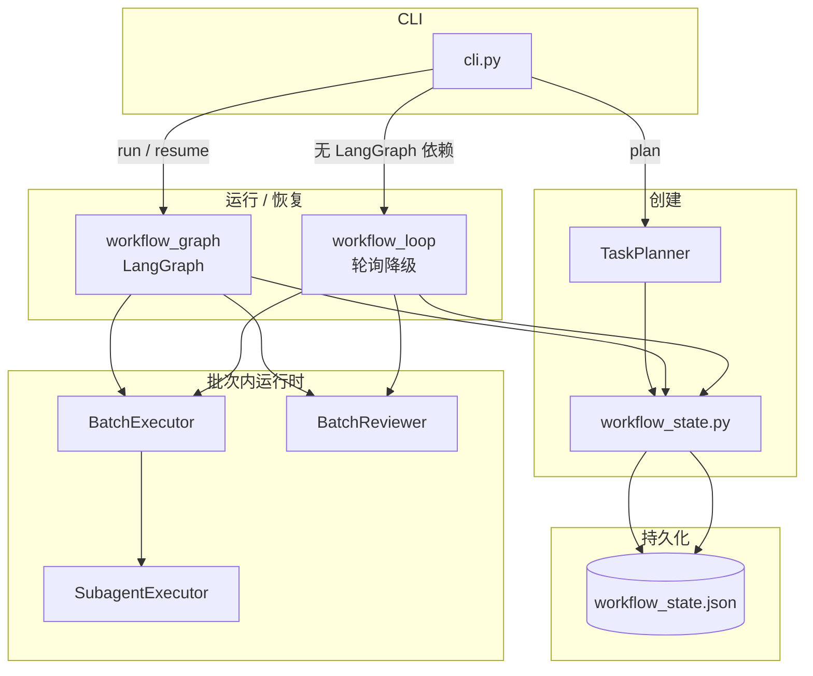
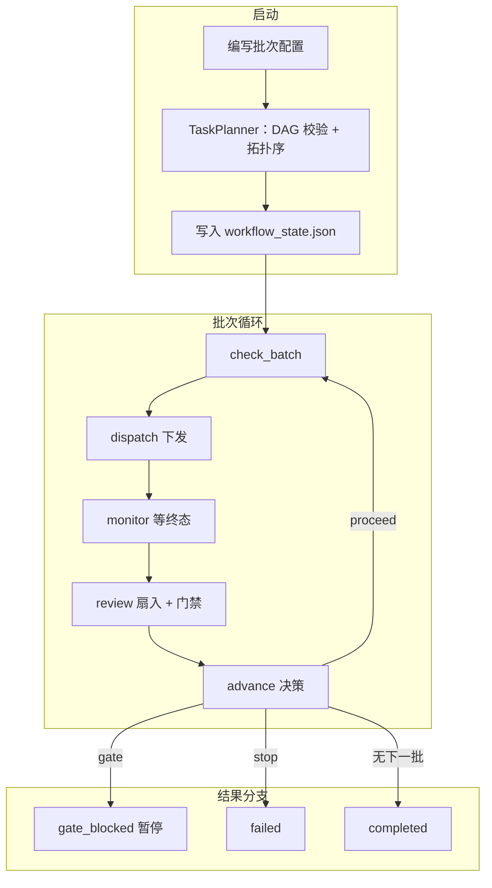
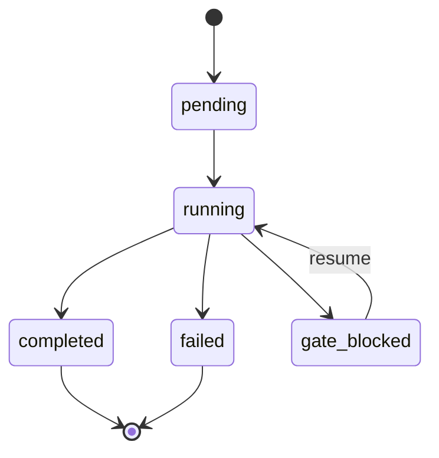
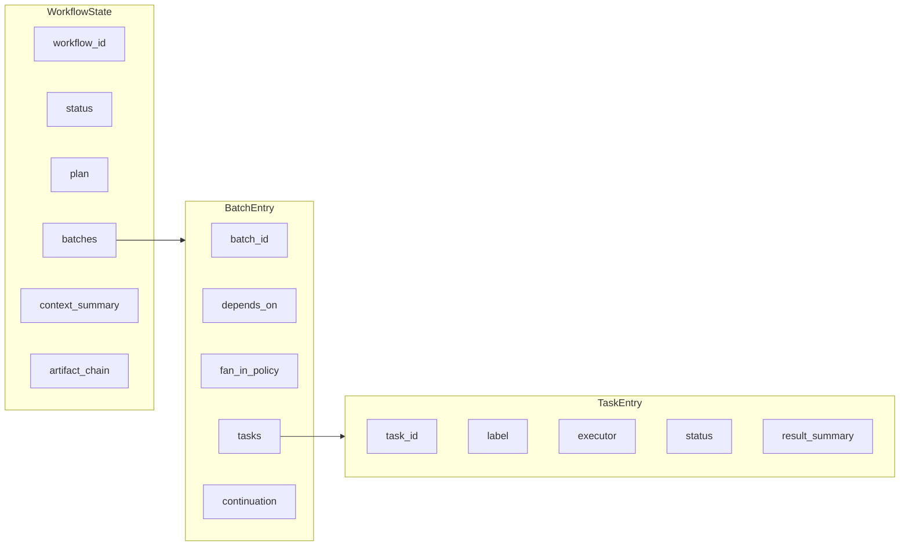
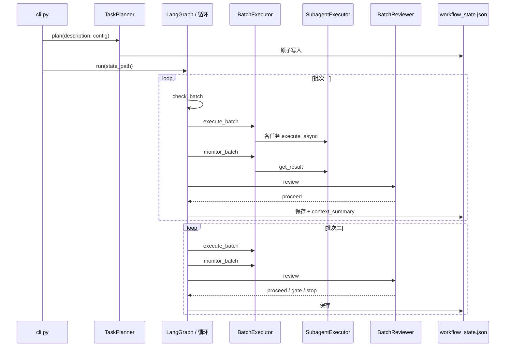

# OpenClaw 公司级编排 — 多 Agent 工作流控制面

> **单一 CLI**、**单一 JSON 状态文件**、**按批并行**、**扇入评审**、**自动推进或可暂停门禁**。有 LangGraph 走图引擎；没有则降级为轮询主循环。

[English README](README.md) · [操作指南](docs/OPERATIONS.md) · [当前真值](docs/CURRENT_TRUTH.md)

---

## 这套东西解决什么问题

面向 OpenClaw 体系的多 Agent 编排 **控制面**（不是再造一个通用 Agent 框架）：

1. **规划** — 校验批次 DAG（`depends_on`）、拓扑排序、落盘 `workflow_state_*.json`。
2. **执行** — 每个批次内并行下发任务，经 `SubagentExecutor` 起子进程 / 跑 runner。
3. **评审** — 按 `fan_in_policy`（全成功 / 任一成功 / 过半）聚合，并可触发 **门禁**。
4. **推进** — `proceed` 进下一批、`gate` 等人、`stop` 判失败。

OpenClaw 继续握 **策略、频道、sessions_spawn 语义**；本运行时负责 **批次 DAG、持久化、续跑语义** 这一层。

---

## 上手命令

```bash
python3 runtime/orchestrator/cli.py plan "目标描述" config.json
python3 runtime/orchestrator/cli.py run workflow_state_wf_xxx.json --workspace /你的/workspace
python3 runtime/orchestrator/cli.py show workflow_state_wf_xxx.json
python3 runtime/orchestrator/cli.py resume workflow_state_wf_xxx.json
```

- **`run`**：能 `import langgraph` 时走 **`workflow_graph.py`（LangGraph）**；否则走 **`workflow_loop.py`（轮询）**。状态文件与语义一致。

---

## 1. 架构总览



---

## 2. 工作流生命周期



---

## 3. 工作流级状态机

对应 `workflow_state.py` 中的 `WorkflowState.status`：



---

## 4. `workflow_state.json` 数据流



`plan` 含 `total_batches`、`current_batch_index`、`description`。`continuation` 为 `ContinuationDecision`：`proceed` / `gate` / `stop`、`stopped_because`、`next_batch`、`decided_at`。

---

## 5. 典型两批次执行（时序）



---

## 6. 与其他框架怎么比

| 框架 | 主战场 | 本仓库相对它的位置 |
|------|--------|-------------------|
| **LangGraph** | 通用有状态图、checkpoint、中断恢复 | **内嵌为引擎 A**；批次语义、扇入、门禁、**JSON 真值**由本层定义 |
| **Deer-Flow** (字节) | 调研工作流：plan → research → report，带人工审批 | 共享设计：**SubagentExecutor**（task_id / timeout / status / 热状态）。我们在此基础上扩展了 **批次 DAG** 和 **fan-in 策略** |
| **CrewAI** | 角色化班组、高层编排模式 | **文件型控制面** + 子进程执行；不提供 Crew/角色 DSL |
| **AutoGen / AG2** | 对话式多 Agent 协议 | **批次 DAG + 策略** 驱动 **spawn**，不以消息拓扑为中心 |
| **Temporal** | 持久工作流、多 Worker、规模化重试 | **单机编排器 + JSON 断点**；不依赖 Temporal 集群 |
| **Dify** | 低代码应用、RAG、对话流 | **代码优先**、对接 OpenClaw；不是可视化应用工厂 |
| **Google ADK** | 代码优先 Agent 工具包 | 我们关注 **编排控制** 而非 **Agent 能力**；ADK Agent 可以作为我们 Planner 下的任务执行器 |

一句话：**我们是薄而硬的控制面**（批次、扇入、门禁、一份状态），LangGraph 是 **可选的图执行后端**，没有时也能跑。

---

## 7. 新业务接入清单

1. **写 `config.json`** — 批次数组：每批 `batch_id`、`label`、`tasks`（`task_id`、`label`，可选 `executor`，默认 `subagent`）、`depends_on`（指向已有 `batch_id`，环会被拒绝）。
2. **配 `fan_in_policy`** — `all_success`（默认）、`any_success`、`majority`。
3. **自定义门禁（可选）** — 扩展 `BatchReviewer._check_gate_conditions`；默认逻辑：任意任务 `result_summary` 含 `NEEDS_REVIEW` 即 `gate`。
4. **提供 runner** — `SubagentExecutor` 在 `--workspace` 下查找 `scripts/run_subagent_claude_v1.sh`（参数：任务描述、label）。不存在时走 **模拟** 子进程，便于测试。

流程：`plan` 生成状态文件 → `run` 时把 `--workspace` 指到含 `scripts/` 的工程根。

---

## 8. 诚实评估 — 能跑的和跑不了的

### 已实现并验证

| 能力 | 状态 | 证据 |
|------|------|------|
| DAG 批次规划 | 可用 | Kahn 算法、环检测、拓扑排序 — 全部测试通过 |
| 统一状态文件 | 可用 | 原子写入 + fsync，序列化往返测试通过 |
| Fan-in 评审 | 可用 | all_success / any_success / majority — 全部测试通过 |
| Gate 门禁 | 可用 | NEEDS_REVIEW 检测 → gate_blocked → resume |
| LangGraph 集成 | 可用 | 5 节点 StateGraph + MemorySaver，4 个图测试通过 |
| 上下文恢复 | 可用 | `context_summary` 自动生成，持久化到状态文件 |
| CLI 入口 | 可用 | plan / run / show / resume — 全部可用 |

### 还做不到的（诚实差距）

| 维度 | 当前现实 | 需要什么 |
|------|---------|---------|
| **真实任务执行** | `SubagentExecutor` 在找不到 `run_subagent_claude_v1.sh` 时降级为 `python -c print(...)`，任务"成功"但什么都没做 | 真实 runner 脚本或执行后端适配器接口 |
| **跨进程 Monitor** | `batch_executor.monitor_batch` 每次创建新 `SubagentExecutor`，热状态在进程内存中，monitor 只能读文件但可能滞后 | 共享执行器实例或保证文件持久化先于 monitor 读取 |
| **自动恢复** | 恢复需要手动运行 `resume`。没有 watchdog、没有 cron、没有外部触发 | 守护进程或 systemd 服务自动恢复 gate_blocked/崩溃的工作流 |
| **Checkpoint 持久化** | LangGraph `MemorySaver` 仅内存 — 进程重启即丢失 | SQLite / Redis checkpointer 持久化图状态 |
| **重试** | 任务失败 → 批次 `stop`。无重试策略、无指数退避 | 每个任务/批次可配置重试次数和退避 |
| **横向扩展** | 单进程单机 | 任务队列 (Redis/RabbitMQ) + 多执行器进程 |
| **可观测性** | 日志 + JSON 文件，无结构化追踪 | OpenTelemetry spans 或至少结构化日志事件 |
| **Agent 抽象** | 任务 = 字符串标签发给 SubagentExecutor | 类型化任务 schema、per-task 工具白名单、结果验证 |
| **人机协同** | Gate + CLI resume | Web 审批界面、SLA 计时器、升级机制 |
| **端到端自动化** | 依赖外部触发来启动 `run` | Webhook / 事件驱动触发集成 |

### 状态恢复 — 实际怎么工作的

**状态记在哪：**
- `workflow_state_<id>.json` — 唯一真值文件。包含所有批次/任务状态、续行决策、`context_summary`。
- `~/.openclaw/shared-context/subagent_states/<task_id>.json` — 每个任务的 SubagentExecutor 状态（PID、退出码、热状态）。由 `subagent_executor.py` 管理。
- LangGraph `MemorySaver` — 进程内 checkpoint。**进程重启即丢失。**

**怎么恢复：**
1. `cli.py show <state.json>` — 查看工作流停在哪
2. `cli.py resume <state.json>` — 如果是 `gate_blocked`，设置为 `running` 并重新进入循环
3. 崩溃后恢复：手动将 JSON 文件中的 `status` 改为 `running`，然后 `resume`

**没有自动化的部分：**
- 没有 watchdog 检测崩溃的编排器并重启
- 没有调度器在超时后触发 `resume`
- LangGraph checkpoint 在重启后丢失（MemorySaver 仅内存）
- 状态文件损坏时没有恢复机制

---

## 配置示例

```json
[
  {
    "batch_id": "b0",
    "label": "采集",
    "tasks": [
      {"task_id": "t1", "label": "数据源 A"},
      {"task_id": "t2", "label": "数据源 B"}
    ],
    "depends_on": []
  },
  {
    "batch_id": "b1",
    "label": "汇总",
    "tasks": [{"task_id": "t3", "label": "合并结论"}],
    "depends_on": ["b0"],
    "fan_in_policy": "all_success"
  }
]
```

---

## 源码索引

- **状态模型：** `runtime/orchestrator/workflow_state.py`
- **双引擎：** `workflow_graph.py`、`workflow_loop.py`
- **规划：** `task_planner.py`
- **执行 / 评审：** `batch_executor.py`、`batch_reviewer.py`、`subagent_executor.py`
- **入口：** `runtime/orchestrator/cli.py`

---

## 仓库说明

本仓为 **OpenClaw 公司级 orchestration** 分层 monorepo（`docs/` 阅读入口、`runtime/` 实现真值、`tests/` 验收）。主链边界以 **`docs/CURRENT_TRUTH.md` + 源码** 为准，历史方案见 `archive/` 等目录。
