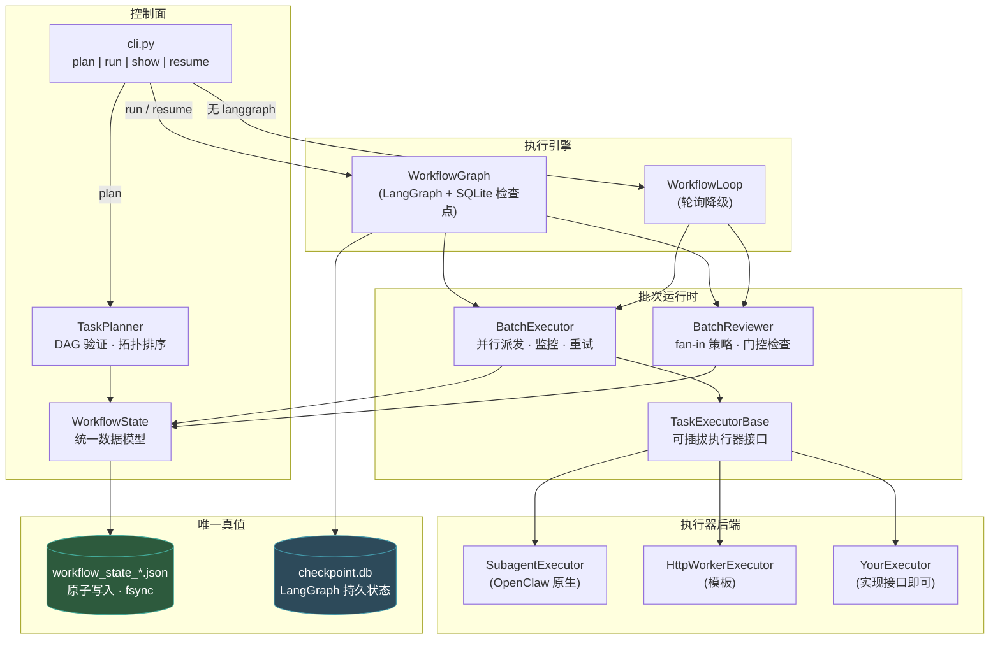
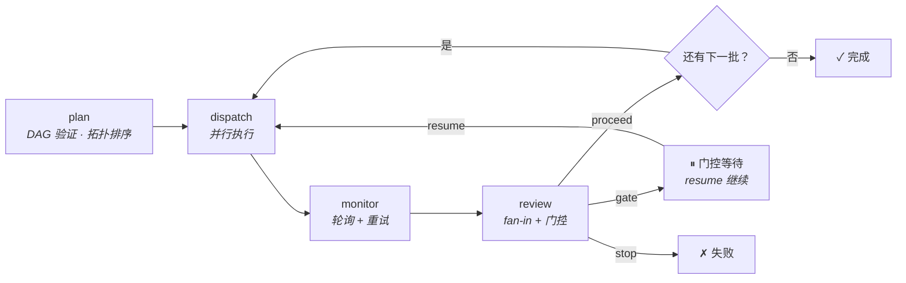
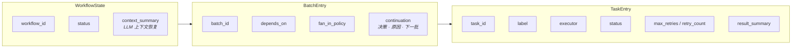

# OpenClaw 编排 — 多 Agent 批量 DAG 控制面

> **一个 CLI · 一个 JSON 真值 · 批量 DAG · Fan-in 审查 · 门控续行**

[English](README.md) · [运维指南](docs/OPERATIONS.md)

---

## 解决什么问题

当你使用 OpenClaw (Claude Code) 的 subagent 时，面临一个协调缺口：

- **无批量控制** — subagent 逐个或临时运行；无法并行派发 5 个任务，等待全部/任一/多数完成后再决策下一步。
- **无持久化** — 进程崩溃后，丢失执行记录，不知道哪些跑过、哪些成功、从哪恢复。
- **无策略** — 没有 fan-in 规则（全部通过？多数即可？），没有人工审查门控，没有重试策略。
- **无 DAG** — 任务有依赖关系（B 依赖 A），但顺序全靠人工管理。

本项目用一个**轻量、有态度的控制面**填补这个缺口。

---

## 是什么（不是什么）

**是：** 一个批量 DAG 编排器，位于 OpenClaw subagent 执行层**之上**。

```
你定义:   config.json（批次、任务、依赖、策略）
你执行:   orchestrator-cli plan → run → show → resume
你得到:   并行执行、fan-in 审查、门控续行、崩溃恢复
```

**不是：** Agent 框架。我们不定义 agent、工具或提示词。CrewAI、AutoGen、LangGraph 定义 *agent 做什么*。我们定义 *什么时候运行、如何收集结果、下一步怎么走*。

---

## 架构



### 关键设计决策

| 决策 | 原因 |
|------|------|
| **JSON 文件为真值** | 人类可读、可 `git diff`、进程崩溃不丢失。无需数据库。 |
| **双引擎** | LangGraph（带 SQLite 检查点）优先；纯 Python 轮询循环为零依赖降级。同一状态文件，同一语义。 |
| **可插拔执行器** | `TaskExecutorBase` 接口 — 可替换为 HTTP worker、LangChain agent 或任何能 start/poll 的后端。 |
| **Fan-in 为一等公民** | `all_success`、`any_success`、`majority` — 审查者按批次决策，非硬编码。 |
| **门控 = 人工检查点** | 启发式触发（如输出中包含 `NEEDS_REVIEW`）暂停工作流。CLI `resume` 继续。 |

---

## 工作流生命周期



### 状态机

```
pending → running → completed
                  → failed
                  → gate_blocked → running (resume)
```

---

## 快速开始

```bash
pip install langgraph langgraph-checkpoint-sqlite  # 可选但推荐

# 1. 规划 — 验证 DAG，创建状态文件
python3 runtime/orchestrator/cli.py plan "分析代码库" config.json

# 2. 执行 — 运行所有批次
python3 runtime/orchestrator/cli.py run workflow_state_wf_xxx.json --workspace /path/to/project

# 3. 查看状态
python3 runtime/orchestrator/cli.py show workflow_state_wf_xxx.json

# 4. 恢复（门控暂停或崩溃恢复时）
python3 runtime/orchestrator/cli.py resume workflow_state_wf_xxx.json
```

---

## 数据模型：`workflow_state.json`



一个文件。所有状态。人类可读的 JSON，带 `fsync` 保证崩溃安全。

---

## 接入新场景

### 第 1 步：定义 `config.json`

```json
[
  {
    "batch_id": "collect",
    "label": "数据采集",
    "tasks": [
      {"task_id": "t1", "label": "数据源 A", "max_retries": 2},
      {"task_id": "t2", "label": "数据源 B", "max_retries": 2}
    ],
    "depends_on": [],
    "fan_in_policy": "any_success"
  },
  {
    "batch_id": "synthesize",
    "label": "合并结果",
    "tasks": [{"task_id": "t3", "label": "综合分析"}],
    "depends_on": ["collect"],
    "fan_in_policy": "all_success"
  }
]
```

### 第 2 步：提供 Runner 脚本

`SubagentExecutor` 调用 `<workspace>/scripts/run_subagent_claude_v1.sh <task_prompt> <label>`。这是你的执行后端 — 接收任务、运行 agent、返回 JSON 结果。

### 第 3 步：自定义策略（可选）

- **Fan-in（按批次）**：`all_success`（默认）、`any_success`、`majority`
- **门控条件**：重写 `BatchReviewer._check_gate_conditions` 自定义审批触发
- **重试**：设置 `max_retries` 实现任务级自动重试
- **自定义执行器**：实现 `TaskExecutorBase` 接口接入非 subagent 后端

### 第 4 步：运行

```bash
python3 runtime/orchestrator/cli.py plan "我的工作流" config.json
python3 runtime/orchestrator/cli.py run workflow_state_wf_xxx.json --workspace ./my-project
```

---

## 与其他框架的定位

| 框架 | 侧重点 | 我们的区别 |
|------|--------|-----------|
| **LangGraph** | 通用有状态 agent 图 | 我们**内嵌** LangGraph 作为引擎之一；在其上增加批量 DAG 语义、fan-in 策略和文件真值 |
| **Deer-Flow** | 研究工作流：规划 → 调研 → 报告 | 共享概念：`SubagentExecutor` 设计。我们扩展了可配置的 fan-in、重试和门控策略 |
| **CrewAI** | 角色驱动的 agent 团队 | 我们是**控制面**，不是 agent 定义框架 |
| **AutoGen / AG2** | 对话式多 agent 协议 | 我们编排**批量并行 worker**，而非消息传递对话 |
| **Temporal** | 大规模持久工作流引擎 | 我们是**单进程 + JSON 检查点** — 无需服务器集群 |
| **Google ADK** | 代码优先 agent 工具包 | 我们关注**何时以及如何调度**，而非 agent 能力。ADK agent 可以作为我们的执行器运行 |

**总结：** 我们是轻量、有态度的批量 DAG 控制面。其他框架定义 agent *是什么*。我们定义 agent *如何协调*。

---

## 崩溃恢复

```bash
# 查看停在哪里
python3 runtime/orchestrator/cli.py show workflow_state_wf_xxx.json

# 从断点恢复
python3 runtime/orchestrator/cli.py resume workflow_state_wf_xxx.json
```

- **JSON 状态**经受任何崩溃（原子写入 + fsync）
- **LangGraph 检查点**（SQLite）跨进程重启持久
- **Watchdog**（`watchdog.py`）可自动检测停滞工作流并标记待恢复

---

## 仓库结构

| 目录 | 用途 | 状态 |
|------|------|------|
| `runtime/orchestrator/` | **v2 核心** — 工作流状态、规划器、执行器、引擎、CLI | 活跃 |
| `tests/orchestrator/` | 测试套件（781 测试，全部通过） | 活跃 |
| `docs/` | 运维指南、架构文档 | 活跃 |
| `examples/` | 示例配置和负载 | 活跃 |
| `schemas/` | 契约 JSON Schema | 活跃 |
| `scripts/` | 辅助脚本、runner 入口 | 活跃 |
| `plugins/` | OpenClaw 插件（如 human-gate） | 活跃 |
| `archive/` | 历史 POC 和旧文档 | 已归档 |
| `orchestration_runtime/` | v1 运行时（已废弃） | 已废弃 |

### v2 核心文件（主链）

```
runtime/orchestrator/
├── workflow_state.py      # 统一数据模型（WorkflowState, BatchEntry, TaskEntry）
├── task_planner.py        # DAG 验证、拓扑排序、状态文件创建
├── batch_executor.py      # 并行任务派发、监控、重试逻辑
├── batch_reviewer.py      # Fan-in 评估（all/any/majority）+ 门控条件
├── workflow_graph.py      # LangGraph 引擎，带 SQLite 检查点
├── workflow_loop.py       # 轮询降级引擎（零依赖）
├── subagent_executor.py   # OpenClaw subagent 进程管理
├── executor_interface.py  # 可插拔执行器抽象基类
├── watchdog.py            # 停滞检测和自动恢复标记
└── cli.py                 # 统一 CLI 入口
```

---

## License

MIT
