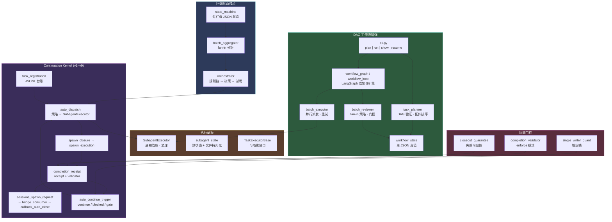
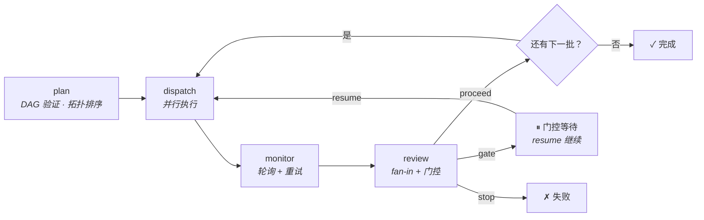

# OpenClaw 公司级编排

> **OpenClaw 原生的多任务编排控制面** — 回调驱动 · 批量 DAG · Continuation Kernel · Fan-in 审查 · 门控续行

[English](README.md) · [运维指南](docs/OPERATIONS.md) · [当前真值](docs/CURRENT_TRUTH.md)

---

## 解决什么问题

当你在 OpenClaw 中使用 `sessions_spawn` / subagent 做多任务工作时，会遇到协调缺口：

- Agent 完成了任务、报告了结果 — **然后呢？** 谁决定下一步？
- 5 个并行任务完成，结果好坏参半 — **继续还是停？** 按什么规则？
- 进程中途崩溃 — **我们在哪？** 怎么恢复？
- 复杂工作需要分阶段（规划 → 执行 → 收尾）— **谁编排交接？**

本仓库就是回答这些问题的**编排控制面**，原生构建在 OpenClaw 的基础设施之上（`sessions_spawn`、subagent、callback、shared-context）。

---

## 它是怎么工作的

系统有三个紧密集成的层，从真实生产需求中渐进演化而来：



### 第一层：回调驱动核心

基础层。每个任务是一个 JSON 文件（`~/.openclaw/shared-context/job-status/tsk_*.json`）。当任务完成（回调收到）时，系统：

1. **`state_machine`** — 更新任务状态（`pending → running → callback_received → final_closed`）
2. **`batch_aggregator`** — 检查批次是否完成，分析成功/失败/超时统计
3. **`orchestrator`** — 运行规则链（`all_success` / `partial_failure` / `major_failure` / `has_common_blocker`）→ 产出 `Decision`（proceed / retry / abort / fix_blocker）→ 可选派发下一批任务

这是**经过生产验证的基础**。Trading roundtable、channel roundtable 和通用场景都接入这里。

### 第二层：Continuation Kernel（v1–v9）

在核心之上渐进构建，解决**"agent 做完就停"**的问题：

| 版本 | 模块 | 做了什么 |
|------|------|---------|
| v1–v2 | `partial_continuation`, `task_registration` | 收尾契约 + JSONL 任务台账 |
| v3–v4 | `auto_dispatch`, `spawn_closure` | 基于策略的自动派发 + 去重 + spawn artifact |
| v5 | `spawn_execution`, `completion_receipt` | 完整闭环：spawn → 执行 → receipt |
| v6 | `sessions_spawn_request`, `callback_auto_close` | 通用 sessions_spawn 接口 + 自动关闭桥 |
| v7–v8 | `bridge_consumer` | 消费 request → 执行（真实或模拟）+ 自动触发 |
| v9 | `sessions_spawn_bridge` | 真实 OpenClaw `sessions_spawn` API 集成 |

每个版本增加一块能力；**linkage 链**把它们串起来：`registration_id → dispatch_id → spawn_id → execution_id → receipt_id → request_id → consumed_id → api_execution_id`。

### 第三层：DAG 工作流增强

增加回调驱动核心缺少的能力：多批次工作流的**全局视图**（含显式依赖关系）、**单 JSON 真值文件**、以及 **LangGraph 级别的检查点**。

| 模块 | 增加了什么 |
|------|-----------|
| `workflow_state.py` | 单一 `workflow_state_*.json` — 所有批次、任务、决策都在一个文件里 |
| `task_planner.py` | DAG 验证（Kahn 算法）、拓扑排序、`depends_on` |
| `batch_executor.py` | 通过 SubagentExecutor 并行派发、监控、可配置重试 |
| `batch_reviewer.py` | Fan-in 策略（`all_success` / `any_success` / `majority`）+ 门控条件 |
| `workflow_graph.py` | LangGraph StateGraph 引擎，带 SQLite 检查点 |
| `workflow_loop.py` | 零依赖轮询降级 |
| `watchdog.py` | 停滞检测、自动恢复标记 |
| `cli.py` | 统一 CLI：`plan`、`run`、`show`、`resume`（+ 原有命令：`status`、`batch-summary`、`decide`、`list`） |

### 执行基板

所有层共享统一的执行引擎：

- **`SubagentExecutor`** — 封装 `sessions_spawn(runtime="subagent")`，含进程管理、超时、清理（杀死进程组）、信号量并发控制
- **`subagent_state`** — 内存热状态 + 磁盘冷状态，重启可恢复
- **`TaskExecutorBase`** — 可插拔接口，支持接入非 subagent 后端（HTTP worker、LangChain agent 等）

### 质量门控

横切面安全机制：

- **`completion_validator`** — Enforce 模式（非 audit-only）：blocked/gate/through 规则，前缀匹配白名单
- **`single_writer_guard`** — 域级文件锁，防止并发写入
- **`auto_continue_trigger`** — 基于 validator + receipt + writer guard，输出 `continue_allowed` / `continue_blocked` / `gate_required`
- **`closeout_guarantee`** — 确保失败对用户可见，即使主链没有自然浮出失败信息

---

## 工作流生命周期



### 状态机

```
工作流: pending → running → completed / failed / gate_blocked (→ running via resume)
任务:   pending → running → callback_received → final_closed (or failed / timeout)
```

---

## 快速开始

```bash
# 安装可选依赖（推荐）
pip install langgraph langgraph-checkpoint-sqlite

# DAG 工作流模式
python3 runtime/orchestrator/cli.py plan "分析代码库" config.json
python3 runtime/orchestrator/cli.py run workflow_state_wf_xxx.json --workspace /path/to/project
python3 runtime/orchestrator/cli.py show workflow_state_wf_xxx.json
python3 runtime/orchestrator/cli.py resume workflow_state_wf_xxx.json

# 回调驱动模式（原有编排器）
python3 runtime/orchestrator/cli.py status <task_id>
python3 runtime/orchestrator/cli.py batch-summary <batch_id>
python3 runtime/orchestrator/cli.py decide <batch_id>
python3 runtime/orchestrator/cli.py list --state running
python3 runtime/orchestrator/cli.py stuck --timeout 60

# OpenClaw 场景入口
python3 runtime/scripts/orch_command.py --context <场景> --channel-id "<频道ID>" --topic "<主题>"
```

---

## 接入新场景

### 回调驱动场景（Trading / Channel / 自定义）

1. **选择 adapter**：`trading_roundtable`（交易）、`channel_roundtable`（通用频道）、或自定义
2. **配置自动派发**：初始 `allow_auto_dispatch=false`，验证 artifact 稳定后再启用
3. **设置 fan-in 规则**：在 `Orchestrator` 规则链中配置
4. **首次运行**：确认 callback → ack → dispatch artifact 稳定后再启用自动续行

### DAG 工作流场景

1. **定义 `config.json`**（批次、任务、依赖、策略）
2. **提供 runner 脚本**：`<workspace>/scripts/run_subagent_claude_v1.sh <task_prompt> <label>`
3. **运行**：`plan` → `run` → `show` → `resume`

---

## 框架定位

| 框架 | 侧重点 | 本仓库 |
|------|--------|--------|
| **LangGraph** | 通用有状态 agent 图 | **内嵌**为可选引擎；在其上增加批量 DAG + fan-in + 门控 + JSON 真值 |
| **Deer-Flow** | 研究工作流 | 共享概念：SubagentExecutor 设计。我们扩展了 continuation kernel + 质量门控 |
| **CrewAI / AutoGen** | Agent 定义框架 | 我们是**控制面** — 编排 agent 何时如何运行，而非定义 agent 是什么 |
| **Temporal** | 大规模持久工作流引擎 | 我们是单进程 + JSON 检查点 — 无需服务器集群 |

**本仓库是 OpenClaw 原生的编排控制面。** 以 OpenClaw 的 `sessions_spawn`、callback、shared-context 为规范接口。外部框架只进入叶子执行层。

---

## 仓库结构

```
├── runtime/orchestrator/     # 所有编排模块（核心 + kernel + DAG + 执行）
│   ├── state_machine.py      # 任务状态机（每任务 JSON 文件）
│   ├── batch_aggregator.py   # Fan-in 分析、批次汇总
│   ├── orchestrator.py       # 规则链决策引擎
│   ├── subagent_executor.py  # SubagentExecutor（借鉴 Deer-Flow）
│   ├── task_registration.py  # 任务台账（JSONL）
│   ├── auto_dispatch.py      # 自动派发 + 策略评估
│   ├── spawn_closure.py      # Spawn closure artifact
│   ├── completion_receipt.py # 完成 receipt + validator 集成
│   ├── sessions_spawn_*.py   # sessions_spawn 请求/桥
│   ├── bridge_consumer.py    # Bridge 消费层
│   ├── auto_continue_trigger.py  # 自动续行决策
│   ├── completion_validator.py   # Enforce 模式 validator
│   ├── workflow_state.py     # 单 JSON 真值（DAG 增强）
│   ├── task_planner.py       # DAG 验证 + 拓扑排序
│   ├── batch_executor.py     # 并行派发 + 重试
│   ├── batch_reviewer.py     # Fan-in 策略 + 门控
│   ├── workflow_graph.py     # LangGraph 引擎（SQLite 检查点）
│   ├── workflow_loop.py      # 轮询降级引擎
│   ├── watchdog.py           # 停滞检测 + 自动恢复
│   ├── cli.py                # 统一 CLI 入口
│   └── ...                   # Trading/channel adapter、质量门控等
├── tests/orchestrator/       # 测试套件（781 测试，全部通过）
├── runtime/tests/            # 集成测试（子集）
├── docs/                     # CURRENT_TRUTH、运维指南、架构文档
├── examples/                 # 示例配置和 payload
├── schemas/                  # JSON Schema
├── scripts/                  # 辅助脚本、runner 入口
├── plugins/                  # OpenClaw 插件（human-gate）
├── archive/                  # 历史 POC 和旧 kernel 文档
└── orchestration_runtime/    # 早期原型（已废弃，见 runtime/）
```

---

## 设计原则

1. **OpenClaw 原生** — 构建在 `sessions_spawn`、callback、shared-context 之上。不是外来框架移植。
2. **渐进式** — 每个 kernel 版本增加一个能力。不做大爆炸重写。
3. **回调驱动为主，DAG 按需** — 简单场景用回调；复杂多批次 DAG 用 `workflow_state`。
4. **先验证，再自动化** — 初始 `allow_auto_dispatch=false`，验证 artifact 稳定后再启用自动续行。
5. **薄层桥接，不是厚平台** — 我们编排；agent 做事。

---

## 测试

```bash
cd <repo-root>
PYTHONPATH=runtime/orchestrator:runtime/scripts python3 -m pytest tests/orchestrator/ -q
# 781 passed
```

---

## License

MIT
