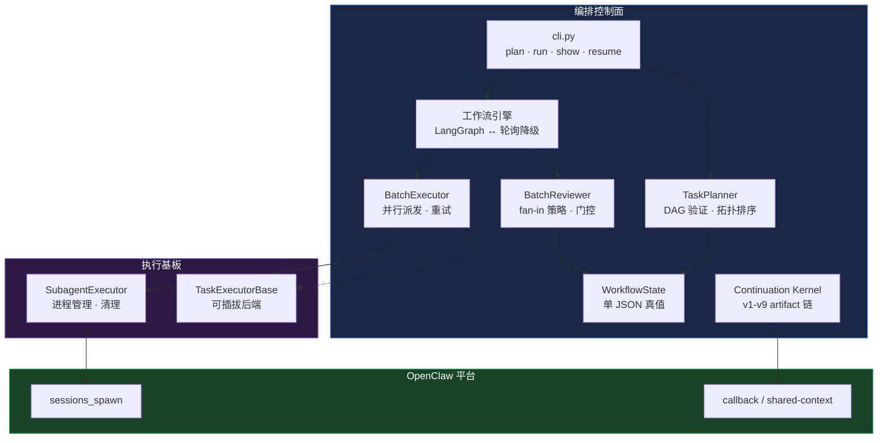
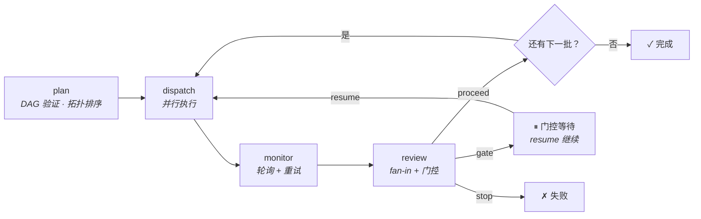

# OpenClaw 编排控制面

> **当一个 Agent 做完任务后，接下来该做什么？**
> 本仓库让这个答案变得显式、可追溯、安全 — 原生构建在 OpenClaw 之上。

[English](README.md) · [运维指南](docs/OPERATIONS.md) · [当前真值](docs/CURRENT_TRUTH.md)

---

## 解决什么问题

多 Agent 系统很少因为"模型答不上来"而失败。它们失败在**协调缺口**上：

| 缺口 | 出了什么问题 |
|------|------------|
| **没有显式交接** | Agent A 做完了。没人告诉 Agent B。工作静默停滞。 |
| **没有 Fan-in** | 5 个并行任务返回不同结果。继续还是停？按什么规则？ |
| **没有状态连续性** | 进程崩溃了。我们在哪？做了什么？怎么恢复？ |
| **没有安全门控** | 没有护栏的自动派发 → agent 失控、算力浪费。 |
| **没有可追溯性** | 出了问题。你能追溯完整的决策链吗？ |

这些不是"锦上添花"——它们是**大多数多 Agent 自动化只能停留在 demo 阶段**的原因。

---

## 本仓库提供什么

一个面向 OpenClaw 的**编排控制面**，让任务过渡变得显式：

```
任务完成 → 显式契约 → Fan-in 评审 → 安全门控 → 下一步派发
                ↓
   (stopped_because / next_step / next_owner / readiness)
```

### 核心能力

| 能力 | 怎么做到的 | 状态 |
|------|----------|------|
| **批次 DAG 规划** | 定义带 `depends_on` 的任务批次。Kahn 算法校验 DAG，拓扑排序决定执行顺序。 | ✅ 生产验证 |
| **并行派发 + 重试** | `BatchExecutor` 通过 `SubagentExecutor` 派发任务，监控完成状态，失败自动重试（可配置 `max_retries`）。 | ✅ 生产验证 |
| **Fan-in 评审** | `BatchReviewer` 按 `all_success` / `any_success` / `majority` 策略决定批次结果。 | ✅ 生产验证 |
| **安全门控** | 可配置的门控条件暂停工作流等待人工审查。准备好后 resume 继续。 | ✅ 生产验证 |
| **单 JSON 真值** | 每个工作流一个 `workflow_state_*.json` 文件 — 所有批次、任务、决策、上下文。唯一真值源。 | ✅ 生产验证 |
| **LangGraph 集成** | 可选的 LangGraph StateGraph 引擎 + SQLite 检查点。无依赖时降级为轮询引擎。 | ✅ 生产验证 |
| **Continuation Kernel** | 9 个版本渐进演化：`注册 → 派发 → spawn → 执行 → receipt → 回调 → 自动续行`。完整 artifact linkage 链。 | ✅ 生产验证 |
| **上下文恢复** | 每次保存自动生成 `context_summary`。从崩溃或上下文压缩中恢复。 | ✅ 生产验证 |
| **可插拔执行器** | `TaskExecutorBase` 抽象接口 — 可接入 HTTP worker、LangChain agent 或任何自定义后端。 | ✅ 接口已定义 |

---

## 架构



**设计原则：** OpenClaw 持有平台原语（`sessions_spawn`、回调、shared-context）。本仓库持有**编排逻辑** — 批次 DAG、fan-in、门控、状态。外部框架（LangGraph 等）只进入执行层。

---

## 工作流程

### 生命周期



### 状态机

```
工作流: pending → running → completed / failed / gate_blocked
                                              ↓ resume
                                           running
```

### Artifact Linkage（续行内核）

每次任务执行维护完整的可追溯链：

```
registration_id → dispatch_id → spawn_id → execution_id
    → receipt_id → request_id → consumed_id → api_execution_id
```

任意 ID 都可以正向或反向查询完整链路。

---

## 快速开始

```bash
pip install langgraph langgraph-checkpoint-sqlite  # 可选，推荐

# 1. Plan — 校验 DAG，生成状态文件
python3 runtime/orchestrator/cli.py plan "分析代码库" config.json

# 2. Run — 执行批次
python3 runtime/orchestrator/cli.py run workflow_state_wf_xxx.json --workspace /path/to/project

# 3. Monitor — 查看进度
python3 runtime/orchestrator/cli.py show workflow_state_wf_xxx.json

# 4. Resume — 从门控或崩溃处恢复
python3 runtime/orchestrator/cli.py resume workflow_state_wf_xxx.json
```

### 示例 `config.json`

```json
[
  {
    "batch_id": "collect",
    "label": "数据采集",
    "tasks": [
      {"task_id": "t1", "label": "数据源 A", "max_retries": 2},
      {"task_id": "t2", "label": "数据源 B"}
    ],
    "depends_on": [],
    "fan_in_policy": "any_success"
  },
  {
    "batch_id": "synthesize",
    "label": "汇总结果",
    "tasks": [{"task_id": "t3", "label": "合并分析"}],
    "depends_on": ["collect"]
  }
]
```

---

## 接入新场景

### 第一步：定义工作流

创建 `config.json`，每个批次包含：
- `batch_id` — 唯一标识
- `tasks[]` — `{task_id, label}` 数组，可选 `executor`（默认 `subagent`）、`max_retries`
- `depends_on` — 依赖的批次 ID 列表（有环会被拒绝）
- `fan_in_policy` — `all_success`（默认）/ `any_success` / `majority`

### 第二步：提供 Runner 脚本

`SubagentExecutor` 在 `<workspace>/scripts/run_subagent_claude_v1.sh` 查找执行器。参数：`<task_prompt> <label>`。

### 第三步：运行并迭代

```bash
python3 runtime/orchestrator/cli.py plan "你的目标" config.json
python3 runtime/orchestrator/cli.py run workflow_state_wf_xxx.json --workspace .
```

从简单的两批次工作流开始。验证 artifact 稳定后再增加复杂度。

### 回调驱动场景

如果你的场景是回调驱动的（如 Trading 或 Channel Roundtable）：

1. 选择 adapter：`trading_roundtable`、`channel_roundtable` 或自定义
2. 初始 `allow_auto_dispatch=false`
3. 验证 callback → ack → dispatch artifact 稳定后再启用自动续行

---

## 框架定位

| 框架 | 侧重点 | 本仓库 |
|------|--------|--------|
| **LangGraph** | 通用有状态 agent 图、检查点、中断恢复 | **内嵌**为可选引擎；在其上增加批次 DAG + fan-in + 门控 + JSON 真值 |
| **Deer-Flow**（字节） | 研究工作流：plan → research → report | 共享概念：`SubagentExecutor` 设计。我们扩展了完整的续行内核和质量门控 |
| **CrewAI / AutoGen** | Agent 定义与对话框架 | 我们是**控制面** — 决定 agent 何时如何运行，而非定义 agent 是什么 |
| **Temporal** | 企业级持久工作流引擎 | 我们是单进程 + JSON 检查点。无需服务器集群。为 OpenClaw 量身定做 |
| **Google ADK** | 代码优先 agent 工具包 | 我们专注**编排**而非 **agent 能力**。ADK agent 可作为我们的任务执行器 |

**一句话：** 我们是 OpenClaw 的**薄层、有主见的控制面**。LangGraph 是可选执行后端。Agent 做事；我们编排过渡。

---

## 仓库结构

```
runtime/orchestrator/       # 核心编排模块
├── cli.py                  # 统一 CLI 入口
├── workflow_state.py       # 单 JSON 真值模型
├── task_planner.py         # DAG 验证 + 拓扑排序
├── batch_executor.py       # 并行派发 + 重试
├── batch_reviewer.py       # Fan-in 策略 + 门控条件
├── workflow_graph.py       # LangGraph 引擎（SQLite 检查点）
├── workflow_loop.py        # 零依赖轮询降级
├── subagent_executor.py    # 进程管理 + 清理
├── executor_interface.py   # 可插拔执行器抽象接口
├── watchdog.py             # 停滞检测 + 自动恢复
├── state_machine.py        # 每任务状态（回调驱动核心）
├── batch_aggregator.py     # Fan-in 分析
├── orchestrator.py         # 规则链决策引擎
├── auto_dispatch.py        # 基于策略的自动派发
├── completion_receipt.py   # 完成 receipt + validator
├── sessions_spawn_*.py     # OpenClaw sessions_spawn 集成
└── ...                     # Adapter、质量门控、artifact

tests/orchestrator/         # 测试套件（781 测试，全部通过）
docs/                       # 运维指南、架构文档
examples/                   # 示例配置和 payload
```

---

## 设计原则

1. **OpenClaw 原生** — 构建在 `sessions_spawn`、callback、shared-context 之上。不是外来框架移植。
2. **渐进演化** — 每个 kernel 版本增加一个能力。不做大爆炸重写。
3. **回调驱动为主，DAG 按需** — 简单场景用回调。复杂多批次工作流用 `workflow_state`。
4. **先验证，再自动化** — 初始 `allow_auto_dispatch=false`，验证稳定后再启用。
5. **薄层桥接，不是厚平台** — 我们编排过渡。Agent 做事。

---

## 测试

```bash
PYTHONPATH=runtime/orchestrator:runtime/scripts python3 -m pytest tests/orchestrator/ -q
# 781 passed
```

---

## License

MIT
