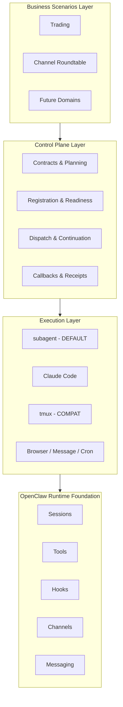
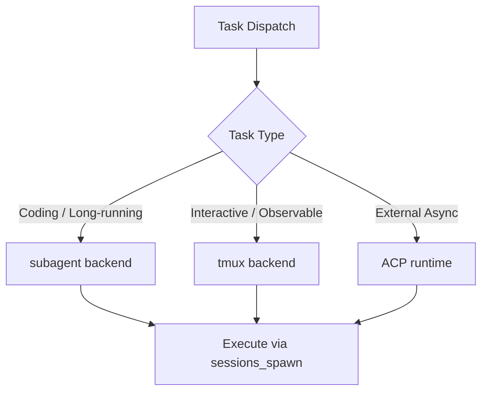

# Architecture Overview

> **Purpose:** High-level architecture of the OpenClaw Orchestration Control Plane.
> **Audience:** New contributors, architects, and engineers evaluating the system.
> **Last updated:** 2026-03-24

---

## Layering Model

The system is organized into four layers:



### Layer Responsibilities

| Layer | Responsibility | Key Objects |
|-------|---------------|-------------|
| **Business Scenarios** | Domain-specific workflows | `trading_roundtable`, `channel_roundtable`, future adapters |
| **Control Plane** | Workflow orchestration logic | contracts, registration, dispatch plans, callbacks, receipts |
| **Execution** | Task execution backends | subagent (default), Claude Code, tmux (compat) |
| **Runtime** | OpenClaw primitives | sessions, tools, hooks, channels, messaging |

---

## Control Plane Components

```mermaid
graph LR
    subgraph Entry["Entry Point"]
        E1[orch_command.py]
        E2[orchestration-entry skill]
    end

    subgraph Planning["Planning"]
        P1[Planning Artifact]
        P2[Handoff Schema]
    end

    subgraph Registration["Registration"]
        R1[Task Registry]
        R2[Readiness Check]
        R3[Safety Gates]
    end

    subgraph Dispatch["Dispatch"]
        D1[Dispatch Plan]
        D2[Auto-Trigger Guard]
        D3[Execution Request]
    end

    subgraph Execution["Execution Bridge"]
        X1[Bridge Consumer]
        X2[Sessions Spawn Bridge]
        X3[Execution Artifact]
    end

    subgraph Completion["Completion"]
        C1[Completion Receipt]
        C2[Callback Auto-Close]
        C3[Next-Step Decision]
    end

    Entry --> Planning
    Planning --> Registration
    Registration --> Dispatch
    Dispatch --> Execution
    Execution --> Completion
    Completion -.-> Registration
```



### Component Flow

1. **Entry** → User triggers via CLI or skill
2. **Planning** → System generates planning artifact with handoff schema
3. **Registration** → Task registered with readiness + safety gates check
4. **Dispatch** → Dispatch plan created; auto-trigger guard evaluates
5. **Execution** → Bridge consumer triggers sessions_spawn; execution artifact recorded
6. **Completion** → Receipt generated; callback auto-close; next-step decision made

---

## Key Contracts

### Continuation Contract

```typescript
interface ContinuationContract {
  entry_context: EntryContext;
  adapter: string;           // e.g., "trading_roundtable"
  owner: string;             // e.g., "trading", "main"
  executor: ExecutionProfile;
  continuation: {
    stopped_because: string;
    next_step?: string;
    next_owner?: string;
  };
  readiness: ReadinessStatus;
  safety_gates: Gate[];
  truth_anchor: TruthAnchor;
}
```

### Dispatch Plan

```typescript
interface DispatchPlan {
  registration_id: string;
  dispatch_id: string;
  status: "triggered" | "skipped" | "blocked" | "wait_at_gate";
  execution_request?: ExecutionRequest;
  reason?: string;
}
```

### Execution Request

```typescript
interface ExecutionRequest {
  request_id: string;
  runtime: "subagent" | "acp";
  cwd: string;
  task: string;
  label: string;
  metadata: {
    dispatch_id: string;
    spawn_id: string;
    source: string;
  };
  status: "prepared" | "emitted" | "blocked" | "failed";
}
```

### Completion Receipt

```typescript
interface CompletionReceipt {
  receipt_id: string;
  spawn_id: string;
  execution_id: string;
  status: "done" | "blocked" | "failed";
  output?: string;
  error?: string;
  callback_sent: boolean;
  callback_ack: boolean;
}
```

---

## Artifact Linkage

The system maintains a complete linkage chain for traceability:

```
registration_id
    ↓
dispatch_id
    ↓
spawn_id
    ↓
execution_id
    ↓
receipt_id
    ↓
request_id
    ↓
consumed_id
    ↓
api_execution_id (childSessionKey / runId)
```

Any ID can be used to query the full chain state.

---

## Backend Strategy

### Dual-Track Backend

| Backend | Status | Use Case |
|---------|--------|----------|
| **subagent** | DEFAULT | Automated execution, CI/CD, new development |
| **tmux** | SUPPORTED | Interactive sessions, manual observation |

Both backends are supported indefinitely. No breaking removal planned.

### Backend Selection



---

## Safety & Gates

### Safety Gates

- **Allowlist-based:** Only registered scenarios can auto-dispatch
- **Gate policy:** `stop_on_gate` by default
- **Manual approval:** Can be required for specific scenarios

### Readiness Check

Before dispatch, the system verifies:
- Task is registered
- Payload is valid
- No duplicate execution
- Safety gates pass
- Truth anchor exists (for in_progress status)

### Anomaly Detection

- Waiting integrity checks
- Hard-close policy for stuck tasks
- Fail-fast for missing artifacts
- Heartbeat-based liveness monitoring (external ring, not core state)

---

## Testing Strategy

- **434 tests passing** (as of 2026-03-23)
- Tests are a **source of truth**, not just packaging hygiene
- Coverage includes:
  - Continuation kernel (v1-v9)
  - Bridge consumer
  - Sessions spawn bridge
  - Callback auto-close
  - Auto-trigger guards
  - Duplicate prevention
  - Linkage verification

---

## Current Maturity

| Aspect | Status |
|--------|--------|
| Control plane main chain | ✅ In place |
| Subagent backend | ✅ Default |
| Tmux backend | ✅ Supported |
| Trading continuation | ✅ Real execution path |
| Channel roundtable | ✅ Minimum adapter |
| Auto-trigger consumption | ✅ Implemented (configurable) |
| Git push auto-continue | ⚠️ Not fully closed |
| Overall maturity | **safe semi-auto / thin bridge** |

---

## See Also

- **Main flow diagram:** [`../diagrams/mainline-flow.md`](../diagrams/mainline-flow.md)
- **Current truth:** [`../CURRENT_TRUTH.md`](../CURRENT_TRUTH.md)
- **Validation status:** [`../validation-status.md`](../validation-status.md)
- **Technical debt:** [`../technical-debt/technical-debt-2026-03-22.md`](../technical-debt/technical-debt-2026-03-22.md)
