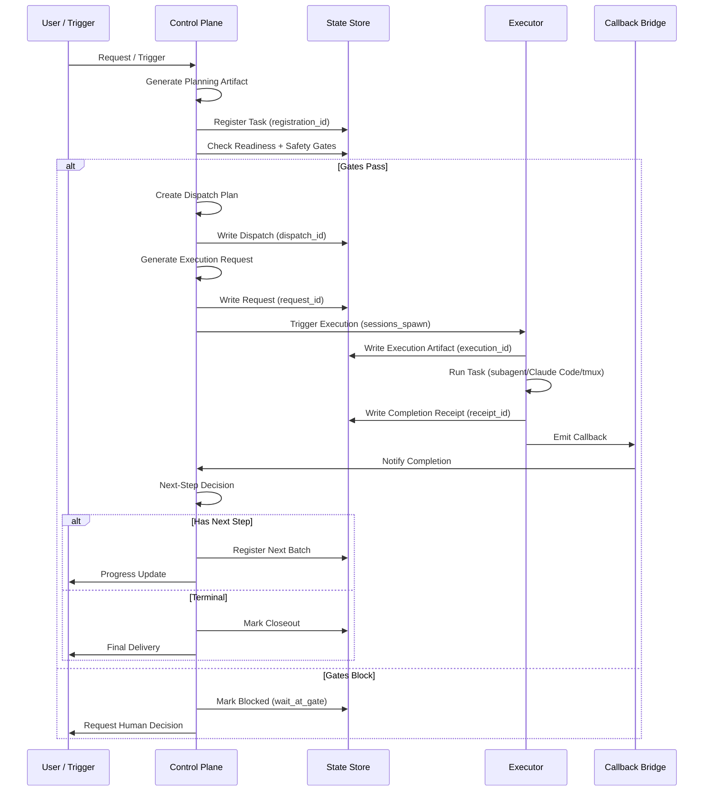
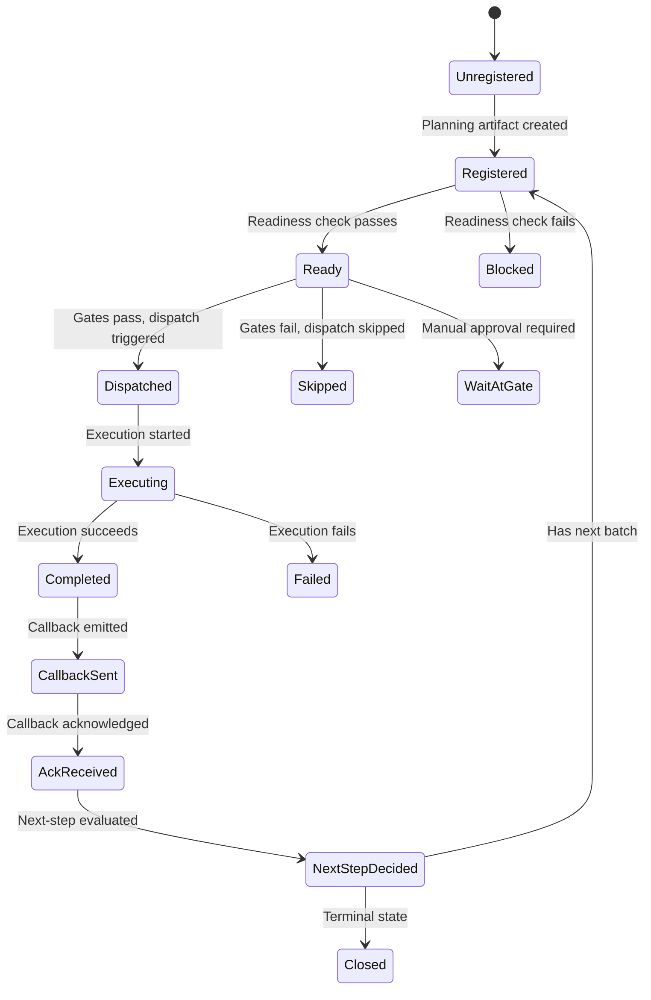
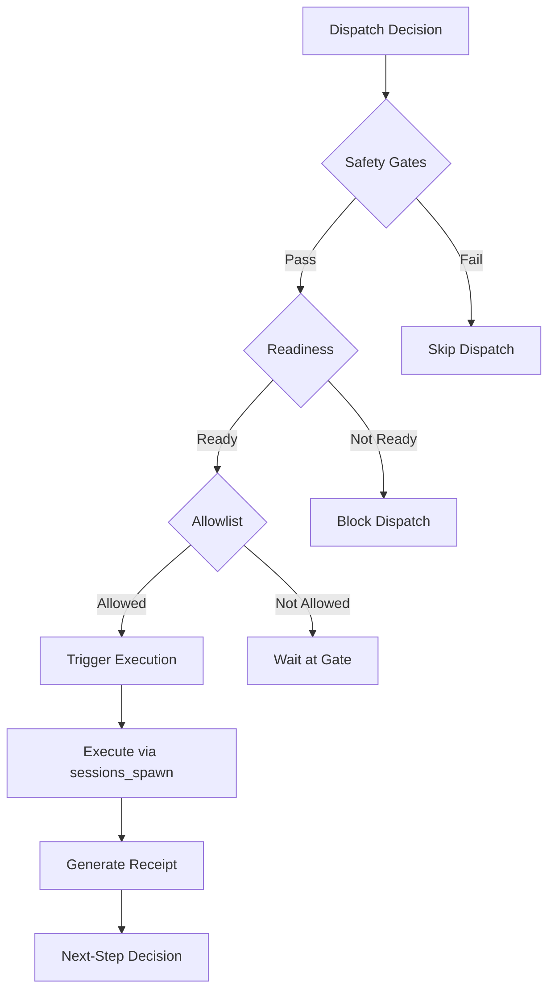
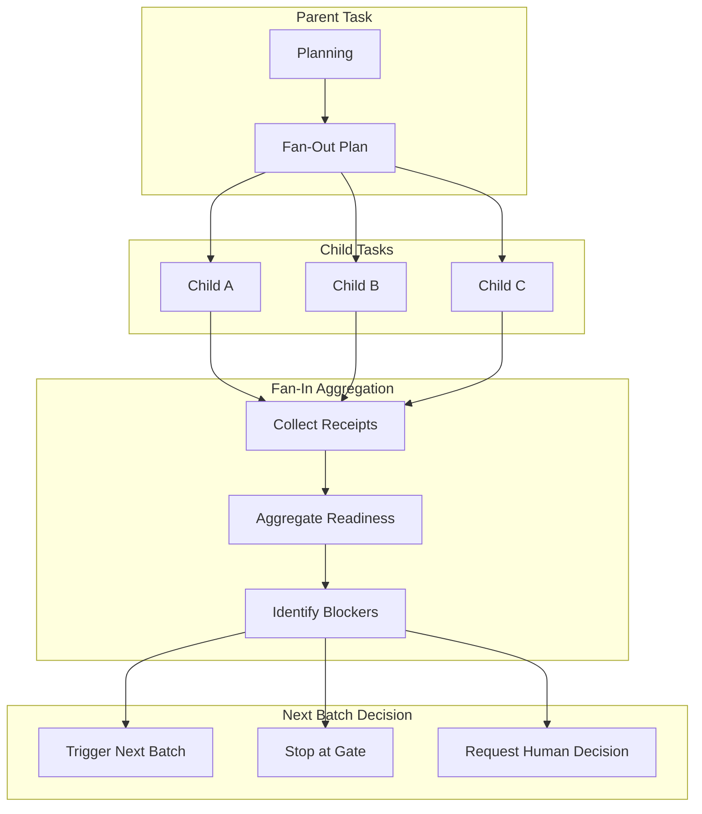
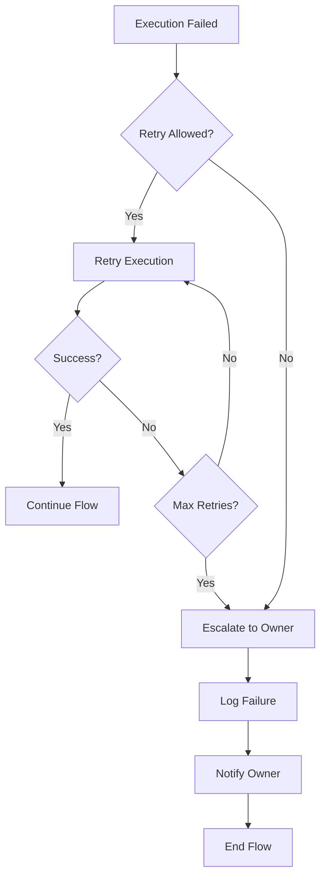

# Main Flow: Request → Callback → Closeout → Next Batch

> **Purpose:** Detailed flow diagram of the orchestration mainline.
> **Audience:** Engineers implementing or debugging the continuation path.
> **Last updated:** 2026-03-24

---

## High-Level Sequence



---

## Detailed State Transitions

### Task Registration



### Dispatch Decision Tree



---

## Fan-Out / Fan-In Pattern



### Fan-In States

| Child A | Child B | Child C | Aggregation Result |
|---------|---------|---------|-------------------|
| done | done | done | Trigger next batch |
| done | blocked | done | Stop at gate / request decision |
| done | failed | done | Evaluate failure policy |
| blocked | blocked | blocked | Escalate to owner |

---

## Artifact Lifecycle

```mermaid
graph LR
    subgraph Planning["Planning Artifacts"]
        PA[Planning Artifact]
        HS[Handoff Schema]
    end
    
    subgraph Registration["Registration Artifacts"]
        TR[Task Registry]
        RS[Readiness Status]
        SG[Safety Gates]
    end
    
    subgraph Dispatch["Dispatch Artifacts"]
        DP[Dispatch Plan]
        ER[Execution Request]
    end
    
    subgraph Execution["Execution Artifacts"]
        SC[Spawn Closure]
        EA[Execution Artifact]
        CR[Completion Receipt]
    end
    
    subgraph Callback["Callback Artifacts"]
        CC[Callback Close]
        NS[Next-Step Decision]
    end
    
    PA --> HS
    HS --> TR
    TR --> RS
    RS --> SG
    SG --> DP
    DP --> ER
    ER --> SC
    SC --> EA
    EA --> CR
    CR --> CC
    CC --> NS
```



---

## Linkage Chain (Traceability)

Every execution maintains a complete linkage chain:

```
┌─────────────────────────────────────────────────────────────┐
│ Linkage Chain (queryable by any ID)                         │
├─────────────────────────────────────────────────────────────┤
│ registration_id → dispatch_id → spawn_id → execution_id    │
│       ↓                ↓           ↓            ↓           │
│   task registry   dispatch    spawn       execution        │
│   entry           plan        closure     artifact         │
│                                                           │
│ execution_id → receipt_id → request_id → consumed_id      │
│       ↓             ↓            ↓            ↓            │
│   execution     completion   spawn       bridge           │
│   artifact      receipt      request     consumed         │
│                                                           │
│ consumed_id → api_execution_id (childSessionKey / runId) │
│       ↓                ↓                                   │
│   bridge          OpenClaw API                            │
│   consumed        execution                               │
└─────────────────────────────────────────────────────────────┘
```

### Query Examples

```bash
# Query by registration_id
cat ~/.openclaw/shared-context/task_registry/<registration_id>.json

# Query by receipt_id
cat ~/.openclaw/shared-context/completion_receipts/receipt_<id>.json

# Query full chain (any ID)
# Use any ID to trace through all linked artifacts
```

---

## Error Handling

### Failure Modes

| Mode | Detection | Response |
|------|-----------|----------|
| Missing artifact | File not found | Fail-fast, log error |
| Duplicate execution | ID collision check | Skip, log warning |
| Gate violation | Policy evaluation | Block, request approval |
| Execution timeout | Heartbeat / timeout | Mark failed, escalate |
| Callback lost | No ack received | Retry, alert owner |
| Waiting anomaly | active=0, waiting=true | Heartbeat triggers re-check |

### Recovery Path



---

## Current Implementation Status

| Component | Status | Notes |
|-----------|--------|-------|
| Planning artifact | ✅ Implemented | gstack-style planning default |
| Task registration | ✅ Implemented | JSONL registry ledger |
| Readiness check | ✅ Implemented | Payload validation + dedupe |
| Safety gates | ✅ Implemented | Allowlist-based |
| Dispatch plan | ✅ Implemented | Auto-trigger configurable |
| Execution request | ✅ Implemented | Canonical sessions_spawn interface |
| Bridge consumer | ✅ Implemented | Real execute mode + auto-trigger |
| Sessions spawn bridge | ✅ Implemented | Real OpenClaw API integration |
| Completion receipt | ✅ Implemented | Closure artifact with linkage |
| Callback auto-close | ✅ Implemented | Bridge consumption layer |
| Next-step decision | ✅ Implemented | Post-completion replan contract |
| Fan-out/fan-in | ✅ Implemented | Multi-child aggregation |
| Git push auto-continue | ⚠️ Partial | Not fully closed |

---

## See Also

- **Architecture overview:** [`./overview.md`](./overview.md)
- **Current truth:** [`../CURRENT_TRUTH.md`](../CURRENT_TRUTH.md)
- **Auto-trigger config:** [`../configuration/auto-trigger-config-guide.md`](../configuration/auto-trigger-config-guide.md)
- **Validation status:** [`../validation-status.md`](../validation-status.md)
