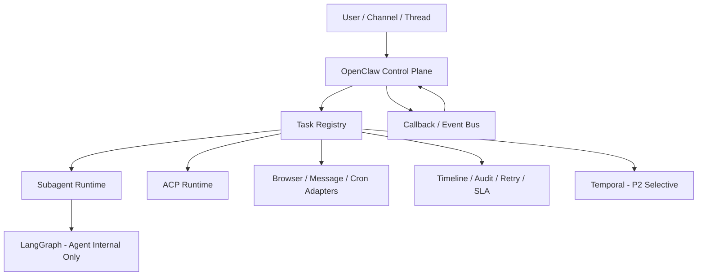

# 执行摘要

## 一句话结论

**OpenClaw 公司级编排不应直接走“LangGraph-first”或“Temporal-first 全迁”。最优路线是分阶段 Hybrid：**

- **P0 / P1：OpenClaw Native+**
- **P2：Selective Temporal**
- **LangGraph：Agent 内部子图**

---

## 为什么不是 LangGraph-first

LangGraph 的强项是：
- LLM/agent 内部认知流
- 工具调用图
- checkpoint / 人审断点

但它的短板也很明确：
- 不是公司级 durable execution 底座
- 不天然解决跨 runtime 的统一状态、统一重试、统一审计
- 容易把“agent 思考流问题”误当成“公司执行总线问题”

**结论：适合做叶子层，不适合做公司级主干层。**

---

## 为什么不是 Temporal-first

Temporal 的强项最适合：
- 长事务
- 跨天流程
- timer / signal / retry / compensation
- 强审计、强恢复、强 SLA

但短期直接全量引入的成本很高：
- 要把 subagent / ACP / browser / message / cron 全部 activity 化
- 要引入 worker / namespace / history / determinism / versioning 新心智负担
- 要重新设计 OpenClaw 的运行时边界

**结论：适合中后期关键链路，不适合短期全局替换。**

---

## 为什么不是 Pure Native Forever

OpenClaw 原生最大的优势是：
- 与现有运行时完全兼容
- 接入成本最低
- 当前最容易落地

但它的天花板也清楚：
- 状态分散
- 重试口径不统一
- 跨流程 timeline 不完整
- 补偿与回放能力不足
- 高 SLA 流程会越来越依赖人为经验

**结论：Native 是最好的起点，但不是终局。**

---

## 推荐架构

### 分层定义
- **控制平面**：OpenClaw 原生（入口、线程、人审、权限、路由）
- **状态平面**：Task Registry + 统一状态机 + Event Bus
- **执行平面**：subagent / ACP / browser / cron / message
- **耐久编排平面**：Temporal（P2 选择性接入）
- **认知编排平面**：LangGraph（只在 agent 内部使用）

---

## 路线图

### P0：统一语义
- 定义 `orchestration_task` schema
- 定义统一状态机：`queued/running/waiting_human/retrying/completed/failed/timeout/cancelled/degraded`
- 统一终态与 delivery 幂等键

### P1：统一接入与观测
- subagent / ACP / browser / cron / message 统一接入 registry
- 做 timeline / retry / escalation / human-in-the-loop 标准协议
- 先挑 1~2 条关键流程 shadow run

### P2：Selective Temporal
- 只把高价值长事务迁到 Temporal
- 保留 OpenClaw 为主控制平面
- 不迁移消息线程与人机交互主语义

---

## 当前建议的决策动作

### 立刻做
1. 把状态统一
2. 把可观测性统一
3. 把 HITL 协议统一
4. 把 callback / retry / escalation 做成标准件

### 暂时不做
1. 不把 LangGraph 提到公司级 orchestrator
2. 不推动 Temporal 一步到位全迁

---

## 最终判断

> **未来 6~12 个月，对 OpenClaw 最优的不是单一框架替换，而是“原生控制平面 + 统一状态层 + Temporal 选择性增强 + LangGraph 叶子层认知编排”的混合路线。**
