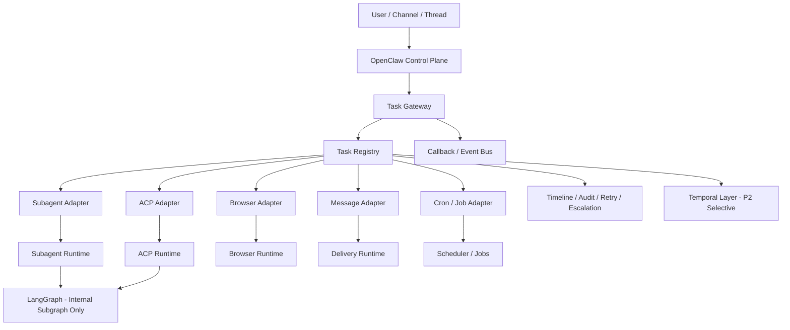

# OpenClaw 公司级编排架构 Proposal

日期：2026-03-19  
状态：proposal-v1  
来源：整合已完成的同主题调研任务与正式设计稿，去重后收敛为单一审阅版本。

---

## 1. 问题定义

OpenClaw 当前已经拥有多种真实运行时资产：
- `sessions_spawn(runtime="subagent")`
- ACP session / external harness
- watcher / callback
- cron
- message
- browser

所以当前真正的问题不是“有没有编排能力”，而是：

1. **状态分散**：subagent、ACP、watcher、delivery 分别持有局部真值
2. **重试口径不统一**：不同执行器的 retry / timeout / completion 语义不一致
3. **人工介入缺协议**：有人审能力，但缺统一 HITL 状态机
4. **观测不连续**：缺单个公司级任务的完整 timeline
5. **恢复与补偿不足**：跨天、跨运行时、高 SLA 流程仍偏脚本级工程约定

因此，这不是简单的“框架选型题”，而是：

> **如何在不推倒 OpenClaw 现有资产的前提下，把它升级成公司级 orchestration system。**

---

## 2. 方案比较结论

### 2.1 选型结论

**推荐路线：Hybrid（分阶段）**

- **P0 / P1：OpenClaw Native+**
- **P2：Selective Temporal**
- **LangGraph：Agent Internal Only**

### 2.2 为什么不是 LangGraph-first

LangGraph 更适合：
- 单 agent 的认知流
- 多工具调用图
- 审批/断点嵌在思考流中

但不适合直接担任：
- 公司级 durable execution 底座
- 跨 runtime 统一审计与恢复引擎
- 强 SLA 的异步执行总线

### 2.3 为什么不是 Temporal-first

Temporal 最适合：
- 长事务
- 跨天流程
- 强 retry / timer / signal / compensation
- 可回放、可审计的关键链路

但短期代价过大：
- 现有执行器都要 activity 化
- 要引入 worker/namespace/determinism/versioning 体系
- 要重构 OpenClaw 运行时边界

### 2.4 为什么不是纯原生不变

OpenClaw 原生最适合作为：
- 控制平面
- 入口
- 线程 / 权限 / 人审协调层

但如果长期不升级：
- 状态仍会分散
- 补偿/回放/SLA 难统一
- 公司级流程可观测性不足

---

## 3. 推荐架构

### 3.1 分层定义

#### 控制平面
负责：
- 用户入口
- 会话/线程语义
- 权限与审批
- 人机交互
- 最终回执

#### 状态平面
核心新增件：
- `Task Registry`
- 统一 `orchestration_task` schema
- 统一状态机
- 统一终态语义
- Timeline / Audit / Retry / Escalation

#### 执行平面
统一纳管：
- subagent
- ACP
- browser
- message
- cron / local jobs

#### 耐久编排平面
- 仅对高价值长事务接入 Temporal
- 不替代 OpenClaw 控制平面

#### 认知编排平面
- LangGraph 只在 agent 内部使用
- 不越过 task boundary 成为公司级 orchestrator

---

## 4. 统一状态机建议

建议统一到以下状态：

- `queued`
- `running`
- `waiting_human`
- `retrying`
- `completed`
- `failed`
- `timeout`
- `cancelled`
- `degraded`

### 4.1 状态迁移原则

1. 所有执行器必须映射到统一状态机
2. `completed` 必须对应真实交付物或可验证终态
3. `timeout` 与 `failed` 必须区分
4. `degraded` 用于“主目标部分达成但质量门不完整”
5. `waiting_human` 必须带审批超时策略

### 4.2 终态语义

终态只允许：
- `completed`
- `failed`
- `timeout`
- `cancelled`
- `degraded`

且终态必须携带：
- `task_id`
- `owner`
- `runtime`
- `evidence`
- `report_path`
- `delivery_status`
- `next_action`

---

## 5. 模块边界建议

### 5.1 Task Gateway
负责统一接收入参，并路由到不同执行器。

### 5.2 Task Registry
负责：
- task schema
- 当前状态
- last signal
- retry count
- owner
- dependency
- final summary pointer

### 5.3 Adapter 层
为不同执行器提供统一接口：
- subagent adapter
- ACP adapter
- browser adapter
- message adapter
- cron adapter

### 5.4 Callback / Event Bus
负责：
- 回调去重
- 状态推进
- delivery 幂等
- 回原线程/频道

### 5.5 Observability Layer
负责：
- timeline
- 审计
- retry trace
- escalation
- SLA 观察

### 5.6 Temporal Bridge（P2）
只桥接关键 workflow，不接管所有流程。

---

## 6. 失败恢复与补偿

### 6.1 失败分类
- 可重试失败：网络波动、外部服务偶发失败
- 需人工失败：审批卡住、结果冲突、权限不足
- 不可恢复失败：输入错误、配置缺失、契约不成立

### 6.2 恢复策略
- `retrying`：按 adapter 定义 backoff / max attempts
- `waiting_human`：进入审批断点，超时升级
- `failed`：附失败原因与建议动作
- `timeout`：支持重入或人工接管

### 6.3 幂等策略
建议 callback/delivery 幂等键统一为：

`task_id + state + content_hash + target`

---

## 7. 质量门

所有公司级编排任务至少满足：

1. **结论**：完成 / 部分完成 / 失败
2. **证据**：日志、状态、文件、回执、测试或审计线索
3. **动作**：下一步、Owner、截止时间

额外要求：
- `completed` 不能只有聊天回执，必须有真实产物或真实终态证据
- 运行时状态与报告状态必须一致
- 跨执行器任务必须能回放 timeline

---

## 8. 路线图

### P0：统一语义层
目标：先把“公司级任务”定义出来。

- 定义 `orchestration_task` schema
- 定义统一状态机
- 统一终态语义
- 打通 subagent / ACP 接入
- 接入统一 callback 幂等规则

### P1：统一可观测与人工介入
目标：把“脚本集”变成“运营级控制系统”。

- timeline 看板
- retry registry
- escalation / dead-letter
- human-in-the-loop 协议
- browser / message / cron 接入 registry
- 选择 1~2 条关键流程做 shadow workflow

### P2：Selective Temporal
目标：把最痛的长事务交给耐久执行层。

优先迁入：
- 跨天任务
- 强 SLA 任务
- 多阶段审批链
- 强补偿/可回放流程

不建议迁入：
- 简单 agent 子任务
- 短平快本地执行
- 仅认知推理型流程

---

## 9. 最终建议

### 应该做的
- 保留 OpenClaw 作为主控制平面
- 新增 Task Registry + 统一状态机 + Event Bus
- 先把现有执行器统一成标准 adapter
- 把 Human-in-the-loop、retry、delivery、escalation 做成平台能力
- 只把真正需要 durable execution 的流程接给 Temporal
- 把 LangGraph 收敛到 agent 内部复杂推理子图

### 不应该做的
- 不要让 LangGraph 接管公司级总线
- 不要让 Temporal 一步到位替换所有现有机制
- 不要继续让状态散落在 run dir / session / watcher / delivery 各自为政

---

## 10. 结论

> **OpenClaw 未来的最优架构，不是单框架替代，而是“原生控制平面 + 统一状态层 + Temporal 选择性增强 + LangGraph 叶子层认知编排”的分层混合方案。**
